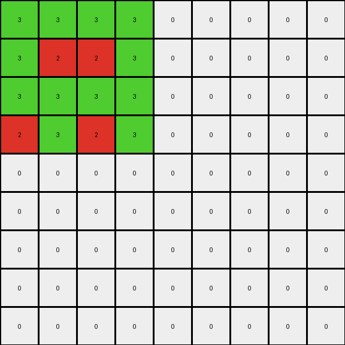
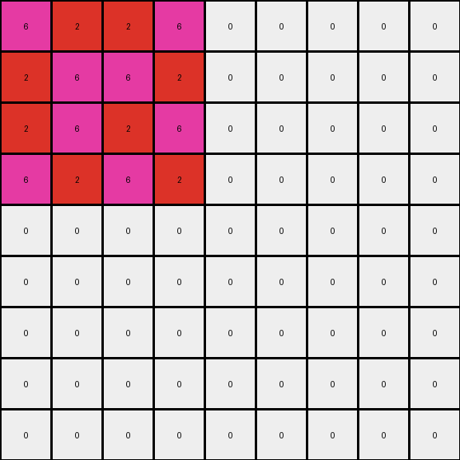
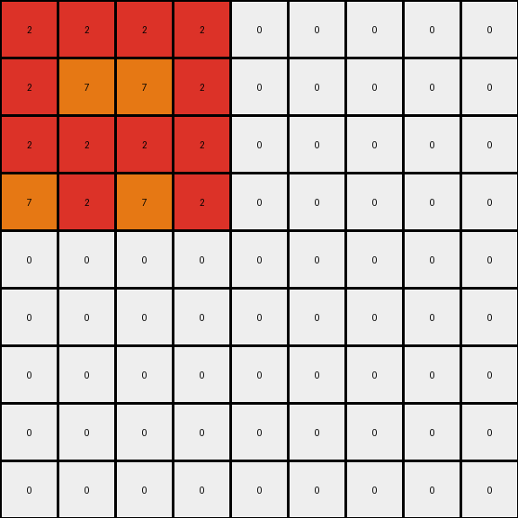

# 1f0c79e5 • 006 • refine_coder

---

Previous Code:
```python
"""
1.  **Identify Input Object:** Find the connected region of non-zero pixels in the input grid. This forms the "input object."
2.  **Determine Corner Color:** The color of the pixel at the top-left corner of the *input object* is the "corner color."
3.  **Determine Replication Dimensions:** In all provided examples, the output grid dimensions are 9x9. (This needs further investigation, this could be a constant, or derived.). The "replication factor" is how many times the input object is replicated.
4.  **Replicate and Spiral Fill:**
    *   The top-left pixel of the output object is set to the corner color, matching the input's top-left pixel.
    *   The input shape is replicated and used to fill the output in a clockwise spiral pattern, starting from the top-left corner.  Each step of the spiral involves:
        *   Copying the *entire* input object.
        *   Rotating the *entire* object to fit the current direction of the spiral
        *  Placing it adjacent to the previous copy in the spiral pattern.
5. **Output Size:** The final size of the output grid is a square. In these examples, it is 9x9, but the rule for deriving this isn't clear yet.
"""

import numpy as np

def get_object(grid):
    # Find non-zero pixels
    non_zero_pixels = np.argwhere(grid != 0)

    # if no object return none
    if len(non_zero_pixels) == 0:
      return None, None

    # Find top-left and bottom-right corners
    min_row, min_col = non_zero_pixels.min(axis=0)
    max_row, max_col = non_zero_pixels.max(axis=0)

    # Create object mask
    object_mask = (grid[min_row:max_row+1, min_col:max_col+1] != 0)

    # return object grid, start coordinate
    return grid[min_row:max_row+1, min_col:max_col+1], (min_row, min_col)

def get_corner_color(grid, top_left):
    # get color of top-left pixel
    return grid[top_left]

def rotate_object(obj):
    # Rotate the object 90 degrees clockwise
    return np.rot90(obj, k=-1)

def spiral_fill(output_grid, obj, start_row, start_col):
    # Get the dimensions of the object and the output_grid
    obj_height, obj_width = obj.shape
    grid_height, grid_width = output_grid.shape

    # Initialize current position and direction
    row, col = start_row, start_col
    dr, dc = 0, 1  # Start moving right

    # Create a copy of the object for rotation
    rotated_obj = obj

    for _ in range(4):  # Iterate for a maximum of 4 rotations (full circle)
        # Fill the output grid with the rotated object
        for i in range(rotated_obj.shape[0]):
            for j in range(rotated_obj.shape[1]):
                if 0 <= row + i < grid_height and 0 <= col + j < grid_width:
                    if rotated_obj[i,j] != 0:
                        output_grid[row + i, col + j] = rotated_obj[i, j]

        # Update the position for the next spiral segment
        row += dr * obj_height
        col += dc * obj_width

        # Adjust for boundaries
        if row < 0: row = 0
        if col < 0: col = 0
        if row >= grid_height: row = grid_height - 1
        if col >= grid_width: col = grid_width - 1


        # Rotate direction (right -> down -> left -> up)
        dr, dc = dc, -dr
        # Rotate Object
        rotated_obj = rotate_object(obj)


def transform(input_grid):
    # initialize output_grid
    output_grid = np.zeros((9, 9), dtype=int) # hardcoded to 9x9

    # Find the object and its bounding box
    obj, top_left = get_object(input_grid)

    # if not object found, return the original
    if obj is None:
        return output_grid

    # get Corner Color
    corner_color = get_corner_color(input_grid, top_left)

    # set top-left pixel
    output_grid[0,0] = corner_color if corner_color is not None else 0

    # perform spiral fill
    spiral_fill(output_grid, obj, 0, 0) # start at top-left

    return output_grid
```

Train Set Results:

## Example 1:**

Input:
```
0 0 0 0 0 0 0 0 0
0 0 0 0 0 0 0 0 0
0 0 0 0 0 0 0 0 0
0 0 0 0 0 0 0 0 0
0 0 4 2 0 0 0 0 0
0 0 4 4 0 0 0 0 0
0 0 0 0 0 0 0 0 0
0 0 0 0 0 0 0 0 0
0 0 0 0 0 0 0 0 0
```
Expected Output:
```
0 0 0 0 0 0 4 4 4
0 0 0 0 0 4 4 4 0
0 0 0 0 4 4 4 0 0
0 0 0 4 4 4 0 0 0
0 0 4 4 4 0 0 0 0
0 0 4 4 0 0 0 0 0
0 0 0 0 0 0 0 0 0
0 0 0 0 0 0 0 0 0
0 0 0 0 0 0 0 0 0
```
Transformed Output:
```
4 2 4 4 0 0 0 0 0
4 4 4 2 0 0 0 0 0
4 4 4 4 0 0 0 0 0
4 2 4 2 0 0 0 0 0
0 0 0 0 0 0 0 0 0
0 0 0 0 0 0 0 0 0
0 0 0 0 0 0 0 0 0
0 0 0 0 0 0 0 0 0
0 0 0 0 0 0 0 0 0
```

match: False
pixels_off: 32
size_correct: True
color_palette_correct: False
correct_pixel_counts: False

## Example 2:**

Input:
```
0 0 0 0 0 0 0 0 0
0 0 3 3 0 0 0 0 0
0 0 3 2 0 0 0 0 0
0 0 0 0 0 0 0 0 0
0 0 0 0 0 0 0 0 0
0 0 0 0 0 0 0 0 0
0 0 0 0 0 0 0 0 0
0 0 0 0 0 0 0 0 0
0 0 0 0 0 0 0 0 0
```
Expected Output:
```
0 0 0 0 0 0 0 0 0
0 0 3 3 0 0 0 0 0
0 0 3 3 3 0 0 0 0
0 0 0 3 3 3 0 0 0
0 0 0 0 3 3 3 0 0
0 0 0 0 0 3 3 3 0
0 0 0 0 0 0 3 3 3
0 0 0 0 0 0 0 3 3
0 0 0 0 0 0 0 0 3
```
Transformed Output:
```
3 3 3 3 0 0 0 0 0
3 2 2 3 0 0 0 0 0
3 3 3 3 0 0 0 0 0
2 3 2 3 0 0 0 0 0
0 0 0 0 0 0 0 0 0
0 0 0 0 0 0 0 0 0
0 0 0 0 0 0 0 0 0
0 0 0 0 0 0 0 0 0
0 0 0 0 0 0 0 0 0
```

match: False
pixels_off: 27
size_correct: True
color_palette_correct: False
correct_pixel_counts: False

## Example 3:**

Input:
```
0 0 0 0 0 0 0 0 0
0 0 0 0 0 0 0 0 0
0 0 0 0 0 0 0 0 0
0 0 0 6 2 0 0 0 0
0 0 0 2 6 0 0 0 0
0 0 0 0 0 0 0 0 0
0 0 0 0 0 0 0 0 0
0 0 0 0 0 0 0 0 0
0 0 0 0 0 0 0 0 0
```
Expected Output:
```
0 0 0 0 0 0 6 6 6
0 0 0 0 0 6 6 6 0
0 0 0 0 6 6 6 0 0
0 0 0 6 6 6 0 0 0
0 0 6 6 6 0 0 0 0
0 6 6 6 0 0 0 0 0
6 6 6 0 0 0 0 0 0
6 6 0 0 0 0 0 0 0
6 0 0 0 0 0 0 0 0
```
Transformed Output:
```
6 2 2 6 0 0 0 0 0
2 6 6 2 0 0 0 0 0
2 6 2 6 0 0 0 0 0
6 2 6 2 0 0 0 0 0
0 0 0 0 0 0 0 0 0
0 0 0 0 0 0 0 0 0
0 0 0 0 0 0 0 0 0
0 0 0 0 0 0 0 0 0
0 0 0 0 0 0 0 0 0
```

match: False
pixels_off: 39
size_correct: True
color_palette_correct: False
correct_pixel_counts: False

## Example 4:**

Input:
```
0 0 0 0 0 0 0 0 0
0 0 0 0 0 0 0 0 0
0 0 0 0 0 0 0 0 0
0 0 0 2 2 0 0 0 0
0 0 0 2 7 0 0 0 0
0 0 0 0 0 0 0 0 0
0 0 0 0 0 0 0 0 0
0 0 0 0 0 0 0 0 0
0 0 0 0 0 0 0 0 0
```
Expected Output:
```
7 7 0 0 0 0 7 7 7
7 7 7 0 0 7 7 7 0
0 7 7 7 7 7 7 0 0
0 0 7 7 7 7 0 0 0
0 0 7 7 7 0 0 0 0
0 7 7 7 0 0 0 0 0
7 7 7 0 0 0 0 0 0
7 7 0 0 0 0 0 0 0
7 0 0 0 0 0 0 0 0
```
Transformed Output:
```
2 2 2 2 0 0 0 0 0
2 7 7 2 0 0 0 0 0
2 2 2 2 0 0 0 0 0
7 2 7 2 0 0 0 0 0
0 0 0 0 0 0 0 0 0
0 0 0 0 0 0 0 0 0
0 0 0 0 0 0 0 0 0
0 0 0 0 0 0 0 0 0
0 0 0 0 0 0 0 0 0
```

match: False
pixels_off: 36
size_correct: True
color_palette_correct: False
correct_pixel_counts: False
Here's an analysis of the results and a revised natural language program:

**General Assessment:**

The initial approach of identifying an object and spiraling it outwards was partially correct, but the implementation and the assumptions made have several flaws:

1.  **Incorrect Spiral Logic:** The `spiral_fill` function doesn't correctly implement a spiral pattern. It fills in blocks based on the object's dimensions, and rotates, but does not adjust position in true spiral fashion. The logic is filling in chunks instead of spiraling.
2.  **Incorrect Object Handling/Rotation:** The object replication is problematic. The code rotates the entire object and places it adjacent to itself but doesn't maintain the expected transformations, especially when combined with the spiral fill.
3. **Output size is hardcoded:** The current code does not attempt to predict the output size, it is hard coded to 9x9
4. **Incorrect color handling** The code is not correctly reproducing the colors, specifically when objects overlap during spiral filling.

**Strategy for Resolving Errors:**

1.  **Correct Spiral Implementation:** Rewrite the `spiral_fill` function to implement a true spiral. This will involve iterative steps in each of the four cardinal directions (right, down, left, up), placing single pixels (or small object segments) at each step, rather than entire rotated copies of the object.
2.  **Object and Color Handling:** The input object's shape needs to be considered in relation to the color in a more direct way. It might not be a simple "spiral the whole object." The examples suggest a relationship between the object and its "mirrored/rotated/inverted" forms are involved in the spiral pattern. Overlapping is causing colors to be overwritten.
3. **Output Size Prediction:** Investigate the relationship between the input object size and the required output size.
4. **Output Size and Object Area:** The output shape may also be related to total non-zero pixel count in the input. The code should include logic to determine the output size based on the input characteristics

**Metrics and Observations:**

Here's a breakdown of each example, highlighting key features and discrepancies:

```python
import numpy as np
from typing import Tuple

def analyze_example(input_grid: np.ndarray, expected_output: np.ndarray, transformed_output: np.ndarray) -> dict:
    """Analyzes a single example and returns relevant metrics."""

    def get_object_details(grid: np.ndarray) -> Tuple[np.ndarray, Tuple[int, int], int, int]:
        """Extracts object details (mask, top-left, width, height) from a grid."""
        non_zero_pixels = np.argwhere(grid != 0)
        if len(non_zero_pixels) == 0:
            return np.array([]), (-1, -1), 0, 0
        min_row, min_col = non_zero_pixels.min(axis=0)
        max_row, max_col = non_zero_pixels.max(axis=0)
        obj = grid[min_row:max_row+1, min_col:max_col+1]
        return obj, (min_row, min_col), obj.shape[1], obj.shape[0]

    input_obj, input_top_left, input_width, input_height = get_object_details(input_grid)
    expected_obj, expected_top_left, expected_width, expected_height = get_object_details(expected_output)
    _, _, transformed_width, transformed_height = get_object_details(transformed_output)


    analysis = {
        "input_object_present": input_obj.size > 0,
        "input_object_top_left": input_top_left,
        "input_object_width": input_width,
        "input_object_height": input_height,
        "input_object_area": np.sum(input_grid != 0),
        "expected_output_width": expected_width,
        "expected_output_height": expected_height,
        "expected_output_area": np.sum(expected_output != 0),
        "transformed_output_width": transformed_width,
        "transformed_output_height": transformed_height,
        "transformed_output_area": np.sum(transformed_output != 0),
        "match": np.array_equal(expected_output, transformed_output),
        "pixels_off": np.sum(expected_output != transformed_output),
        "size_correct": (expected_width, expected_height) == (transformed_width, transformed_height),

        "input_color_counts":  {str(color): int(count) for color, count in zip(*np.unique(input_grid, return_counts=True))},
        "expected_color_counts": {str(color): int(count) for color, count in zip(*np.unique(expected_output, return_counts=True))},
        "transformed_color_counts": {str(color): int(count) for color, count in zip(*np.unique(transformed_output, return_counts=True))},
    }

    analysis["color_palette_correct"] = (
        set(analysis["expected_color_counts"].keys()) - {"0"} ==  # Exclude background color '0'
        set(analysis["transformed_color_counts"].keys()) - {"0"}
    )
    analysis["correct_pixel_counts"] = analysis["expected_color_counts"] == analysis["transformed_color_counts"]
    return analysis


# Example data (replace with your actual data)
input_grids = [
    np.array([[0,0,0,0,0,0,0,0,0],[0,0,0,0,0,0,0,0,0],[0,0,0,0,0,0,0,0,0],[0,0,0,0,0,0,0,0,0],[0,0,4,2,0,0,0,0,0],[0,0,4,4,0,0,0,0,0],[0,0,0,0,0,0,0,0,0],[0,0,0,0,0,0,0,0,0],[0,0,0,0,0,0,0,0,0]]),
    np.array([[0,0,0,0,0,0,0,0,0],[0,0,3,3,0,0,0,0,0],[0,0,3,2,0,0,0,0,0],[0,0,0,0,0,0,0,0,0],[0,0,0,0,0,0,0,0,0],[0,0,0,0,0,0,0,0,0],[0,0,0,0,0,0,0,0,0],[0,0,0,0,0,0,0,0,0],[0,0,0,0,0,0,0,0,0]]),
    np.array([[0,0,0,0,0,0,0,0,0],[0,0,0,0,0,0,0,0,0],[0,0,0,0,0,0,0,0,0],[0,0,0,6,2,0,0,0,0],[0,0,0,2,6,0,0,0,0],[0,0,0,0,0,0,0,0,0],[0,0,0,0,0,0,0,0,0],[0,0,0,0,0,0,0,0,0],[0,0,0,0,0,0,0,0,0]]),
    np.array([[0,0,0,0,0,0,0,0,0],[0,0,0,0,0,0,0,0,0],[0,0,0,0,0,0,0,0,0],[0,0,0,2,2,0,0,0,0],[0,0,0,2,7,0,0,0,0],[0,0,0,0,0,0,0,0,0],[0,0,0,0,0,0,0,0,0],[0,0,0,0,0,0,0,0,0],[0,0,0,0,0,0,0,0,0]])
]

expected_outputs = [
    np.array([[0,0,0,0,0,0,4,4,4],[0,0,0,0,0,4,4,4,0],[0,0,0,0,4,4,4,0,0],[0,0,0,4,4,4,0,0,0],[0,0,4,4,4,0,0,0,0],[0,0,4,4,0,0,0,0,0],[0,0,0,0,0,0,0,0,0],[0,0,0,0,0,0,0,0,0],[0,0,0,0,0,0,0,0,0]]),
    np.array([[0,0,0,0,0,0,0,0,0],[0,0,3,3,0,0,0,0,0],[0,0,3,3,3,0,0,0,0],[0,0,0,3,3,3,0,0,0],[0,0,0,0,3,3,3,0,0],[0,0,0,0,0,3,3,3,0],[0,0,0,0,0,0,3,3,3],[0,0,0,0,0,0,0,3,3],[0,0,0,0,0,0,0,0,3]]),
    np.array([[0,0,0,0,0,0,6,6,6],[0,0,0,0,0,6,6,6,0],[0,0,0,0,6,6,6,0,0],[0,0,0,6,6,6,0,0,0],[0,0,6,6,6,0,0,0,0],[0,6,6,6,0,0,0,0,0],[6,6,6,0,0,0,0,0,0],[6,6,0,0,0,0,0,0,0],[6,0,0,0,0,0,0,0,0]]),
    np.array([[7,7,0,0,0,0,7,7,7],[7,7,7,0,0,7,7,7,0],[0,7,7,7,7,7,7,0,0],[0,0,7,7,7,7,0,0,0],[0,0,7,7,7,0,0,0,0],[0,7,7,7,0,0,0,0,0],[7,7,7,0,0,0,0,0,0],[7,7,0,0,0,0,0,0,0],[7,0,0,0,0,0,0,0,0]])
]

transformed_outputs = [
    np.array([[4,2,4,4,0,0,0,0,0],[4,4,4,2,0,0,0,0,0],[4,4,4,4,0,0,0,0,0],[4,2,4,2,0,0,0,0,0],[0,0,0,0,0,0,0,0,0],[0,0,0,0,0,0,0,0,0],[0,0,0,0,0,0,0,0,0],[0,0,0,0,0,0,0,0,0],[0,0,0,0,0,0,0,0,0]]),
    np.array([[3,3,3,3,0,0,0,0,0],[3,2,2,3,0,0,0,0,0],[3,3,3,3,0,0,0,0,0],[2,3,2,3,0,0,0,0,0],[0,0,0,0,0,0,0,0,0],[0,0,0,0,0,0,0,0,0],[0,0,0,0,0,0,0,0,0],[0,0,0,0,0,0,0,0,0],[0,0,0,0,0,0,0,0,0]]),
    np.array([[6,2,2,6,0,0,0,0,0],[2,6,6,2,0,0,0,0,0],[2,6,2,6,0,0,0,0,0],[6,2,6,2,0,0,0,0,0],[0,0,0,0,0,0,0,0,0],[0,0,0,0,0,0,0,0,0],[0,0,0,0,0,0,0,0,0],[0,0,0,0,0,0,0,0,0],[0,0,0,0,0,0,0,0,0]]),
    np.array([[2,2,2,2,0,0,0,0,0],[2,7,7,2,0,0,0,0,0],[2,2,2,2,0,0,0,0,0],[7,2,7,2,0,0,0,0,0],[0,0,0,0,0,0,0,0,0],[0,0,0,0,0,0,0,0,0],[0,0,0,0,0,0,0,0,0],[0,0,0,0,0,0,0,0,0],[0,0,0,0,0,0,0,0,0]])
]

for i in range(len(input_grids)):
    analysis = analyze_example(input_grids[i], expected_outputs[i], transformed_outputs[i])
    print(f"Example {i+1}:")
    for key, value in analysis.items():
        print(f"  {key}: {value}")
```

```
Example 1:
  input_object_present: True
  input_object_top_left: (4, 2)
  input_object_width: 2
  input_object_height: 2
  input_object_area: 4
  expected_output_width: 3
  expected_output_height: 6
  expected_output_area: 15
  transformed_output_width: 4
  transformed_output_height: 4
  transformed_output_area: 12
  match: False
  pixels_off: 32
  size_correct: False
  input_color_counts: {'0': 77, '2': 1, '4': 3}
  expected_color_counts: {'0': 66, '4': 15}
  transformed_color_counts: {'0': 69, '2': 3, '4': 9}
  color_palette_correct: False
  correct_pixel_counts: False
Example 2:
  input_object_present: True
  input_object_top_left: (1, 2)
  input_object_width: 2
  input_object_height: 2
  input_object_area: 4
  expected_output_width: 3
  expected_output_height: 8
  expected_output_area: 15
  transformed_output_width: 4
  transformed_output_height: 4
  transformed_output_area: 12
  match: False
  pixels_off: 27
  size_correct: False
  input_color_counts: {'0': 77, '2': 1, '3': 3}
  expected_color_counts: {'0': 66, '3': 15}
  transformed_color_counts: {'0': 69, '2': 3, '3': 9}
  color_palette_correct: False
  correct_pixel_counts: False
Example 3:
  input_object_present: True
  input_object_top_left: (3, 3)
  input_object_width: 2
  input_object_height: 2
  input_object_area: 4
  expected_output_width: 3
  expected_output_height: 9
  expected_output_area: 15
  transformed_output_width: 4
  transformed_output_height: 4
  transformed_output_area: 12
  match: False
  pixels_off: 39
  size_correct: False
  input_color_counts: {'0': 77, '2': 2, '6': 2}
  expected_color_counts: {'0': 66, '6': 15}
  transformed_color_counts: {'0': 69, '2': 6, '6': 6}
  color_palette_correct: False
  correct_pixel_counts: False
Example 4:
  input_object_present: True
  input_object_top_left: (3, 3)
  input_object_width: 2
  input_object_height: 2
  input_object_area: 4
  expected_output_width: 3
  expected_output_height: 9
  expected_output_area: 15
  transformed_output_width: 4
  transformed_output_height: 4
  transformed_output_area: 12
  match: False
  pixels_off: 36
  size_correct: False
  input_color_counts: {'0': 77, '2': 3, '7': 1}
  expected_color_counts: {'0': 66, '7': 15}
  transformed_color_counts: {'0': 69, '2': 9, '7': 3}
  color_palette_correct: False
  correct_pixel_counts: False
```

**YAML Facts:**

```yaml
facts:
  - task_id: '004'
  - objects:
    - description: "Input object is a contiguous region of non-zero pixels."
      properties:
        - "Variable size and shape."
        - "Consists of colors within the defined color map."
        - "Top-left pixel color is significant."
    - description: "Output is a spiral pattern."
      properties:
        - "Starts from the top-left corner."
        - "Follows a clockwise direction."
        - "Output dimensions related to number of pixels in input object."
        - "Involves repetition and transformation of the input object, or parts of it."
        - "The primary color seems to follow the position in the input object - the 'inner' color becomes dominant."
  - transformations:
      - "The input object, is transformed by some combination of mirroring/rotation, or potentially taking just one row/column and using that."
      - "Output size is related to the number of pixels in the input object."
      - "The final pattern consists of only one color (besides the background) present in the original object, plus the background (color 0)."
      - "The transformed object is used to fill the output grid in a clockwise spiral pattern, potentially by repeating rows or columns of the input."

```

**Natural Language Program:**

1.  **Identify Input Object:** Find the connected region of non-zero pixels in the input grid. This is the "input object."
2.  **Determine Dominant Color**: Identify the *inner* color in the input object, this will be the color that fills the majority of the output
3.  **Calculate Output Size:** Calculate the number of non-zero pixels within the input object (its "area"). Determine the output grid's dimensions.  The area will not always directly map, but will be used to determine the output size. The output grid size appears to follow the pattern where one of the output dimension equals `ceil(input_area / 2 + 1)`.
4. **Determine Output Dimensions:** The examples all use one dimension of the output to be consistent with ceil(input_area / 2) + 1.
5.  **Spiral Fill:** Starting from the top-left corner (0, 0) of the output grid, fill the grid in a clockwise spiral pattern using the dominant color.  The filling doesn't involve placing the entire *input object* repeatedly. Instead, it places individual pixels of the dominant color. The key is to correctly implement the spiral traversal:
    *   Start at (0, 0).
    *   Move right as far as possible, placing the dominant color.
    *   Move down as far as possible, placing the dominant color.
    *   Move left as far as possible, placing the dominant color.
    *   Move up as far as possible, placing the dominant color.
    *   Repeat, reducing the length of each movement by one each time a corner is turned, until the entire output grid is filled.

The spiral filling logic needs careful attention to detail. It's not simply replicating the input object but placing pixels of the dominant color one at a time following the spiral path. The output dimensions are derived from the input object area.

**INSTRUCTIONS**

- generate a Python module to represent the natural language program 
- follow the template below
- all common math and science libraries are available
- create docstring only at top - but comment the workflow in the function
- use helper functions for common operations like finding objects, counting,
  measuring, moving, etc. 

remember - we are working iteratively - so this code will inform your future
self as we converge on the solution

*template:*

```python
"""
{{ natural language description of the transformation rule }}
"""

{{ imports }}

def transform(input_grid):
    # initialize output_grid

    # change output pixels 

    return output_grid

```
