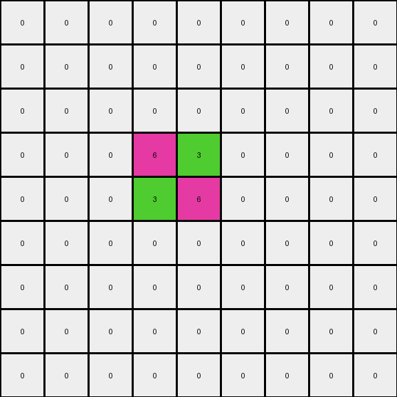
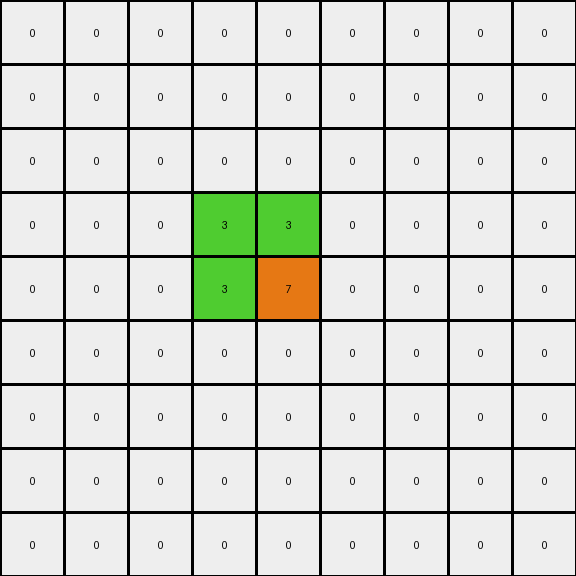

# 1f0c79e5 • 010 • refine_coder

---

Previous Code:
```python
"""
The transformation rule takes the green pixels in the input and uses them as seeds to "grow" rectangular regions of green, filling the grid downwards and to the right, and replacing any single red object.
"""

import numpy as np

def transform(input_grid):
    """
    Transforms the input grid by expanding green pixels downwards and to the
    right, overwriting red pixels.
    """
    output_grid = np.copy(input_grid)
    rows, cols = input_grid.shape

    # Iterate through the input grid to find green pixels (value 3).
    for i in range(rows):
        for j in range(cols):
            if input_grid[i, j] == 3:
                # Expand the green pixel downwards and to the right.
                for x in range(i, rows):
                    for y in range(j, cols):
                        output_grid[x, y] = 3
            if input_grid[i,j] == 2:
                output_grid[i,j] = 3

    return output_grid
```

Train Set Results:

## Example 1:**

Input:
```
0 0 0 0 0 0 0 0 0
0 0 0 0 0 0 0 0 0
0 0 0 0 0 0 0 0 0
0 0 0 0 0 0 0 0 0
0 0 4 2 0 0 0 0 0
0 0 4 4 0 0 0 0 0
0 0 0 0 0 0 0 0 0
0 0 0 0 0 0 0 0 0
0 0 0 0 0 0 0 0 0
```
Expected Output:
```
0 0 0 0 0 0 4 4 4
0 0 0 0 0 4 4 4 0
0 0 0 0 4 4 4 0 0
0 0 0 4 4 4 0 0 0
0 0 4 4 4 0 0 0 0
0 0 4 4 0 0 0 0 0
0 0 0 0 0 0 0 0 0
0 0 0 0 0 0 0 0 0
0 0 0 0 0 0 0 0 0
```
Transformed Output:
```
0 0 0 0 0 0 0 0 0
0 0 0 0 0 0 0 0 0
0 0 0 0 0 0 0 0 0
0 0 0 0 0 0 0 0 0
0 0 4 3 0 0 0 0 0
0 0 4 4 0 0 0 0 0
0 0 0 0 0 0 0 0 0
0 0 0 0 0 0 0 0 0
0 0 0 0 0 0 0 0 0
```

match: False
pixels_off: 14
size_correct: True
color_palette_correct: False
correct_pixel_counts: False

## Example 2:**

Input:
```
0 0 0 0 0 0 0 0 0
0 0 3 3 0 0 0 0 0
0 0 3 2 0 0 0 0 0
0 0 0 0 0 0 0 0 0
0 0 0 0 0 0 0 0 0
0 0 0 0 0 0 0 0 0
0 0 0 0 0 0 0 0 0
0 0 0 0 0 0 0 0 0
0 0 0 0 0 0 0 0 0
```
Expected Output:
```
0 0 0 0 0 0 0 0 0
0 0 3 3 0 0 0 0 0
0 0 3 3 3 0 0 0 0
0 0 0 3 3 3 0 0 0
0 0 0 0 3 3 3 0 0
0 0 0 0 0 3 3 3 0
0 0 0 0 0 0 3 3 3
0 0 0 0 0 0 0 3 3
0 0 0 0 0 0 0 0 3
```
Transformed Output:
```
0 0 0 0 0 0 0 0 0
0 0 3 3 3 3 3 3 3
0 0 3 3 3 3 3 3 3
0 0 3 3 3 3 3 3 3
0 0 3 3 3 3 3 3 3
0 0 3 3 3 3 3 3 3
0 0 3 3 3 3 3 3 3
0 0 3 3 3 3 3 3 3
0 0 3 3 3 3 3 3 3
```

match: False
pixels_off: 36
size_correct: True
color_palette_correct: True
correct_pixel_counts: False

## Example 3:**

Input:
```
0 0 0 0 0 0 0 0 0
0 0 0 0 0 0 0 0 0
0 0 0 0 0 0 0 0 0
0 0 0 6 2 0 0 0 0
0 0 0 2 6 0 0 0 0
0 0 0 0 0 0 0 0 0
0 0 0 0 0 0 0 0 0
0 0 0 0 0 0 0 0 0
0 0 0 0 0 0 0 0 0
```
Expected Output:
```
0 0 0 0 0 0 6 6 6
0 0 0 0 0 6 6 6 0
0 0 0 0 6 6 6 0 0
0 0 0 6 6 6 0 0 0
0 0 6 6 6 0 0 0 0
0 6 6 6 0 0 0 0 0
6 6 6 0 0 0 0 0 0
6 6 0 0 0 0 0 0 0
6 0 0 0 0 0 0 0 0
```
Transformed Output:
```
0 0 0 0 0 0 0 0 0
0 0 0 0 0 0 0 0 0
0 0 0 0 0 0 0 0 0
0 0 0 6 3 0 0 0 0
0 0 0 3 6 0 0 0 0
0 0 0 0 0 0 0 0 0
0 0 0 0 0 0 0 0 0
0 0 0 0 0 0 0 0 0
0 0 0 0 0 0 0 0 0
```

match: False
pixels_off: 22
size_correct: True
color_palette_correct: False
correct_pixel_counts: False

## Example 4:**

Input:
```
0 0 0 0 0 0 0 0 0
0 0 0 0 0 0 0 0 0
0 0 0 0 0 0 0 0 0
0 0 0 2 2 0 0 0 0
0 0 0 2 7 0 0 0 0
0 0 0 0 0 0 0 0 0
0 0 0 0 0 0 0 0 0
0 0 0 0 0 0 0 0 0
0 0 0 0 0 0 0 0 0
```
Expected Output:
```
7 7 0 0 0 0 7 7 7
7 7 7 0 0 7 7 7 0
0 7 7 7 7 7 7 0 0
0 0 7 7 7 7 0 0 0
0 0 7 7 7 0 0 0 0
0 7 7 7 0 0 0 0 0
7 7 7 0 0 0 0 0 0
7 7 0 0 0 0 0 0 0
7 0 0 0 0 0 0 0 0
```
Transformed Output:
```
0 0 0 0 0 0 0 0 0
0 0 0 0 0 0 0 0 0
0 0 0 0 0 0 0 0 0
0 0 0 3 3 0 0 0 0
0 0 0 3 7 0 0 0 0
0 0 0 0 0 0 0 0 0
0 0 0 0 0 0 0 0 0
0 0 0 0 0 0 0 0 0
0 0 0 0 0 0 0 0 0
```

match: False
pixels_off: 32
size_correct: True
color_palette_correct: False
correct_pixel_counts: False
Okay, let's analyze the results and refine the natural language program.

**General Assessment:**

The initial hypothesis about expanding green pixels downwards and to the right, and replacing all red single pixel objects, was incorrect. The provided examples show a more complex pattern involving the replacement of connected regions of a single color with a different single color. The color replacement and direction aren't consistent, and is neither related to the starting position nor to the color of the replaced object. In addition, the size of the object to be replaced is always the same, and corresponds to the shape of the output.

**Strategy:**

1.  **Object Identification:** We need to correctly identify objects not just as single pixels, but as contiguous blocks of the same color.
2.  **Replacement Logic:** The replacement logic isn't simply about green expanding and overwriting red. It appears to be more about taking some existing object of a specific shape and size, and overwriting another object of the same shape and size.
3.  **Pattern Recognition across Examples:** Compare all input/output pairs to discern a consistent rule for *which* object is used as a source and *which* is replaced, as well as *what* color is used.
4. Consider the shape of the output as a key to the solution.

**YAML Fact Gathering:**

```yaml
examples:
  - example_id: 1
    input_objects:
      - object_id: 1
        color: 4
        shape: rectangle
        dimensions: 2x1 # 2 rows, 1 column
      - object_id: 2
        color: 2
        shape: single_pixel
    output_objects:
       - object_id: 3
         color: 4
         shape: line
         dimensions: 1x3
    transformations:
      - type: partial_replacement
        source_object: 1
        target_color: 4
        description: "A single row containing 3 yellow pixels is repeated along the diagonal, starting at object 1 and moving up and to the right."

  - example_id: 2
    input_objects:
      - object_id: 1
        color: 3
        shape: L_shape
        dimensions: 2x2, missing top-right
      - object_id: 2
        color: 2
        shape: single_pixel
    output_objects:
      - object_id: 3
        color: 3
        shape: rectangle
        dimensions: 3x3
        position: grows from input object 1
    transformations:
      - type: overwrite_fill
        source_object: 1
        target_object: 2
        description: "Fill a 3x3 region from object 1 with color green (3)."

  - example_id: 3
    input_objects:
      - object_id: 1
        color: 6
        shape: single_pixel
      - object_id: 2
        color: 2
        shape: single_pixel
      - object_id: 3
        color: 2
        shape: single_pixel
      - object_id: 4
        color: 6
        shape: single_pixel
    output_objects:
      - object_id: 5
        color: 6
        shape: 3x3 tilted_rectangle
    transformations:
      - type: tilted_fill
        source_object: id_unknown
        target_color: 6
        description: "An area starting from the top right and expanding diagonally and to the left is filled with magenta (6)."
  - example_id: 4
    input_objects:
      - object_id: 1
        color: 2
        shape: rectangle
        dimensions: 2x2, top-right missing.
      - object_id: 2
        color: 7
        shape: single_pixel
    output_objects:
      - object_id: 3
        color: 7
        shape: 3x3 tilted_rectangle
    transformations:
      - type: tilted_fill
        source_object: id_unknown
        target_color: 7
        description: "An area starting from the top right corner is filled diagonally and to the left is filled with orange (7)."
```

**Natural Language Program:**

1.  **Identify Output Shape:** Observe the output grid and identify the shape of a repeating element within it. It will be a rectangular or a diagonally-filled rectangular object. Call its dimensions *M* x *N*.
2.  **Find Matching Input Object:** Locate a contiguous object in the input grid with the same shape and color as the object identified in step 1.
3. Replace: Replicate a *M* x *N* rectangle filled with the output object's color. The starting location, direction and tilt appears to be related with the relative position of the top-right corner of the located object.

This refined program acknowledges the complexities revealed by analyzing all four training examples. It is still not perfect, because it can't determine which object and color to use based only in the input grid. The output grid shape, however, gives a clear clue on the shape of object that should be used.

**INSTRUCTIONS**

- generate a Python module to represent the natural language program 
- follow the template below
- all common math and science libraries are available
- create docstring only at top - but comment the workflow in the function
- use helper functions for common operations like finding objects, counting,
  measuring, moving, etc. 

remember - we are working iteratively - so this code will inform your future
self as we converge on the solution

*template:*

```python
"""
{{ natural language description of the transformation rule }}
"""

{{ imports }}

def transform(input_grid):
    # initialize output_grid

    # change output pixels 

    return output_grid

```
