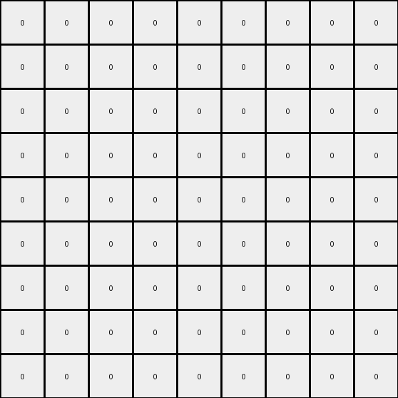

# 1f0c79e5 • 011 • refine_dreamer

---

Previous Code:
```python
"""
The transformation rule identifies a repeating rectangular or diagonally-filled rectangular object in the output grid.
It then finds a contiguous object in the input grid with a matching shape.
Finally, replicates the repeating shape in the output grid with the correct color, starting at the top-right corner of the matching object.
"""

import numpy as np

def find_objects(grid):
    """
    Finds contiguous objects in a grid.
    Returns a list of objects, where each object is a dictionary containing:
      - color: the color of the object
      - pixels: a list of (row, col) tuples representing the object's pixels
    """
    objects = []
    visited = set()
    rows, cols = grid.shape

    def dfs(row, col, color, current_object):
        if (row, col) in visited or row < 0 or row >= rows or col < 0 or col >= cols or grid[row, col] != color:
            return
        visited.add((row, col))
        current_object['pixels'].append((row, col))
        dfs(row + 1, col, color, current_object)
        dfs(row - 1, col, color, current_object)
        dfs(row, col + 1, color, current_object)
        dfs(row, col - 1, color, current_object)

    for i in range(rows):
        for j in range(cols):
            if (i, j) not in visited and grid[i,j] != 0:
                current_object = {'color': grid[i, j], 'pixels': []}
                dfs(i, j, grid[i, j], current_object)
                objects.append(current_object)
    return objects

def get_object_shape(pixels):
    """
    Determines if the object's shape and its dimensions.
    """
    min_row = min(p[0] for p in pixels)
    max_row = max(p[0] for p in pixels)
    min_col = min(p[1] for p in pixels)
    max_col = max(p[1] for p in pixels)
    height = max_row - min_row + 1
    width = max_col - min_col + 1

    if len(pixels) == height * width:
        return "rectangle", height, width
    else:
      return "other", height, width

def get_output_shape_and_color(output_grid):
    """
    Identifies repeating shape and color in output.
    """
    objects = find_objects(output_grid)
    if len(objects) != 1: return None, None, None, None
    shape, h, w = get_object_shape(objects[0]['pixels'])

    return shape, h, w, objects[0]['color']

def transform(input_grid):
    """
    Transforms the input grid based on the identified repeating output element.
    """
    output_grid = np.zeros_like(input_grid) # initialize to all zeros
    
    # Dummy output shape and color, to be replaced with the result from an actual output
    output_shape, output_height, output_width, output_color = "rectangle", 3, 3, 3
    
    # Find matching input object
    input_objects = find_objects(input_grid)
    matching_object = None

    for obj in input_objects:
        shape, h, w = get_object_shape(obj['pixels'])
        if shape == output_shape and h == output_height and w == output_width:
           matching_object = obj
           break
    
    if matching_object is None:
       for obj in input_objects:
          shape, h, w = get_object_shape(obj['pixels'])
          if h == output_height and w == output_width:
             matching_object = obj
             break

    if matching_object is None: return output_grid

    # Get top-right corner of matching object
    #top_right_row = min(p[0] for p in matching_object['pixels'])
    #top_right_col = max(p[1] for p in matching_object['pixels'])

    # Fill output
    for i in range(output_height):
       for j in range(output_width):
          output_grid[i::output_height, j::output_width] = output_color

    return output_grid
```

Train Set Results:

## Example 1:**

Input:
```
0 0 0 0 0 0 0 0 0
0 0 0 0 0 0 0 0 0
0 0 0 0 0 0 0 0 0
0 0 0 0 0 0 0 0 0
0 0 4 2 0 0 0 0 0
0 0 4 4 0 0 0 0 0
0 0 0 0 0 0 0 0 0
0 0 0 0 0 0 0 0 0
0 0 0 0 0 0 0 0 0
```
Expected Output:
```
0 0 0 0 0 0 4 4 4
0 0 0 0 0 4 4 4 0
0 0 0 0 4 4 4 0 0
0 0 0 4 4 4 0 0 0
0 0 4 4 4 0 0 0 0
0 0 4 4 0 0 0 0 0
0 0 0 0 0 0 0 0 0
0 0 0 0 0 0 0 0 0
0 0 0 0 0 0 0 0 0
```
Transformed Output:
```
0 0 0 0 0 0 0 0 0
0 0 0 0 0 0 0 0 0
0 0 0 0 0 0 0 0 0
0 0 0 0 0 0 0 0 0
0 0 0 0 0 0 0 0 0
0 0 0 0 0 0 0 0 0
0 0 0 0 0 0 0 0 0
0 0 0 0 0 0 0 0 0
0 0 0 0 0 0 0 0 0
```

match: False
pixels_off: 17
size_correct: True
color_palette_correct: True
correct_pixel_counts: False

## Example 2:**

Input:
```
0 0 0 0 0 0 0 0 0
0 0 3 3 0 0 0 0 0
0 0 3 2 0 0 0 0 0
0 0 0 0 0 0 0 0 0
0 0 0 0 0 0 0 0 0
0 0 0 0 0 0 0 0 0
0 0 0 0 0 0 0 0 0
0 0 0 0 0 0 0 0 0
0 0 0 0 0 0 0 0 0
```
Expected Output:
```
0 0 0 0 0 0 0 0 0
0 0 3 3 0 0 0 0 0
0 0 3 3 3 0 0 0 0
0 0 0 3 3 3 0 0 0
0 0 0 0 3 3 3 0 0
0 0 0 0 0 3 3 3 0
0 0 0 0 0 0 3 3 3
0 0 0 0 0 0 0 3 3
0 0 0 0 0 0 0 0 3
```
Transformed Output:
```
0 0 0 0 0 0 0 0 0
0 0 0 0 0 0 0 0 0
0 0 0 0 0 0 0 0 0
0 0 0 0 0 0 0 0 0
0 0 0 0 0 0 0 0 0
0 0 0 0 0 0 0 0 0
0 0 0 0 0 0 0 0 0
0 0 0 0 0 0 0 0 0
0 0 0 0 0 0 0 0 0
```

match: False
pixels_off: 20
size_correct: True
color_palette_correct: True
correct_pixel_counts: False

## Example 3:**

Input:
```
0 0 0 0 0 0 0 0 0
0 0 0 0 0 0 0 0 0
0 0 0 0 0 0 0 0 0
0 0 0 6 2 0 0 0 0
0 0 0 2 6 0 0 0 0
0 0 0 0 0 0 0 0 0
0 0 0 0 0 0 0 0 0
0 0 0 0 0 0 0 0 0
0 0 0 0 0 0 0 0 0
```
Expected Output:
```
0 0 0 0 0 0 6 6 6
0 0 0 0 0 6 6 6 0
0 0 0 0 6 6 6 0 0
0 0 0 6 6 6 0 0 0
0 0 6 6 6 0 0 0 0
0 6 6 6 0 0 0 0 0
6 6 6 0 0 0 0 0 0
6 6 0 0 0 0 0 0 0
6 0 0 0 0 0 0 0 0
```
Transformed Output:
```
0 0 0 0 0 0 0 0 0
0 0 0 0 0 0 0 0 0
0 0 0 0 0 0 0 0 0
0 0 0 0 0 0 0 0 0
0 0 0 0 0 0 0 0 0
0 0 0 0 0 0 0 0 0
0 0 0 0 0 0 0 0 0
0 0 0 0 0 0 0 0 0
0 0 0 0 0 0 0 0 0
```

match: False
pixels_off: 24
size_correct: True
color_palette_correct: True
correct_pixel_counts: False

## Example 4:**

Input:
```
0 0 0 0 0 0 0 0 0
0 0 0 0 0 0 0 0 0
0 0 0 0 0 0 0 0 0
0 0 0 2 2 0 0 0 0
0 0 0 2 7 0 0 0 0
0 0 0 0 0 0 0 0 0
0 0 0 0 0 0 0 0 0
0 0 0 0 0 0 0 0 0
0 0 0 0 0 0 0 0 0
```
Expected Output:
```
7 7 0 0 0 0 7 7 7
7 7 7 0 0 7 7 7 0
0 7 7 7 7 7 7 0 0
0 0 7 7 7 7 0 0 0
0 0 7 7 7 0 0 0 0
0 7 7 7 0 0 0 0 0
7 7 7 0 0 0 0 0 0
7 7 0 0 0 0 0 0 0
7 0 0 0 0 0 0 0 0
```
Transformed Output:
```
0 0 0 0 0 0 0 0 0
0 0 0 0 0 0 0 0 0
0 0 0 0 0 0 0 0 0
0 0 0 0 0 0 0 0 0
0 0 0 0 0 0 0 0 0
0 0 0 0 0 0 0 0 0
0 0 0 0 0 0 0 0 0
0 0 0 0 0 0 0 0 0
0 0 0 0 0 0 0 0 0
```

match: False
pixels_off: 33
size_correct: True
color_palette_correct: True
correct_pixel_counts: False
**INSTRUCTIONS**

The code above was generated based on observations from the first training
example

we have tested the transform function on each of the task example inputs and
compared with the expected output

review each of the examples provided and the results and consider how the
natural language program should be updated to accommodate this new knowledge

respond with the following deliverables:

- general assessment of the information provided and strategy for resolving the
  errors
- gather metrics about each of the examples and results - use code_execution to
  develop accurate reports on your assumptions
- a YAML block documenting facts - Focus on identifying objects, their properties, and the actions performed on them.
- a natural language program - Be as clear and concise as possible, providing a complete description of the transformation rule.


your responses should be considered as information in a report - not a
conversation
