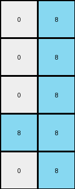
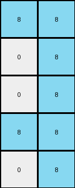
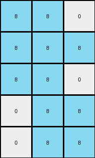
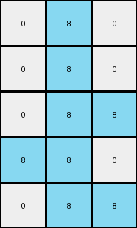

# 1b2d62fb • 005 • refine_dreamer

---


Previous Code:
```python
"""
1.  **Identify the longest vertical line of blue (1) pixels** in the input grid. Record its starting row, column index, and length.
2.  **Determine Output Grid Height:** The output grid has the same height as the length of the identified blue line.
3.  **Determine the Region and Output Grid Width:**
    - initialize the output grid width as 1.
    - iterate through each row within the length of the blue vertical line.
    - For each row:
        - If the pixel to the *left* of the blue pixel is 0, then add a column to the beginning of the output grid.
        - If the pixel to the *right* of the blue pixel is 0, then add a column to the end of the output grid.
4.  **Create and Populate output grid:** Create the correctly sized and shaped output grid filled with white (0).
    - Iterate through each row within the length of the blue vertical line.
    - For each row:
        - populate the central pixel with azure (8)
        - If the pixel to the *left* of the blue pixel is 0, populate the left pixel with azure (8)
        - If the pixel to the *right* of the blue pixel is 0, populate the right pixel with azure (8).
5.  **Return** the resulting output grid.
"""

import numpy as np

def find_vertical_line(grid, value):
    """Finds the longest vertical line of a specific value in a grid."""
    rows, cols = grid.shape
    max_len = 0
    start_row = -1
    col_index = -1

    for j in range(cols):
        current_len = 0
        current_start_row = -1
        for i in range(rows):
            if grid[i, j] == value:
                if current_len == 0:
                    current_start_row = i
                current_len += 1
            else:
                if current_len > max_len:
                    max_len = current_len
                    start_row = current_start_row
                    col_index = j
                current_len = 0
                current_start_row = -1
        # Check for line at the end of the column
        if current_len > max_len:
            max_len = current_len
            start_row = current_start_row
            col_index = j

    return start_row, col_index, max_len

def transform(input_grid):
    # Convert input to numpy array
    input_grid = np.array(input_grid)

    # 1. Find the longest vertical line of blue (1) pixels
    start_row, col_index, length = find_vertical_line(input_grid, 1)

    # 2. Determine Output Grid Height (same as the length of the blue line)
    output_height = length

    # 3. Determine Output Grid Width and Region
    output_width = 1
    left_offset = 0  # how many columns added to the left
    right_offset = 0 # how many columns added to the right
   
    for i in range(length):
      row = start_row + i
      # left
      if col_index > 0 and input_grid[row, col_index-1] == 0:
          left_offset = 1
      # right
      if col_index < input_grid.shape[1]-1 and input_grid[row, col_index + 1] == 0:
          right_offset = 1

    output_width = left_offset + output_width + right_offset

    # 4. Create and Populate output grid
    output_grid = np.zeros((output_height, output_width), dtype=int)

    for i in range(length):
        row_in_input = start_row + i
        
        # Central pixel (always azure)
        output_grid[i, left_offset] = 8

        # Check left neighbor
        if col_index > 0 and input_grid[row_in_input, col_index - 1] == 0:
            output_grid[i, 0] = 8

        # Check right neighbor
        if col_index < input_grid.shape[1] - 1 and input_grid[row_in_input, col_index + 1] == 0 :
            output_grid[i, output_width - 1] = 8

    # 5. Return the output grid
    return output_grid.tolist()
```

Train Set Results:

## Example 1:**

Input:
```
0 9 9 1 9 9 9
0 0 9 1 9 9 0
9 0 9 1 9 9 0
0 0 0 1 9 0 0
0 9 9 1 9 9 9
```
Expected Output:
```
0 0 0
0 0 0
0 0 0
0 8 8
0 0 0
```
Transformed Output:
```
0 8
0 8
0 8
8 8
0 8
```

match: False
pixels_off: None
size_correct: False
color_palette_correct: True
correct_pixel_counts: False

## Example 2:**

Input:
```
0 0 0 1 9 0 0
9 0 9 1 9 9 9
0 9 9 1 9 9 9
0 0 0 1 9 9 9
0 9 9 1 9 9 9
```
Expected Output:
```
0 8 8
0 0 0
0 0 0
0 0 0
0 0 0
```
Transformed Output:
```
8 8
0 8
0 8
8 8
0 8
```

match: False
pixels_off: None
size_correct: False
color_palette_correct: True
correct_pixel_counts: False

## Example 3:**

Input:
```
9 0 0 1 9 0 9
9 0 0 1 0 9 0
9 0 0 1 9 0 0
0 9 9 1 0 9 9
0 0 9 1 0 9 0
```
Expected Output:
```
0 8 0
0 0 8
0 8 8
8 0 0
8 0 0
```
Transformed Output:
```
8 8 0
8 8 8
8 8 0
0 8 8
0 8 8
```

match: False
pixels_off: 11
size_correct: True
color_palette_correct: True
correct_pixel_counts: False

## Example 4:**

Input:
```
0 9 9 1 9 0 9
9 0 0 1 9 0 0
9 9 9 1 9 9 9
0 9 0 1 0 0 0
9 0 0 1 9 0 0
```
Expected Output:
```
0 0 0
0 8 8
0 0 0
8 0 8
0 8 8
```
Transformed Output:
```
0 8 0
8 8 0
0 8 0
8 8 8
8 8 0
```

match: False
pixels_off: 7
size_correct: True
color_palette_correct: True
correct_pixel_counts: False

## Example 5:**

Input:
```
0 9 9 1 9 0 9
9 0 9 1 9 9 9
9 9 9 1 0 0 9
9 0 0 1 9 0 0
9 9 9 1 0 0 9
```
Expected Output:
```
0 0 0
0 0 0
0 0 0
0 8 8
0 0 0
```
Transformed Output:
```
0 8 0
0 8 0
0 8 8
8 8 0
0 8 8
```

match: False
pixels_off: 8
size_correct: True
color_palette_correct: True
correct_pixel_counts: False

**INSTRUCTIONS**

The code above was generated based on observations from the first training
example

we have tested the transform function on each of the task example inputs and
compared with the expected output

review each of the examples provided and the results and consider how the
natural language program should be updated to accommodate this new knowledge

respond with the following deliverables:

- general assessment of the information provided and strategy for resolving the
  errors
- gather metrics about each of the examples and results - use code_execution to
  develop accurate reports on your assumptions
- a YAML block documenting facts - Focus on identifying objects, their properties, and the actions performed on them.
- a natural language program - Be as clear and concise as possible, providing a complete description of the transformation rule.


your responses should be considered as information in a report - not a
conversation
