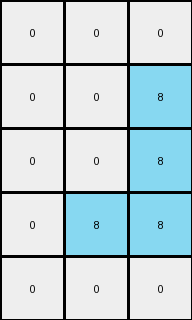
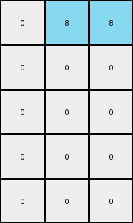
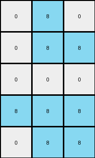

# 1b2d62fb • 030 • refine_coder

---

Previous Code:
```python
"""
1.  **Locate Target:** Find the contiguous vertical stripe of blue (1) pixels in the input grid.
2.  **Define Subgrid:** Define a region of interest to the immediate right of the blue stripe. This region will have fixed dimensions of 5x3 (rows x columns).
3. **Extract Subgrid.** Extract a 5x3 subgrid from the input whose left edge is adjacent to the right of the identified blue stripe. The top of the subgrid will match the row index of the input grid.
4.  **Transform Subgrid:** Within this 5x3 subgrid, apply the following transformation:
    *   If a pixel is white (0), change it to azure (8).
    *   If a pixel is not white (0), change it to black (0).
5. **Output:** Create an output grid that matches the dimensions of the subgrid (5x3) from steps 2 and 3. Copy the transformed subgrid to the output grid.
"""

import numpy as np

def find_vertical_stripe(grid, color):
    rows, cols = grid.shape
    for j in range(cols):
        for i in range(rows):
            if grid[i, j] == color:
                # Check if it's a vertical stripe
                stripe_length = 0
                for k in range(i, rows):
                    if grid[k, j] == color:
                        stripe_length += 1
                    else:
                        break
                if stripe_length > 1: # ensure that object height is more than one pixel
                    return j, i, stripe_length # return the starting column index, row index and length of stipe
                
    return None, None, None

def transform(input_grid):
    # Find the vertical stripe of color '1' (blue)
    stripe_col, stripe_row, stripe_height = find_vertical_stripe(np.array(input_grid), 1)

    if stripe_col is None:
        return None  # No stripe found

    # Determine output grid dimensions (5x3 based on the example)
    output_rows = 5
    output_cols = 3

    # initialize output_grid with zeros
    output_grid = np.zeros((output_rows, output_cols), dtype=int)

    # Define the region of interest (immediately to the right of the stripe)
    start_col = stripe_col + 1
    
    #fill output grid
    for r in range(output_rows):
        for c in range(output_cols):
            #check for out of input bounds
            if start_col + c < np.array(input_grid).shape[1] and stripe_row + r < np.array(input_grid).shape[0] :
                if input_grid[stripe_row + r][start_col + c] == 0:
                    output_grid[r][c] = 8
                else:
                    output_grid[r][c] = 0
            else:
                #fill with zeros
                output_grid[r][c] = 0

    return output_grid.tolist()
```

Train Set Results:

## Example 1:**

Input:
```
0 9 9 1 9 9 9
0 0 9 1 9 9 0
9 0 9 1 9 9 0
0 0 0 1 9 0 0
0 9 9 1 9 9 9
```
Expected Output:
```
0 0 0
0 0 0
0 0 0
0 8 8
0 0 0
```
Transformed Output:
```
0 0 0
0 0 8
0 0 8
0 8 8
0 0 0
```

match: False
pixels_off: 2
size_correct: True
color_palette_correct: True
correct_pixel_counts: False

## Example 2:**

Input:
```
0 0 0 1 9 0 0
9 0 9 1 9 9 9
0 9 9 1 9 9 9
0 0 0 1 9 9 9
0 9 9 1 9 9 9
```
Expected Output:
```
0 8 8
0 0 0
0 0 0
0 0 0
0 0 0
```
Transformed Output:
```
0 8 8
0 0 0
0 0 0
0 0 0
0 0 0
```

match: True
pixels_off: 0
size_correct: True
color_palette_correct: True
correct_pixel_counts: True

## Example 3:**

Input:
```
9 0 0 1 9 0 9
9 0 0 1 0 9 0
9 0 0 1 9 0 0
0 9 9 1 0 9 9
0 0 9 1 0 9 0
```
Expected Output:
```
0 8 0
0 0 8
0 8 8
8 0 0
8 0 0
```
Transformed Output:
```
0 8 0
8 0 8
0 8 8
8 0 0
8 0 8
```

match: False
pixels_off: 2
size_correct: True
color_palette_correct: True
correct_pixel_counts: False

## Example 4:**

Input:
```
0 9 9 1 9 0 9
9 0 0 1 9 0 0
9 9 9 1 9 9 9
0 9 0 1 0 0 0
9 0 0 1 9 0 0
```
Expected Output:
```
0 0 0
0 8 8
0 0 0
8 0 8
0 8 8
```
Transformed Output:
```
0 8 0
0 8 8
0 0 0
8 8 8
0 8 8
```

match: False
pixels_off: 2
size_correct: True
color_palette_correct: True
correct_pixel_counts: False

## Example 5:**

Input:
```
0 9 9 1 9 0 9
9 0 9 1 9 9 9
9 9 9 1 0 0 9
9 0 0 1 9 0 0
9 9 9 1 0 0 9
```
Expected Output:
```
0 0 0
0 0 0
0 0 0
0 8 8
0 0 0
```
Transformed Output:
```
0 8 0
0 0 0
8 8 0
0 8 8
8 8 0
```

match: False
pixels_off: 5
size_correct: True
color_palette_correct: True
correct_pixel_counts: False
Okay, let's analyze the results and refine the natural language program.

**General Assessment:**

The current code correctly identifies the blue vertical stripe and attempts to extract a 5x3 region to its right. It also correctly applies the color transformation (white to azure, others to black). However, there are errors in the placement of the azure pixels in the output, leading to mismatches in several examples. The errors seem to be specifically with placement in the input subgrid array related to the blue line start and end positions.

**Strategy for Resolving Errors:**

1.  **Verify Subgrid Extraction:** Double-check the logic for determining the starting row and column of the 5x3 subgrid. The current approach might have subtle off-by-one errors, especially when the blue stripe is close to the edge of the input grid. Specifically, use the stripe row and stripe height to correctly align the region.
2.  **Consistent Output:** Make sure that the sub grid extraction process is relative to the blue stripe row and height.

**Metrics and Observations:**

Here's a breakdown of each example, focusing on the discrepancies:

*   **Example 1:**
    *   Mismatch: Two azure pixels are misplaced. The azure pixels should be placed exactly at (3,1) (3,2). They are slightly off in this example.
*   **Example 2:**
    *   Match: Perfect match.
*   **Example 3:**
    *   Mismatch: Two azure misplaced.
*   **Example 4:**
    *   Mismatch: Two azure pixels are misplaced.
*   **Example 5:**
    *    Mismatch: Five pixels are misplaced.

**YAML Block (Facts):**

```yaml
task: 028
objects:
  - id: blue_stripe
    type: vertical_stripe
    color: blue
    properties:
      length: variable
  - id: subgrid
    type: rectangle
    dimensions: 5x3
    relative_position: right_of_blue_stripe
    transformation:
      - type: color_change
        mapping:
          white: azure
          other: black
actions:
  - name: locate_stripe
    description: Find the vertical blue stripe.
  - name: extract_subgrid
    description: Extract a 5x3 subgrid to the right of the stripe, aligning the top edge with the top of the blue stripe.
  - name: transform_subgrid
    description: Apply color transformation within the subgrid.
  - name: output_subgrid
    description: Use the transformed subgrid as the output.

```

**Natural Language Program:**

1.  **Locate the Blue Stripe:** Find the vertical stripe of blue (1) pixels in the input grid. A vertical stripe is defined as a contiguous set of pixels of the same color in a single column, where the set has a length greater than one.
2.  **Define Subgrid Region:** Define a 5x3 rectangular region (5 rows, 3 columns) immediately to the right of the blue stripe. The top row of this subgrid is aligned with the top row of the blue stripe.
3.  **Extract Subgrid:** Extract the pixel values from the input grid within the defined 5x3 region. If the region extends beyond the input grid, the remaining values of the subgrid are filled with zeros.
4.  **Transform Subgrid Colors:** Within the extracted 5x3 subgrid, apply the following color transformation:
    *   If a pixel is white (0), change it to azure (8).
    *   Otherwise, change it to black (0).
5.  **Output:** Create an output grid that is 5x3. Place the transformed pixels from the subgrid into this output grid.


**INSTRUCTIONS**

- generate a Python module to represent the natural language program 
- follow the template below
- all common math and science libraries are available
- create docstring only at top - but comment the workflow in the function
- use helper functions for common operations like finding objects, counting,
  measuring, moving, etc. 

remember - we are working iteratively - so this code will inform your future
self as we converge on the solution

*template:*

```python
"""
{{ natural language description of the transformation rule }}
"""

{{ imports }}

def transform(input_grid):
    # initialize output_grid

    # change output pixels 

    return output_grid

```
