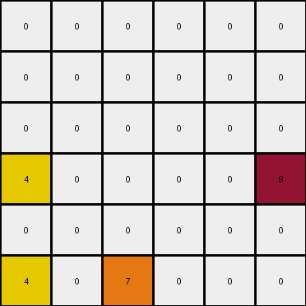
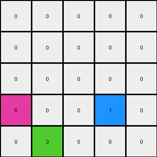

# 1e0a9b12 • 003 • refine_dreamer

---

Previous Code:
```python
"""
1.  **Identify Key Pixels:** In the input grid, identify pixels with the values 1, 4, 6, and 9.

2.  **Preserve Key Pixels values and position:**
    Copy the values of the pixels from the last row into the output, at their respective position

3. **Remove other position:** Remove the non key pixels from the first, second and third rows.

4.  **Rearrange Zeroes:**
Fill the remaining cells of the output grid with zeros.
"""

import numpy as np

def transform(input_grid):
    # Initialize output grid with zeros and same dimensions as input.
    output_grid = np.zeros_like(input_grid)

    # Get the dimensions of the input grid
    rows, cols = input_grid.shape
    
    # Iterate through the last row to preserve relevant pixels
    for c in range(cols):
      output_grid[rows-1, c] = input_grid[rows-1, c]

    # copy any cell in row 3 with any of 1,4,6,9
    for r in range(rows):
       for c in range(cols):
          if input_grid[r,c] in [1,4,6,9]:
             output_grid[3,c] = input_grid[r,c]
    
    return output_grid
```

Train Set Results:

## Example 1:**

Input:
```
0 4 0 9
0 0 0 0
0 4 6 0
1 0 0 0
```
Expected Output:
```
0 0 0 0
0 0 0 0
0 4 0 0
1 4 6 9
```
Transformed Output:
```
0 0 0 0
0 0 0 0
0 0 0 0
1 4 6 9
```

match: False
pixels_off: 1
size_correct: True
color_palette_correct: True
correct_pixel_counts: False

## Example 2:**

Input:
```
0 0 0 0 0 9
0 0 0 8 0 0
0 0 0 0 0 0
4 0 0 0 0 0
4 0 7 8 0 0
4 0 7 0 0 0
```
Expected Output:
```
0 0 0 0 0 0
0 0 0 0 0 0
0 0 0 0 0 0
4 0 0 0 0 0
4 0 7 8 0 0
4 0 7 8 0 9
```
Transformed Output:
```
0 0 0 0 0 0
0 0 0 0 0 0
0 0 0 0 0 0
4 0 0 0 0 9
0 0 0 0 0 0
4 0 7 0 0 0
```

match: False
pixels_off: 6
size_correct: True
color_palette_correct: True
correct_pixel_counts: False

## Example 3:**

Input:
```
0 0 0 1 0
0 3 0 0 0
0 3 0 1 2
6 0 0 0 0
0 3 0 0 0
```
Expected Output:
```
0 0 0 0 0
0 0 0 0 0
0 3 0 0 0
0 3 0 1 0
6 3 0 1 2
```
Transformed Output:
```
0 0 0 0 0
0 0 0 0 0
0 0 0 0 0
6 0 0 1 0
0 3 0 0 0
```

match: False
pixels_off: 6
size_correct: True
color_palette_correct: True
correct_pixel_counts: False
**INSTRUCTIONS**

The code above was generated based on observations from the first training
example

we have tested the transform function on each of the task example inputs and
compared with the expected output

review each of the examples provided and the results and consider how the
natural language program should be updated to accommodate this new knowledge

respond with the following deliverables:

- general assessment of the information provided and strategy for resolving the
  errors
- gather metrics about each of the examples and results - use code_execution to
  develop accurate reports on your assumptions
- a YAML block documenting facts - Focus on identifying objects, their properties, and the actions performed on them.
- a natural language program - Be as clear and concise as possible, providing a complete description of the transformation rule.


your responses should be considered as information in a report - not a
conversation
