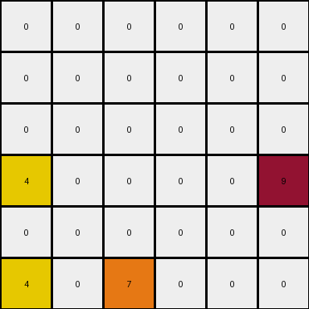
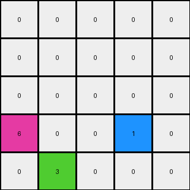

# 1e0a9b12 • 004 • refine_coder

---

Previous Code:
```python
"""
1.  **Identify Key Pixels:** In the input grid, identify pixels with the values 1, 4, 6, and 9.

2.  **Preserve Key Pixels values and position:**
    Copy the values of the pixels from the last row into the output, at their respective position

3. **Remove other position:** Remove the non key pixels from the first, second and third rows.

4.  **Rearrange Zeroes:**
Fill the remaining cells of the output grid with zeros.
"""

import numpy as np

def transform(input_grid):
    # Initialize output grid with zeros and same dimensions as input.
    output_grid = np.zeros_like(input_grid)

    # Get the dimensions of the input grid
    rows, cols = input_grid.shape
    
    # Iterate through the last row to preserve relevant pixels
    for c in range(cols):
      output_grid[rows-1, c] = input_grid[rows-1, c]

    # copy any cell in row 3 with any of 1,4,6,9
    for r in range(rows):
       for c in range(cols):
          if input_grid[r,c] in [1,4,6,9]:
             output_grid[3,c] = input_grid[r,c]
    
    return output_grid
```

Train Set Results:

## Example 1:**

Input:
```
0 4 0 9
0 0 0 0
0 4 6 0
1 0 0 0
```
Expected Output:
```
0 0 0 0
0 0 0 0
0 4 0 0
1 4 6 9
```
Transformed Output:
```
0 0 0 0
0 0 0 0
0 0 0 0
1 4 6 9
```

match: False
pixels_off: 1
size_correct: True
color_palette_correct: True
correct_pixel_counts: False

## Example 2:**

Input:
```
0 0 0 0 0 9
0 0 0 8 0 0
0 0 0 0 0 0
4 0 0 0 0 0
4 0 7 8 0 0
4 0 7 0 0 0
```
Expected Output:
```
0 0 0 0 0 0
0 0 0 0 0 0
0 0 0 0 0 0
4 0 0 0 0 0
4 0 7 8 0 0
4 0 7 8 0 9
```
Transformed Output:
```
0 0 0 0 0 0
0 0 0 0 0 0
0 0 0 0 0 0
4 0 0 0 0 9
0 0 0 0 0 0
4 0 7 0 0 0
```

match: False
pixels_off: 6
size_correct: True
color_palette_correct: True
correct_pixel_counts: False

## Example 3:**

Input:
```
0 0 0 1 0
0 3 0 0 0
0 3 0 1 2
6 0 0 0 0
0 3 0 0 0
```
Expected Output:
```
0 0 0 0 0
0 0 0 0 0
0 3 0 0 0
0 3 0 1 0
6 3 0 1 2
```
Transformed Output:
```
0 0 0 0 0
0 0 0 0 0
0 0 0 0 0
6 0 0 1 0
0 3 0 0 0
```

match: False
pixels_off: 6
size_correct: True
color_palette_correct: True
correct_pixel_counts: False
Here's an analysis of the provided examples and results, along with a strategy for refining the natural language program and code:

**General Assessment:**

The initial natural language program and the resulting code were too narrowly focused on the first training example. It correctly identified the importance of the last row and certain key colors (1, 4, 6, 9), but failed to generalize the rule to other rows and colors. The core issue is that the program doesn't capture the relationship between *all* non-zero pixels across the input and output, and their vertical position. Specifically, the current version of the program:

1. Only transfers the last row, irrespective of the contents.
2. Copies the value in row 3 to the output, *but* any other key values (1,4,6,9) also appear in the same column in row 3.
3. Fills the rest of the output with zeros.

The strategy to improve the natural language program will be:

1.  **Focus on all non-zero pixels:** Instead of focusing only on the last row and specific key colors, shift the focus to *all* non-zero pixels in the input grid.

2.  **Vertical Preservation:** Emphasize that non-zero pixel values are preserved *vertically* – their column index remains the same, but their row index might change.

3.  **Stacking:** Describe how non-zero pixels from the input "stack" at the bottom of the output grid, maintaining their relative vertical order.

**Example Metrics and Analysis:**

Here's a breakdown of each example, using the concepts above:

*   **Example 1:**
    *   Input non-zero pixels: (0,1):4, (0,3):9, (2,1):4, (2,2):6, (3,0):1
    *   Output non-zero pixels: (2, 1):4, (3,0):1, (3,1):4, (3,2):6, (3,3):9
    * The program partially captured this by getting the last row right but missed the movement of the 4 from (0,1) to (2,1).

*   **Example 2:**
    *   Input non-zero pixels: (0,5):9, (1,3):8, (3,0):4, (4,0):4, (4,2):7, (4,3):8, (5,0):4, (5,2):7
    *   Output non-zero pixels: (3,0):4, (4,0):4, (4,2):7, (4,3):8, (5,0):4, (5,2):7, (5,3):8, (5,5):9
    *   The program failed significantly here. It transferred the last row (4, 0, 7, 0, 0, 0), but got the positions mixed, did not account for other non-zero elements, and only placed 9 at (3,5)

*   **Example 3:**
    *    Input Non-Zero pixels: (0, 3): 1, (1, 1): 3, (2, 1): 3, (2, 3): 1, (2, 4): 2, (3, 0): 6, (4, 1): 3
    *    Output non-zero pixels: (2, 1): 3, (3, 1): 3, (3, 3): 1, (4, 0): 6, (4, 1): 3, (4, 3): 1, (4, 4): 2
    *   The program failed. Row 3 was copied, 6, 0, 0, 1, 0 and the last row 0, 3, 0, 0, 0, other non-zero pixels not considered.

**YAML Fact Block:**

```yaml
facts:
  - observation: Input and output grids have the same dimensions.
  - observation: Non-zero pixels in the input grid are preserved in the output grid.
  - observation: Non-zero pixels maintain their column index (x-coordinate).
  - observation: Non-zero pixels "stack" at the bottom of the output grid.
  - observation: The relative vertical order of non-zero pixels in a column is preserved.
  - observation: Zero pixels in the input are treated as empty space and are not explicitly preserved.
  - action: Iterate through each column of the input grid.
  - action: Collect all non-zero pixels within each column.
  - action: Place the collected non-zero pixels at the bottom of the corresponding column in the output grid, maintaining their order.
  - action: Fill any remaining cells at the top of each column in the output grid with zeros.
```

**Natural Language Program:**

1.  **Iterate:** Go through each column of the input grid one by one.
2.  **Collect:** For the current column, identify and collect all the non-zero pixels, noting their original row order.
3.  **Stack:** In the corresponding column of the output grid, place these collected non-zero pixels starting from the *bottom* row, going upwards. Maintain the original row order from the input.
4.  **Fill:** Fill any remaining empty cells at the top of the output column with zeros.
5.  **Repeat:** Repeat steps 2-4 for all columns in the input grid.

**INSTRUCTIONS**

- generate a Python module to represent the natural language program 
- follow the template below
- all common math and science libraries are available
- create docstring only at top - but comment the workflow in the function
- use helper functions for common operations like finding objects, counting,
  measuring, moving, etc. 

remember - we are working iteratively - so this code will inform your future
self as we converge on the solution

*template:*

```python
"""
{{ natural language description of the transformation rule }}
"""

{{ imports }}

def transform(input_grid):
    # initialize output_grid

    # change output pixels 

    return output_grid

```
