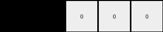

# 1fad071e • 003 • refine_dreamer

---


Previous Code:
```python
"""
1.  **Count Blue Objects:** Count the total number of blue (value '1') pixels present in the entire input grid.
2.  **Count White Objects at edges**: Count number of times a white pixel is at the edge (first row, last row, first column or last column)
3. **Construct Output:** Create an output grid of 1x5 dimension and the first two elements contain the two counts and fill the rest with zero.
"""

import numpy as np

def count_blue_pixels(grid):
    # Count the number of blue pixels (value 1) in the grid.
    return np.sum(grid == 1)

def count_white_pixels_at_edges(grid):
    # Count the number of white pixels (value 0) on the edges of the grid.
    rows, cols = grid.shape
    count = 0
    for i in range(cols):
        if grid[0, i] == 0:  # First row
            count += 1
        if rows > 1 and grid[rows - 1, i] == 0:  # Last row (if more than one row)
            count += 1
    for i in range(1,rows-1):
        if grid[i, 0] == 0:
            count += 1
        if cols > 1 and grid[i, cols-1] == 0:
            count += 1
    return count

def transform(input_grid):
    """
    Transforms the input grid according to the specified rules.
    """
    # Count blue pixels
    blue_count = count_blue_pixels(input_grid)

    # Count edge white pixels.
    white_count = count_white_pixels_at_edges(input_grid)

    # Initialize the output grid
    output_grid = np.zeros((1, 5), dtype=int)

    # fill in the blue count and edge white
    output_grid[0, 0] = blue_count
    output_grid[0, 1] = white_count

    return output_grid
```

Train Set Results:

## Example 1:**

Input:
```
0 0 0 0 2 2 0 0 1
0 1 1 0 2 2 0 0 0
0 1 1 0 0 0 0 2 2
0 0 0 0 0 0 0 2 2
1 0 2 2 0 0 0 0 0
0 0 2 2 0 1 1 0 0
0 0 0 0 0 1 1 0 0
0 0 0 0 0 0 0 0 0
0 1 0 0 0 0 0 0 1
```
Expected Output:
```
1 1 0 0 0
```
Transformed Output:
```
12 24 0 0 0
```

match: False
pixels_off: 2
size_correct: True
color_palette_correct: False
correct_pixel_counts: False

## Example 2:**

Input:
```
1 1 0 2 0 0 0 0 2
1 1 0 0 0 1 1 0 0
0 0 0 2 0 1 1 0 0
0 0 0 0 0 0 0 0 1
0 1 1 0 2 2 0 0 0
0 1 1 0 2 2 0 0 2
0 0 0 0 0 0 0 0 0
0 0 0 2 2 0 1 1 0
0 1 0 2 2 0 1 1 0
```
Expected Output:
```
1 1 1 1 0
```
Transformed Output:
```
18 20 0 0 0
```

match: False
pixels_off: 4
size_correct: True
color_palette_correct: False
correct_pixel_counts: False

## Example 3:**

Input:
```
2 2 0 1 1 0 0 0 0
2 2 0 1 1 0 0 1 1
1 0 0 0 0 0 0 1 1
0 2 2 0 0 0 0 0 0
0 2 2 0 1 1 0 1 0
0 0 0 0 1 1 0 0 0
0 0 0 0 2 0 0 0 0
0 1 1 0 0 0 0 2 2
0 1 1 0 0 1 0 2 2
```
Expected Output:
```
1 1 1 1 0
```
Transformed Output:
```
19 18 0 0 0
```

match: False
pixels_off: 4
size_correct: True
color_palette_correct: False
correct_pixel_counts: False

**INSTRUCTIONS**

The code above was generated based on observations from the first training
example

we have tested the transform function on each of the task example inputs and
compared with the expected output

review each of the examples provided and the results and consider how the
natural language program should be updated to accommodate this new knowledge

respond with the following deliverables:

- general assessment of the information provided and strategy for resolving the
  errors
- gather metrics about each of the examples and results - use code_execution to
  develop accurate reports on your assumptions
- a YAML block documenting facts - Focus on identifying objects, their properties, and the actions performed on them.
- a natural language program - Be as clear and concise as possible, providing a complete description of the transformation rule.


your responses should be considered as information in a report - not a
conversation
