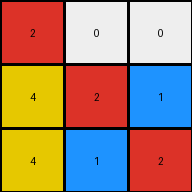

# 2dee498d • 003 • refine_dreamer

---

Previous Code:
```python
"""
The transformation extracts the top-left 3x3 subgrid from the input grid.  The output grid is always 3x3. The program takes the input grid, and creates a new grid, by copying the value from the cell to a corresponding output cell from [0,0] to [2,2].
"""

import numpy as np

def transform(input_grid):
    """
    Extracts the top-left 3x3 subgrid from the input grid.
    """
    # Initialize the output grid as a 3x3 array.
    output_grid = np.zeros((3, 3), dtype=int)

    # Iterate through the rows and columns of the output grid.
    for row in range(3):
        for col in range(3):
            # Copy the corresponding value from the input grid to the output grid.
            # Check if row and col are within the bounds of input_grid
            if row < input_grid.shape[0] and col < input_grid.shape[1]:
                output_grid[row, col] = input_grid[row, col]
            else:
                output_grid[row,col] = 0 # assign a default of white (0) if out of bounds
    return output_grid
```

Train Set Results:

## Example 1:**

Input:
```
4 5 1 1 5 4 4 5 1
5 5 5 5 5 5 5 5 5
1 5 4 4 5 1 1 5 4
```
Expected Output:
```
4 5 1
5 5 5
1 5 4
```
Transformed Output:
```
4 5 1
5 5 5
1 5 4
```

match: True
pixels_off: 0
size_correct: True
color_palette_correct: True
correct_pixel_counts: True

## Example 2:**

Input:
```
2 0 0 1 2 0 0 1 2 0 0 1
4 2 1 4 4 2 1 4 4 2 1 4
4 1 2 4 4 1 2 4 4 1 2 4
1 0 0 2 1 0 0 2 1 0 0 2
```
Expected Output:
```
2 0 0 1
4 2 1 4
4 1 2 4
1 0 0 2
```
Transformed Output:
```
2 0 0
4 2 1
4 1 2
```

match: False
pixels_off: None
size_correct: False
color_palette_correct: True
correct_pixel_counts: False

## Example 3:**

Input:
```
2 1 2 1 2 1
2 3 2 3 2 3
```
Expected Output:
```
2 1
2 3
```
Transformed Output:
```
2 1 2
2 3 2
0 0 0
```

match: False
pixels_off: None
size_correct: False
color_palette_correct: False
correct_pixel_counts: False
**INSTRUCTIONS**

The code above was generated based on observations from the first training
example

we have tested the transform function on each of the task example inputs and
compared with the expected output

review each of the examples provided and the results and consider how the
natural language program should be updated to accommodate this new knowledge

respond with the following deliverables:

- general assessment of the information provided and strategy for resolving the
  errors
- gather metrics about each of the examples and results - use code_execution to
  develop accurate reports on your assumptions
- a YAML block documenting facts - Focus on identifying objects, their properties, and the actions performed on them.
- a natural language program - Be as clear and concise as possible, providing a complete description of the transformation rule.


your responses should be considered as information in a report - not a
conversation
