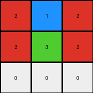

# 2dee498d • 004 • refine_coder

---

Previous Code:
```python
"""
The transformation extracts the top-left 3x3 subgrid from the input grid.  The output grid is always 3x3. The program takes the input grid, and creates a new grid, by copying the value from the cell to a corresponding output cell from [0,0] to [2,2].
"""

import numpy as np

def transform(input_grid):
    """
    Extracts the top-left 3x3 subgrid from the input grid.
    """
    # Initialize the output grid as a 3x3 array.
    output_grid = np.zeros((3, 3), dtype=int)

    # Iterate through the rows and columns of the output grid.
    for row in range(3):
        for col in range(3):
            # Copy the corresponding value from the input grid to the output grid.
            # Check if row and col are within the bounds of input_grid
            if row < input_grid.shape[0] and col < input_grid.shape[1]:
                output_grid[row, col] = input_grid[row, col]
            else:
                output_grid[row,col] = 0 # assign a default of white (0) if out of bounds
    return output_grid
```

Train Set Results:

## Example 1:**

Input:
```
4 5 1 1 5 4 4 5 1
5 5 5 5 5 5 5 5 5
1 5 4 4 5 1 1 5 4
```
Expected Output:
```
4 5 1
5 5 5
1 5 4
```
Transformed Output:
```
4 5 1
5 5 5
1 5 4
```

match: True
pixels_off: 0
size_correct: True
color_palette_correct: True
correct_pixel_counts: True

## Example 2:**

Input:
```
2 0 0 1 2 0 0 1 2 0 0 1
4 2 1 4 4 2 1 4 4 2 1 4
4 1 2 4 4 1 2 4 4 1 2 4
1 0 0 2 1 0 0 2 1 0 0 2
```
Expected Output:
```
2 0 0 1
4 2 1 4
4 1 2 4
1 0 0 2
```
Transformed Output:
```
2 0 0
4 2 1
4 1 2
```

match: False
pixels_off: None
size_correct: False
color_palette_correct: True
correct_pixel_counts: False

## Example 3:**

Input:
```
2 1 2 1 2 1
2 3 2 3 2 3
```
Expected Output:
```
2 1
2 3
```
Transformed Output:
```
2 1 2
2 3 2
0 0 0
```

match: False
pixels_off: None
size_correct: False
color_palette_correct: False
correct_pixel_counts: False
Okay, let's analyze the results and refine the natural language program.

**General Assessment:**

The initial natural language program and the generated code were too specific to the first example. The code correctly extracts a 3x3 subgrid, which worked for the first example. However, the subsequent examples reveal that the output grid's dimensions are not always 3x3, but rather depend on and match the input grid's dimensions, up to a maximum of 3x3. If an input dimension is smaller than 3, the output dimension should be the same size, rather than padding to 3x3 with 0. The second and third examples shows the height should simply match.

**Strategy:**

1.  **Analyze Metrics:** I'll use the provided results, and potentially create a new python program, to check properties.
2.  **Refine Observations:** Update the YAML facts to capture the relationship between input and output dimensions.
3.  **Rewrite Natural Language Program:** Rephrase the natural language program to accurately describe the subgrid extraction, accounting for dimension matching. The rule should clarify that we're taking the *top-left* portion of the input, and dimensions are not fixed to 3x3.

**Metrics and Observations from provided results:**

*   **Example 1:**
    *   Input Size: 3x9
    *   Expected Output Size: 3x3
    *   Transformed Output Size: 3x3
    *   Match: True
    *   Notes: This example worked as expected because the input dimensions were greater or equal to than 3x3.

*   **Example 2:**
    *   Input Size: 4x12
    *   Expected Output Size: 4x4
    *   Transformed Output Size: 3x3
    *   Match: False
    *   Notes: output should have matched input height and width

*   **Example 3:**
    *   Input Size: 2x6
    *   Expected Output Size: 2x2
    *   Transformed Output Size: 3x3
    *   Match: False
    *   Notes: Output height and width should be capped to the height and with of the original.

**YAML Facts:**

```yaml
observations:
  - object: input_grid
    type: grid
    properties:
      - dimensions: variable
      - values: integers (0-9) representing colors
  - object: output_grid
    type: grid
    properties:
      - dimensions: minimum of (3, input_row_count) x minimum of (3, input_column_count)
      - values: copied from corresponding positions in input_grid, starting at [0,0]
  - action: copy
    description: Values from the input_grid are copied to the output_grid.
    constraints:
      - The copied region starts at the top-left corner (0, 0) of the input_grid.
      - output row count = min(3, input row count).
      - output column count = min(3, input column count).

```

**Natural Language Program:**

The transformation extracts the top-left subgrid from the input grid. The output grid's dimensions are determined by taking the minimum of the input grid's dimensions and 3. Specifically, the output grid's number of rows is the minimum of 3 and the number of rows in the input grid. Similarly, the output grid's number of columns is the minimum of 3 and the number of columns in the input grid. The values in the output grid are copied from the corresponding positions in the input grid, starting at position \[0, 0]. If the input grid has less than 3 rows or columns, the smaller of the dimensions is applied.

Revised Program:

1.  Get the dimensions (row count, column count) of the input grid.
2.  Determine the output grid's dimensions:
    *   Output row count = min(3, input row count).
    *   Output column count = min(3, input column count).
3. Create an output_grid
4.  Iterate from \[0,0] to the output grid dimensions and copy the contents
from input to output.


**INSTRUCTIONS**

- generate a Python module to represent the natural language program 
- follow the template below
- all common math and science libraries are available
- create docstring only at top - but comment the workflow in the function
- use helper functions for common operations like finding objects, counting,
  measuring, moving, etc. 

remember - we are working iteratively - so this code will inform your future
self as we converge on the solution

*template:*

```python
"""
{{ natural language description of the transformation rule }}
"""

{{ imports }}

def transform(input_grid):
    # initialize output_grid

    # change output pixels 

    return output_grid

```
