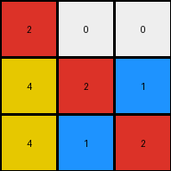

# 2dee498d • 005 • refine_dreamer

---


Previous Code:
```python
"""
The transformation extracts the top-left subgrid from the input grid. The output grid's dimensions are determined by taking the minimum of the input grid's dimensions and 3. Specifically, the output grid's number of rows is the minimum of 3 and the number of rows in the input grid. Similarly, the output grid's number of columns is the minimum of 3 and the number of columns in the input grid. The values in the output grid are copied from the corresponding positions in the input grid, starting at position [0, 0]. If the input grid has less than 3 rows or columns, the smaller of the dimensions is applied.
"""

import numpy as np

def transform(input_grid):
    """
    Extracts the top-left subgrid, with dimensions capped at 3x3.
    """
    # Get input grid dimensions.
    input_rows, input_cols = input_grid.shape

    # Determine output grid dimensions.
    output_rows = min(3, input_rows)
    output_cols = min(3, input_cols)

    # Initialize the output grid.
    output_grid = np.zeros((output_rows, output_cols), dtype=int)

    # Copy values from the input grid to the output grid.
    for row in range(output_rows):
        for col in range(output_cols):
            output_grid[row, col] = input_grid[row, col]

    return output_grid
```

Train Set Results:

## Example 1:**

Input:
```
4 5 1 1 5 4 4 5 1
5 5 5 5 5 5 5 5 5
1 5 4 4 5 1 1 5 4
```
Expected Output:
```
4 5 1
5 5 5
1 5 4
```
Transformed Output:
```
4 5 1
5 5 5
1 5 4
```

match: True
pixels_off: 0
size_correct: True
color_palette_correct: True
correct_pixel_counts: True

## Example 2:**

Input:
```
2 0 0 1 2 0 0 1 2 0 0 1
4 2 1 4 4 2 1 4 4 2 1 4
4 1 2 4 4 1 2 4 4 1 2 4
1 0 0 2 1 0 0 2 1 0 0 2
```
Expected Output:
```
2 0 0 1
4 2 1 4
4 1 2 4
1 0 0 2
```
Transformed Output:
```
2 0 0
4 2 1
4 1 2
```

match: False
pixels_off: None
size_correct: False
color_palette_correct: True
correct_pixel_counts: False

## Example 3:**

Input:
```
2 1 2 1 2 1
2 3 2 3 2 3
```
Expected Output:
```
2 1
2 3
```
Transformed Output:
```
2 1 2
2 3 2
```

match: False
pixels_off: None
size_correct: False
color_palette_correct: True
correct_pixel_counts: False

**INSTRUCTIONS**

The code above was generated based on observations from the first training
example

we have tested the transform function on each of the task example inputs and
compared with the expected output

review each of the examples provided and the results and consider how the
natural language program should be updated to accommodate this new knowledge

respond with the following deliverables:

- general assessment of the information provided and strategy for resolving the
  errors
- gather metrics about each of the examples and results - use code_execution to
  develop accurate reports on your assumptions
- a YAML block documenting facts - Focus on identifying objects, their properties, and the actions performed on them.
- a natural language program - Be as clear and concise as possible, providing a complete description of the transformation rule.


your responses should be considered as information in a report - not a
conversation
