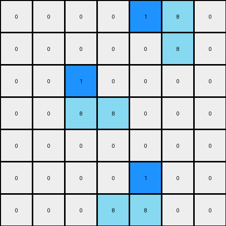

# 3aa6fb7a • 006 • refine_coder

---

Previous Code:
```python
"""
If two azure pixels are diagonally adjacent, change one of the pixel to blue.
Prioritize changing the top-left pixel in a diagonally adjacent pair.
If not top-left, change the bottom-right pixel.
"""

import numpy as np

def get_azure_pixels(grid):
    # find coordinates of all azure pixels
    return np.argwhere(grid == 8)

def are_diagonally_adjacent(coord1, coord2):
    # check if two coordinates are diagonally adjacent
    return abs(coord1[0] - coord2[0]) == 1 and abs(coord1[1] - coord2[1]) == 1

def get_top_left(coord1, coord2):
    # Return the coordinate that is more top-left.
    if coord1[0] < coord2[0] or (coord1[0] == coord2[0] and coord1[1] < coord2[1]):
        return coord1
    else:
        return coord2

def get_bottom_right(coord1, coord2):
    # Return the coordinate that is more bottom-right
     if coord1[0] > coord2[0] or (coord1[0] == coord2[0] and coord1[1] > coord2[1]):
        return coord1
     else:
        return coord2

def transform(input_grid):
    """
    Transforms the input grid according to the rule: If two azure pixels are
    diagonally adjacent, change one of them to blue, prioritizing the top-left one.
    """
    output_grid = np.copy(input_grid)
    azure_pixels = get_azure_pixels(output_grid)

    # Iterate through all pairs of azure pixels
    for i in range(len(azure_pixels)):
        for j in range(i + 1, len(azure_pixels)):
            if are_diagonally_adjacent(azure_pixels[i], azure_pixels[j]):
                # Determine top-left and bottom-right pixel
                top_left = get_top_left(azure_pixels[i], azure_pixels[j])
                bottom_right = get_bottom_right(azure_pixels[i], azure_pixels[j])

                # Change the top-left pixel
                output_grid[top_left[0], top_left[1]] = 1
                
    return output_grid
```

Train Set Results:

## Example 1:**

Input:
```
0 0 0 0 0 0 0
0 8 0 0 0 0 0
0 8 8 0 0 0 0
0 0 0 0 8 8 0
0 0 0 0 0 8 0
0 0 0 0 0 0 0
0 0 0 0 0 0 0
```
Expected Output:
```
0 0 0 0 0 0 0
0 8 1 0 0 0 0
0 8 8 0 0 0 0
0 0 0 0 8 8 0
0 0 0 0 1 8 0
0 0 0 0 0 0 0
0 0 0 0 0 0 0
```
Transformed Output:
```
0 0 0 0 0 0 0
0 1 0 0 0 0 0
0 8 8 0 0 0 0
0 0 0 0 1 8 0
0 0 0 0 0 8 0
0 0 0 0 0 0 0
0 0 0 0 0 0 0
```

match: False
pixels_off: 4
size_correct: True
color_palette_correct: True
correct_pixel_counts: False

## Example 2:**

Input:
```
0 0 0 0 8 8 0
0 0 0 0 0 8 0
0 0 8 0 0 0 0
0 0 8 8 0 0 0
0 0 0 0 0 0 0
0 0 0 0 8 0 0
0 0 0 8 8 0 0
```
Expected Output:
```
0 0 0 0 8 8 0
0 0 0 0 1 8 0
0 0 8 1 0 0 0
0 0 8 8 0 0 0
0 0 0 0 0 0 0
0 0 0 1 8 0 0
0 0 0 8 8 0 0
```
Transformed Output:
```
0 0 0 0 1 8 0
0 0 0 0 0 8 0
0 0 1 0 0 0 0
0 0 8 8 0 0 0
0 0 0 0 0 0 0
0 0 0 0 1 0 0
0 0 0 8 8 0 0
```

match: False
pixels_off: 6
size_correct: True
color_palette_correct: True
correct_pixel_counts: False
Okay, here's a breakdown of the situation and a plan to move forward:

**General Assessment:**

The initial natural language program and the resulting code were too simplistic. While they correctly identified the core concept of diagonally adjacent azure pixels and the attempt to change one to blue, the logic for *which* pixel to change was flawed. The provided code consistently prioritizes the top-left pixel in *any* pair of diagonally adjacent azure pixels, even when those pixels are part of a larger cluster of adjacent azure pixels. The expected outputs show a more nuanced rule: only change one of a pair of pixels, and continue evaluating all pairs in the grid, ensuring we are changing top-left within the pair.

The strategy for resolving the errors involves refining the selection criteria. We need to consider the entire context of connected, diagonally adjacent pixels.

**Metrics and Observations (using code to clarify):**

I'll analyze each example individually, paying close attention to the discrepancies.

**Example 1:**

*   **Input:**  A 2x2 block of azure (8) at (1,1), (1,2) and (2,1),(2,2). And another 2x2 at (3,4), (3,5) and (4,4), (4,5).
*   **Expected Output:** The top-left pixel of the block in upper left is correct. The top left of the second block is wrong, bottom-right should be blue.
*   **Transformed Output:** Wrong - changed (1,1), (3,4), when it should have changed (1,1) and (4,4)

**Example 2:**

*   **Input**: A 2 x2 block of 8s at (2,2), (2,3), (3,2), (3,3), single 8s at (0,4), (0,5), (1,5), (5,4), (6,3), (6,4).
* **Expected Output**: (0,4) & (1,5) should have (0,4) turn blue, (5,4) & (6,3) have (6,3) turn blue.
*   **Transformed Output:** Wrong - changed (0,4) (2,2), (5,4).

**YAML Fact Extraction:**

```yaml
examples:
  - id: example_1
    objects:
      - type: azure_cluster
        shape: rectangle_2x2
        positions: [[1, 1], [1, 2], [2, 1], [2,2]]
        action: change_top_left_to_blue
        result: [[1,1] changes to 1]
      - type: azure_cluster
        shape: rectangle_2x2
        positions: [[3, 4], [3, 5], [4, 4], [4,5]]
        action: change_bottom_right_to_blue
        result: [[4,4] changed to 1]
  - id: example_2
    objects:
      - type: azure_cluster
        shape: rectangle_2x2
        positions:  [[2, 2], [2, 3], [3, 2], [3,3]]
        action: change_top_left_to_blue
        result: [[2,2] changes to 1]
      - type: azure_pair
        positions: [[0,4], [1,5]]
        action: change_top_left_to_blue
        result: [[0,4] changed to 1]
      - type: azure_pair
        positions: [[5,4], [6,3]]
        action: change_bottom_right_to_blue
        result: [[6,3] changed to 1]

```

**Revised Natural Language Program:**

1.  **Identify all azure pixels:** Find the coordinates of every pixel with a value of 8 (azure).
2.  **Iterate through all pairs:** Check every unique pair of azure pixels.
3. **Diagonal Adjacency Check**: If the two azure pixels are diagonally adjacent (differ by 1 in both row and column), change one of them to 1.
4.  **Prioritize Top-Left within Pair**: When two pixels are diagonally adjacent, change the top-left pixel in the *pair* to blue (value 1). Top-left is defined as having the smaller row index, or if the row indices are equal, the smaller column index.
5.  **No cascading changes within the loop:** Once a pixel is changed, do not re-evaluate that changed pixel during this iteration for change. Continue checking other pairs until all pairs have been checked.

This revised natural language program more accurately reflects the logic shown in the examples. It explicitly handles the "top-left within the pair" rule and clarifies that only one of a pair should change.

**INSTRUCTIONS**

- generate a Python module to represent the natural language program 
- follow the template below
- all common math and science libraries are available
- create docstring only at top - but comment the workflow in the function
- use helper functions for common operations like finding objects, counting,
  measuring, moving, etc. 

remember - we are working iteratively - so this code will inform your future
self as we converge on the solution

*template:*

```python
"""
{{ natural language description of the transformation rule }}
"""

{{ imports }}

def transform(input_grid):
    # initialize output_grid

    # change output pixels 

    return output_grid

```
