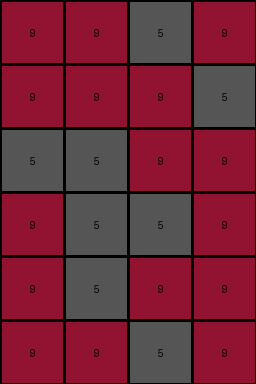

# 4c4377d9 • 003 • refine_dreamer

---

Previous Code:
```python
"""
The input grid is duplicated and stacked vertically with a one-column rightward shift in the position of the colored pixels in the even rows.
"""

import numpy as np

def transform(input_grid):
    # Initialize the output grid with double the height of the input grid and the same width.
    output_grid = np.zeros((input_grid.shape[0] * 2, input_grid.shape[1]), dtype=int)

    # Iterate through the rows of the input grid.
    for i in range(input_grid.shape[0]):
        # Copy each row from the input grid to the output grid, to rows 2i and 2i+1.
        output_grid[i*2] = input_grid[i]
        output_grid[(i*2)+1] = input_grid[i]

        #shift values
        row = output_grid[(i*2)+1]
        shifted_row = np.array(row)  # Create a copy to modify

        # Find indices of values that are not 9 and 5 in the original row
        val_indices = np.where((row != 9) & (row !=5))[0]

        # set values to shift
        for val_index in val_indices:
            shifted_row[val_index] = row[val_index]


        # Find indices of 9s and 5s
        indices_9 = np.where(row == 9)[0]
        indices_5 = np.where(row == 5)[0]

        # Shift indices to right
        shifted_indices_9 = (indices_9 + 1) % row.shape[0]
        shifted_indices_5 = (indices_5 + 1) % row.shape[0]

        #reset original positions
        shifted_row[indices_9] = 0
        shifted_row[indices_5] = 0


        # Apply the shift by assigning values to the new positions
        shifted_row[shifted_indices_9] = 9
        shifted_row[shifted_indices_5] = 5


        output_grid[(i*2)+1] = shifted_row
        

    return output_grid
```

Train Set Results:

## Example 1:**

Input:
```
9 9 5 9
5 5 9 9
9 5 9 9
```
Expected Output:
```
9 5 9 9
5 5 9 9
9 9 5 9
9 9 5 9
5 5 9 9
9 5 9 9
```
Transformed Output:
```
9 9 5 9
9 9 9 5
5 5 9 9
9 5 5 9
9 5 9 9
9 9 5 9
```

match: False
pixels_off: 12
size_correct: True
color_palette_correct: True
correct_pixel_counts: True

## Example 2:**

Input:
```
4 1 1 4
1 1 1 1
4 4 4 1
```
Expected Output:
```
4 4 4 1
1 1 1 1
4 1 1 4
4 1 1 4
1 1 1 1
4 4 4 1
```
Transformed Output:
```
4 1 1 4
4 1 1 4
1 1 1 1
1 1 1 1
4 4 4 1
4 4 4 1
```

match: False
pixels_off: 12
size_correct: True
color_palette_correct: True
correct_pixel_counts: True

## Example 3:**

Input:
```
9 4 9 4
9 9 4 4
4 4 4 4
```
Expected Output:
```
4 4 4 4
9 9 4 4
9 4 9 4
9 4 9 4
9 9 4 4
4 4 4 4
```
Transformed Output:
```
9 4 9 4
0 9 0 9
9 9 4 4
0 9 9 4
4 4 4 4
4 4 4 4
```

match: False
pixels_off: 11
size_correct: True
color_palette_correct: False
correct_pixel_counts: False

## Example 4:**

Input:
```
3 3 5 5
3 5 5 3
5 5 3 3
```
Expected Output:
```
5 5 3 3
3 5 5 3
3 3 5 5
3 3 5 5
3 5 5 3
5 5 3 3
```
Transformed Output:
```
3 3 5 5
5 3 0 5
3 5 5 3
3 0 5 5
5 5 3 3
0 5 5 3
```

match: False
pixels_off: 15
size_correct: True
color_palette_correct: False
correct_pixel_counts: False
**INSTRUCTIONS**

The code above was generated based on observations from the first training
example

we have tested the transform function on each of the task example inputs and
compared with the expected output

review each of the examples provided and the results and consider how the
natural language program should be updated to accommodate this new knowledge

respond with the following deliverables:

- general assessment of the information provided and strategy for resolving the
  errors
- gather metrics about each of the examples and results - use code_execution to
  develop accurate reports on your assumptions
- a YAML block documenting facts - Focus on identifying objects, their properties, and the actions performed on them.
- a natural language program - Be as clear and concise as possible, providing a complete description of the transformation rule.


your responses should be considered as information in a report - not a
conversation
