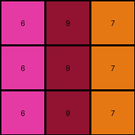

# 0d3d703e • 003 • refine_dreamer

---

Previous Code:
```python
"""
The program takes a 3x3 input grid of digits and transforms it into a 3x3 output grid. For each cell in the input grid, increment the digit value by 1. The resulting value is placed in the corresponding cell of the output grid. The dimensions and arrangement of cells is unchanged.
"""

import numpy as np

def transform(input_grid):
    # Initialize output_grid as a copy of the input_grid.  We use numpy for easier manipulation.
    output_grid = np.array(input_grid).copy()

    # Iterate through each cell of the output_grid.
    for row_index in range(output_grid.shape[0]):
        for col_index in range(output_grid.shape[1]):
            # Increment the value of the cell by 1.
            output_grid[row_index, col_index] += 1

    return output_grid.tolist()
```

Train Set Results:

## Example 1:**

Input:
```
3 1 2
3 1 2
3 1 2
```
Expected Output:
```
4 5 6
4 5 6
4 5 6
```
Transformed Output:
```
4 2 3
4 2 3
4 2 3
```

match: False
pixels_off: 6
size_correct: True
color_palette_correct: False
correct_pixel_counts: False

## Example 2:**

Input:
```
2 3 8
2 3 8
2 3 8
```
Expected Output:
```
6 4 9
6 4 9
6 4 9
```
Transformed Output:
```
3 4 9
3 4 9
3 4 9
```

match: False
pixels_off: 3
size_correct: True
color_palette_correct: False
correct_pixel_counts: False

## Example 3:**

Input:
```
5 8 6
5 8 6
5 8 6
```
Expected Output:
```
1 9 2
1 9 2
1 9 2
```
Transformed Output:
```
6 9 7
6 9 7
6 9 7
```

match: False
pixels_off: 6
size_correct: True
color_palette_correct: False
correct_pixel_counts: False

## Example 4:**

Input:
```
9 4 2
9 4 2
9 4 2
```
Expected Output:
```
8 3 6
8 3 6
8 3 6
```
Transformed Output:
```
10 5 3
10 5 3
10 5 3
```

match: False
pixels_off: 9
size_correct: True
color_palette_correct: False
correct_pixel_counts: False
**INSTRUCTIONS**

The code above was generated based on observations from the first training
example

we have tested the transform function on each of the task example inputs and
compared with the expected output

review each of the examples provided and the results and consider how the
natural language program should be updated to accommodate this new knowledge

respond with the following deliverables:

- general assessment of the information provided and strategy for resolving the
  errors
- gather metrics about each of the examples and results - use code_execution to
  develop accurate reports on your assumptions
- a YAML block documenting facts - Focus on identifying objects, their properties, and the actions performed on them.
- a natural language program - Be as clear and concise as possible, providing a complete description of the transformation rule.


your responses should be considered as information in a report - not a
conversation
