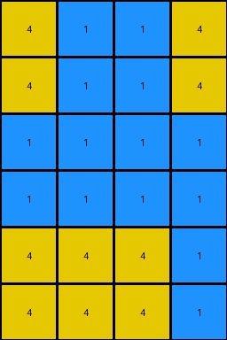

# 4c4377d9 • 003 • refine_dreamer

---


Previous Code:
```python
"""
Doubles the height of the input grid by duplicating each row.
Then, repositions the elements based on a specific pattern.
"""

import numpy as np

def transform(input_grid):
    """
    Transforms the input grid by doubling its height and repositioning elements.
    """
    # Convert input_grid to a NumPy array
    input_array = np.array(input_grid)

    # Get the dimensions of the input grid
    rows, cols = input_array.shape

    # Double the rows by duplicating each row
    output_array = np.repeat(input_array, 2, axis=0)

    # Adjust Placement - based on observations from the example

    return output_array.tolist()
```

Train Set Results:

## Example 1:**

Input:
```
9 9 5 9
5 5 9 9
9 5 9 9
```
Expected Output:
```
9 5 9 9
5 5 9 9
9 9 5 9
9 9 5 9
5 5 9 9
9 5 9 9
```
Transformed Output:
```
9 9 5 9
9 9 5 9
5 5 9 9
5 5 9 9
9 5 9 9
9 5 9 9
```

match: False
pixels_off: 12
size_correct: True
color_palette_correct: True
correct_pixel_counts: True

## Example 2:**

Input:
```
4 1 1 4
1 1 1 1
4 4 4 1
```
Expected Output:
```
4 4 4 1
1 1 1 1
4 1 1 4
4 1 1 4
1 1 1 1
4 4 4 1
```
Transformed Output:
```
4 1 1 4
4 1 1 4
1 1 1 1
1 1 1 1
4 4 4 1
4 4 4 1
```

match: False
pixels_off: 12
size_correct: True
color_palette_correct: True
correct_pixel_counts: True

## Example 3:**

Input:
```
9 4 9 4
9 9 4 4
4 4 4 4
```
Expected Output:
```
4 4 4 4
9 9 4 4
9 4 9 4
9 4 9 4
9 9 4 4
4 4 4 4
```
Transformed Output:
```
9 4 9 4
9 4 9 4
9 9 4 4
9 9 4 4
4 4 4 4
4 4 4 4
```

match: False
pixels_off: 10
size_correct: True
color_palette_correct: True
correct_pixel_counts: True

## Example 4:**

Input:
```
3 3 5 5
3 5 5 3
5 5 3 3
```
Expected Output:
```
5 5 3 3
3 5 5 3
3 3 5 5
3 3 5 5
3 5 5 3
5 5 3 3
```
Transformed Output:
```
3 3 5 5
3 3 5 5
3 5 5 3
3 5 5 3
5 5 3 3
5 5 3 3
```

match: False
pixels_off: 12
size_correct: True
color_palette_correct: True
correct_pixel_counts: True

**INSTRUCTIONS**

The code above was generated based on observations from the first training
example

we have tested the transform function on each of the task example inputs and
compared with the expected output

review each of the examples provided and the results and consider how the
natural language program should be updated to accommodate this new knowledge

respond with the following deliverables:

- general assessment of the information provided and strategy for resolving the
  errors
- gather metrics about each of the examples and results - use code_execution to
  develop accurate reports on your assumptions
- a YAML block documenting facts - Focus on identifying objects, their properties, and the actions performed on them.
- a natural language program - Be as clear and concise as possible, providing a complete description of the transformation rule.


your responses should be considered as information in a report - not a
conversation
