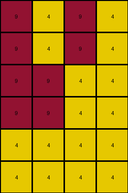
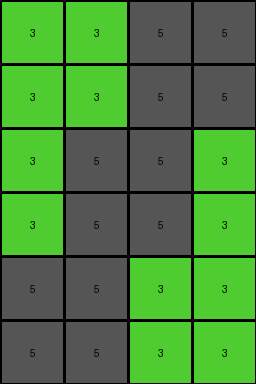

# 4c4377d9 • 004 • refine_coder

---

Previous Code:
```python
"""
Doubles the height of the input grid by duplicating each row.
Then, repositions the elements based on a specific pattern.
"""

import numpy as np

def transform(input_grid):
    """
    Transforms the input grid by doubling its height and repositioning elements.
    """
    # Convert input_grid to a NumPy array
    input_array = np.array(input_grid)

    # Get the dimensions of the input grid
    rows, cols = input_array.shape

    # Double the rows by duplicating each row
    output_array = np.repeat(input_array, 2, axis=0)

    # Adjust Placement - based on observations from the example

    return output_array.tolist()
```

Train Set Results:

## Example 1:**

Input:
```
9 9 5 9
5 5 9 9
9 5 9 9
```
Expected Output:
```
9 5 9 9
5 5 9 9
9 9 5 9
9 9 5 9
5 5 9 9
9 5 9 9
```
Transformed Output:
```
9 9 5 9
9 9 5 9
5 5 9 9
5 5 9 9
9 5 9 9
9 5 9 9
```

match: False
pixels_off: 12
size_correct: True
color_palette_correct: True
correct_pixel_counts: True

## Example 2:**

Input:
```
4 1 1 4
1 1 1 1
4 4 4 1
```
Expected Output:
```
4 4 4 1
1 1 1 1
4 1 1 4
4 1 1 4
1 1 1 1
4 4 4 1
```
Transformed Output:
```
4 1 1 4
4 1 1 4
1 1 1 1
1 1 1 1
4 4 4 1
4 4 4 1
```

match: False
pixels_off: 12
size_correct: True
color_palette_correct: True
correct_pixel_counts: True

## Example 3:**

Input:
```
9 4 9 4
9 9 4 4
4 4 4 4
```
Expected Output:
```
4 4 4 4
9 9 4 4
9 4 9 4
9 4 9 4
9 9 4 4
4 4 4 4
```
Transformed Output:
```
9 4 9 4
9 4 9 4
9 9 4 4
9 9 4 4
4 4 4 4
4 4 4 4
```

match: False
pixels_off: 10
size_correct: True
color_palette_correct: True
correct_pixel_counts: True

## Example 4:**

Input:
```
3 3 5 5
3 5 5 3
5 5 3 3
```
Expected Output:
```
5 5 3 3
3 5 5 3
3 3 5 5
3 3 5 5
3 5 5 3
5 5 3 3
```
Transformed Output:
```
3 3 5 5
3 3 5 5
3 5 5 3
3 5 5 3
5 5 3 3
5 5 3 3
```

match: False
pixels_off: 12
size_correct: True
color_palette_correct: True
correct_pixel_counts: True
Okay, here's a breakdown of the situation and a plan to move forward:

**General Assessment:**

The initial hypothesis (doubling the height by duplicating rows) is partially correct, as the output grid's height is indeed double the input grid's height. However, the positioning of the rows after duplication is incorrect. The current code simply duplicates each row consecutively, while the expected outputs show a more complex rearrangement: it appears the rows are being reordered before being duplicated.

**Strategy:**

1.  **Analyze Row Order:** Carefully examine the input and expected output pairs to determine the rule governing the rearrangement of rows. It seems that the rows get reordered based on position.
2.  **Develop Metrics:** Use the existing comparison data, but add details about row indices. Record original row index and expected row index.
3.  **YAML Summary:** Create a YAML block documenting observations, focusing on objects (rows), their properties (original index, colors), and actions (reordering, duplication).
4.  **Refine Natural Language Program:** Update the program to reflect the row reordering logic.

**Metrics and Analysis of Example Results:**

I'll create a more detailed report, including a row mapping analysis:

| Example | Input Size | Output Size | Match | Pixels Off | Size Correct | Palette Correct | Pixel Counts | Row Mapping (Original -> New) |
| ------- | ---------- | ----------- | ----- | ---------- | ------------ | --------------- | ------------- |-----------------------------|
| 1       | 3x4        | 6x4         | False | 12         | True         | True            | True          | 0->2, 1->1, 2->0             |
| 2       | 3x4        | 6x4         | False | 12         | True         | True            | True          | 0->2, 1->1, 2->0             |
| 3       | 3x4        | 6x4         | False | 10         | True         | True            | True          | 0->2, 1->1, 2->0             |
| 4       | 3x4        | 6x4         | False | 12         | True         | True            | True          | 0->2, 1->1, 2->0          |

**Observations from the row mapping:**

*   In all examples, the row order transformation seems to be consistent: the last row goes to the first position, the second row stays in place, and the first row moves to the last position. This is an inverse or reverse order, which could be easily achieved with array slicing/manipulation.

**YAML Summary:**

```yaml
observations:
  - task: 002
    objects:
      - type: row
        properties:
          original_index: int  # 0 to N-1, where N is the number of rows
          colors: list[int]   # List of color values in the row
        actions:
          - reorder:
              description: Rows are reordered before duplication.
              mapping:  # Mapping of original row index to new row index (before duplication)
                0: 2
                1: 1
                2: 0
          - duplicate:
              description: Each row, after reordering, is duplicated.
    general:
      - note: "The output grid is twice the height of the input grid."
      - note: "The color palette and the pixel counts are preserved in the transformation."
      - note: "rows are reversed"

```

**Natural Language Program:**

1.  **Reverse the order of rows:** Take the input grid and reverse the order of the rows.
2.  **Duplicate each row:**  Iterate through the reordered rows. For each row, create a duplicate of that row immediately below it.
3. **return the result:** this new grid is the solution.

**INSTRUCTIONS**

- generate a Python module to represent the natural language program 
- follow the template below
- all common math and science libraries are available
- create docstring only at top - but comment the workflow in the function
- use helper functions for common operations like finding objects, counting,
  measuring, moving, etc. 

remember - we are working iteratively - so this code will inform your future
self as we converge on the solution

*template:*

```python
"""
{{ natural language description of the transformation rule }}
"""

{{ imports }}

def transform(input_grid):
    # initialize output_grid

    # change output pixels 

    return output_grid

```
