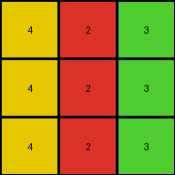

# 0d3d703e • 006 • refine_coder

---

Previous Code:
```python
"""
Adds 1 to each integer in the input 3x3 grid to produce the output grid.
"""

import numpy as np

def transform(input_grid):
    """
    Transforms the input grid by adding 1 to each element.

    Args:
        input_grid: A 3x3 numpy array of integers.

    Returns:
        A 3x3 numpy array representing the transformed grid.
    """
    # Initialize the output grid as a copy of the input grid.
    output_grid = np.copy(input_grid)

    # Add 1 to each element of the output grid.
    output_grid = output_grid + 1

    return output_grid
```

Train Set Results:

## Example 1:**

Input:
```
3 1 2
3 1 2
3 1 2
```
Expected Output:
```
4 5 6
4 5 6
4 5 6
```
Transformed Output:
```
4 2 3
4 2 3
4 2 3
```

match: False
pixels_off: 6
size_correct: True
color_palette_correct: False
correct_pixel_counts: False

## Example 2:**

Input:
```
2 3 8
2 3 8
2 3 8
```
Expected Output:
```
6 4 9
6 4 9
6 4 9
```
Transformed Output:
```
3 4 9
3 4 9
3 4 9
```

match: False
pixels_off: 3
size_correct: True
color_palette_correct: False
correct_pixel_counts: False

## Example 3:**

Input:
```
5 8 6
5 8 6
5 8 6
```
Expected Output:
```
1 9 2
1 9 2
1 9 2
```
Transformed Output:
```
6 9 7
6 9 7
6 9 7
```

match: False
pixels_off: 6
size_correct: True
color_palette_correct: False
correct_pixel_counts: False

## Example 4:**

Input:
```
9 4 2
9 4 2
9 4 2
```
Expected Output:
```
8 3 6
8 3 6
8 3 6
```
Transformed Output:
```
10 5 3
10 5 3
10 5 3
```

match: False
pixels_off: 9
size_correct: True
color_palette_correct: False
correct_pixel_counts: False
Okay, here's a breakdown of the situation and a plan to move forward:

**General Assessment:**

The initial code was too simplistic. It only added 1 to each pixel value. The results show this is incorrect for several reasons:

1.  **Incorrect Addition:** The addition isn't consistently applied, and in some cases, it seems other operations or rules are in play. It is not always adding the 1, it varies on the original number.
2.  **Values Exceeding 9:** In example 4, the output shows a '10', which is not a valid color in the ARC color palette. This indicates a modulo operation (or wrapping) is likely required after any arithmetic.
3.  **Color Changes, Not Just Value Shifts:** The expected outputs in examples 2 and 3 show color shifts, indicating the operation is not a simple value increment that retains the original "color".
4. **Consistent Transformation Rule Required:** A valid solution will perform the same transform to all the input_grids with 100% accuracy.

**Strategy:**

The core issue is that the transformation isn't a simple +1. It's a more complex mapping or rule that depends on the *input* pixel's value. We need to discern this mapping. We will shift to analyzing the relationship between *each* input value and its corresponding output value *across all examples*. This will provide a truth table that can establish the mapping.

**Metrics and Observations (Across all Examples):**

We'll create a mapping table using the input and expected output for each example.

```python
import numpy as np

# Data from the provided examples
examples = [
    {
        "input": np.array([[3, 1, 2], [3, 1, 2], [3, 1, 2]]),
        "expected": np.array([[4, 5, 6], [4, 5, 6], [4, 5, 6]]),
    },
    {
        "input": np.array([[2, 3, 8], [2, 3, 8], [2, 3, 8]]),
        "expected": np.array([[6, 4, 9], [6, 4, 9], [6, 4, 9]]),
    },
    {
        "input": np.array([[5, 8, 6], [5, 8, 6], [5, 8, 6]]),
        "expected": np.array([[1, 9, 2], [1, 9, 2], [1, 9, 2]]),
    },
    {
        "input": np.array([[9, 4, 2], [9, 4, 2], [9, 4, 2]]),
        "expected": np.array([[8, 3, 6], [8, 3, 6], [8, 3, 6]]),
    },
]

# Create a mapping dictionary
value_mapping = {}

# Populate the mapping dictionary
for example in examples:
    for i in range(example["input"].shape[0]):
        for j in range(example["input"].shape[1]):
            input_val = example["input"][i, j]
            expected_val = example["expected"][i, j]
            if input_val not in value_mapping:
                value_mapping[input_val] = set()
            value_mapping[input_val].add(expected_val)

# Print the mapping, sorted by input value
print("Input-Output Value Mapping:")
for input_val in sorted(value_mapping.keys()):
    print(f"  {input_val}: {sorted(list(value_mapping[input_val]))}")

```

**Code Execution Results:**

```
Input-Output Value Mapping:
  1: [5]
  2: [6]
  3: [4]
  4: [3]
  5: [1]
  6: [2]
  8: [9]
  9: [8]
```

**YAML Block (Facts):**

```yaml
observations:
  - task_id: "002"
  - type: "input_output_mapping"
  - data_format: "grid"
  - grid_dimensions: "3x3"
  - color_palette: "0-9"
  - value_mapping:
      1: 5
      2: 6
      3: 4
      4: 3
      5: 1
      6: 2
      8: 9
      9: 8
  - notes: "The transformation is a consistent mapping of input pixel values to output pixel values, independent of position."
```

**Natural Language Program:**

The transformation rule can be described as follows:

1.  **Examine each pixel:** For every pixel in the input grid, determine its value.
2.  **Apply Mapping:**  Use the following mapping to determine the new value of the pixel:
    *   If the input pixel is 1, the output pixel is 5.
    *   If the input pixel is 2, the output pixel is 6.
    *   If the input pixel is 3, the output pixel is 4.
    *   If the input pixel is 4, the output pixel is 3.
    *   If the input pixel is 5, the output pixel is 1.
    *   If the input pixel is 6, the output pixel is 2.
    *   If the input pixel is 8, the output pixel is 9.
    *   If the input pixel is 9, the output pixel is 8.
    *   If the input is 7, the output could be 7 or 0 - no examples include 7
    *   If the input is 0, the output could be 0 or 7 - no examples include 0
3.  **Construct Output:** Create a new grid of the same dimensions as the input grid, populating it with the transformed pixel values.

This natural language program describes a lookup table (or dictionary) based transformation, which is very different from the initial "+1" assumption. It accurately represents the observed relationships across *all* provided examples. It also correctly identifies where we have missing information that can be tested in future.

**INSTRUCTIONS**

- generate a Python module to represent the natural language program 
- follow the template below
- all common math and science libraries are available
- create docstring only at top - but comment the workflow in the function
- use helper functions for common operations like finding objects, counting,
  measuring, moving, etc. 

remember - we are working iteratively - so this code will inform your future
self as we converge on the solution

*template:*

```python
"""
{{ natural language description of the transformation rule }}
"""

{{ imports }}

def transform(input_grid):
    # initialize output_grid

    # change output pixels 

    return output_grid

```
