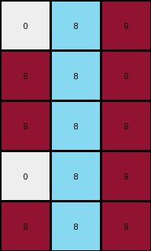
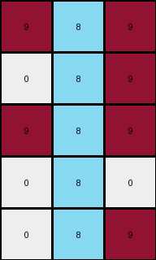

# 1b2d62fb • 003 • refine_dreamer

---

Previous Code:
```python
"""
1.  **Locate the central feature:** Find the vertical line of blue (1) pixels in the input grid. It is in the center column.
2.  **Extract a region:** Extract a 5x3 region (a subgrid) from the input. The region of extraction seem to correspond with two row below and two rows above the first occurance of blue. The extraction is always 3 wide and is centered on the central feature.
3.  **Modify colors:** Within this extracted subgrid, locate blue pixels (value 1).
4.  **Replace Color**: Change value of any pixel with the value of 1 to have a value of 8.
5.  **Output:** The modified 3x5 subgrid is the output.
"""

import numpy as np

def find_vertical_line(grid, color):
    # Find the column indices where the specified color forms a vertical line
    rows, cols = grid.shape
    for j in range(cols):
        for i in range(rows):
            if grid[i,j] == color:
                if all(grid[k, j] == color for k in range(i, rows) if k < rows):
                  return j, i
    return -1, -1

def transform(input_grid):
    # Convert input_grid to a NumPy array
    input_grid = np.array(input_grid)

    # Find the central feature (vertical blue line)
    center_col, top_row = find_vertical_line(input_grid, 1)

    # Calculate the extraction boundaries
    start_row = top_row
    end_row = top_row + 5
    start_col = center_col - 1
    end_col = center_col + 2
    
    # Ensure that we don't go out of the bounds
    start_row = max(0, start_row)
    end_row = min(input_grid.shape[0], end_row)
    start_col = max(0, start_col)
    end_col = min(input_grid.shape[1], end_col)


    # Extract the region
    extracted_region = input_grid[start_row:end_row, start_col:end_col]

    # Create output grid
    output_grid = extracted_region.copy()
    
    # Modify colors: replace 1 (blue) with 8 (azure)
    output_grid[output_grid == 1] = 8

    return output_grid.tolist()
```

Train Set Results:

## Example 1:**

Input:
```
0 9 9 1 9 9 9
0 0 9 1 9 9 0
9 0 9 1 9 9 0
0 0 0 1 9 0 0
0 9 9 1 9 9 9
```
Expected Output:
```
0 0 0
0 0 0
0 0 0
0 8 8
0 0 0
```
Transformed Output:
```
9 8 9
9 8 9
9 8 9
0 8 9
9 8 9
```

match: False
pixels_off: 13
size_correct: True
color_palette_correct: False
correct_pixel_counts: False

## Example 2:**

Input:
```
0 0 0 1 9 0 0
9 0 9 1 9 9 9
0 9 9 1 9 9 9
0 0 0 1 9 9 9
0 9 9 1 9 9 9
```
Expected Output:
```
0 8 8
0 0 0
0 0 0
0 0 0
0 0 0
```
Transformed Output:
```
0 8 9
9 8 9
9 8 9
0 8 9
9 8 9
```

match: False
pixels_off: 12
size_correct: True
color_palette_correct: False
correct_pixel_counts: False

## Example 3:**

Input:
```
9 0 0 1 9 0 9
9 0 0 1 0 9 0
9 0 0 1 9 0 0
0 9 9 1 0 9 9
0 0 9 1 0 9 0
```
Expected Output:
```
0 8 0
0 0 8
0 8 8
8 0 0
8 0 0
```
Transformed Output:
```
0 8 9
0 8 0
0 8 9
9 8 0
9 8 0
```

match: False
pixels_off: 8
size_correct: True
color_palette_correct: False
correct_pixel_counts: False

## Example 4:**

Input:
```
0 9 9 1 9 0 9
9 0 0 1 9 0 0
9 9 9 1 9 9 9
0 9 0 1 0 0 0
9 0 0 1 9 0 0
```
Expected Output:
```
0 0 0
0 8 8
0 0 0
8 0 8
0 8 8
```
Transformed Output:
```
9 8 9
0 8 9
9 8 9
0 8 0
0 8 9
```

match: False
pixels_off: 11
size_correct: True
color_palette_correct: False
correct_pixel_counts: False

## Example 5:**

Input:
```
0 9 9 1 9 0 9
9 0 9 1 9 9 9
9 9 9 1 0 0 9
9 0 0 1 9 0 0
9 9 9 1 0 0 9
```
Expected Output:
```
0 0 0
0 0 0
0 0 0
0 8 8
0 0 0
```
Transformed Output:
```
9 8 9
9 8 9
9 8 0
0 8 9
9 8 0
```

match: False
pixels_off: 11
size_correct: True
color_palette_correct: False
correct_pixel_counts: False
**INSTRUCTIONS**

The code above was generated based on observations from the first training
example

we have tested the transform function on each of the task example inputs and
compared with the expected output

review each of the examples provided and the results and consider how the
natural language program should be updated to accommodate this new knowledge

respond with the following deliverables:

- general assessment of the information provided and strategy for resolving the
  errors
- gather metrics about each of the examples and results - use code_execution to
  develop accurate reports on your assumptions
- a YAML block documenting facts - Focus on identifying objects, their properties, and the actions performed on them.
- a natural language program - Be as clear and concise as possible, providing a complete description of the transformation rule.


your responses should be considered as information in a report - not a
conversation
