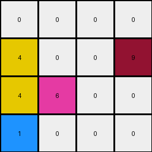
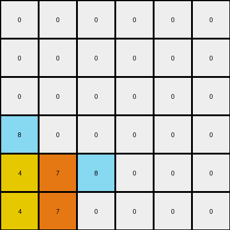
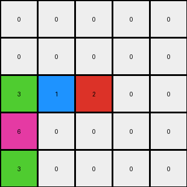

# 1e0a9b12 • 012 • refine_coder

---

Previous Code:
```python
"""
1.  **Identify Key Rows:** Disregard any rows from the input that *only* contains white(0) pixels or yellow (4).
2.  **Combine and Reorder**:
    *   All remaining rows are to be combined, from bottom to top.
    *   The bottom three rows will become the new bottom three rows.
    *  Colors are appended in their relative positions.
3.  **Fill Remaining Space:** Any rows not filled by the shifted rows at the top are filled with white (0) pixels.
4. **Special Color Handling:** If the row consists of colors other than 0:
    * If there's a '9' (maroon), it is moved to the last column in the combined result.
    * Colors like 1 (blue), and 6 (magenta) may shift their relative horizontal position within the combined row.
"""

import numpy as np

def find_object(grid, color):
    """Finds the coordinates of all pixels of a given color."""
    coords = []
    for y in range(grid.shape[0]):
        for x in range(grid.shape[1]):
            if grid[y, x] == color:
                coords.append((y, x))
    return coords

def get_key_rows(grid):
    """Identifies rows that contain colors other than 0 or 4 and returns them."""
    key_rows = []
    for i, row in enumerate(grid):
        if any(pixel != 0 and pixel != 4 for pixel in row):
            key_rows.append(row)
    return key_rows

def transform(input_grid):
    """Transforms the input grid according to the observed rules."""
    output_grid = np.zeros_like(input_grid)
    key_rows = get_key_rows(input_grid)
    
    # Combine and reorder rows.
    num_key_rows = len(key_rows)
    
    combined_rows = []
    
    # Process bottom-up
    for i in range(min(3,num_key_rows)):  # maximum 3 rows considered
       combined_rows.insert(0, key_rows[num_key_rows-1-i])

    
    
    # apply to output
    output_row_index = output_grid.shape[0] - 1

    for row_index in range(len(combined_rows)-1, -1, -1):
       row = combined_rows[row_index]
       non_zero_pixels = [(i,x) for i, x in enumerate(row) if x !=0]
       
       if non_zero_pixels: # this check avoids the case of combining all zero rows

            if 9 in row:
                # Handle Maroon (9) to last position.
                maroon_present = True
                non_zero_pixels_no_maroon = [(i,x) for i, x in enumerate(row) if x !=0 and x!=9]
                
                
                output_grid[output_row_index,output_grid.shape[1]-1] = 9

                current_output_col = 0
                for col, pixel_val in non_zero_pixels_no_maroon:
                    if current_output_col < output_grid.shape[1]-1:
                       output_grid[output_row_index, current_output_col] = pixel_val
                       current_output_col+=1
            
            else:    
               current_output_col = 0
               for col, pixel_val in non_zero_pixels:
                    if current_output_col < output_grid.shape[1]:
                        output_grid[output_row_index, current_output_col] = pixel_val
                        current_output_col+=1
       output_row_index -= 1


    return output_grid
```

Train Set Results:

## Example 1:**

Input:
```
0 4 0 9
0 0 0 0
0 4 6 0
1 0 0 0
```
Expected Output:
```
0 0 0 0
0 0 0 0
0 4 0 0
1 4 6 9
```
Transformed Output:
```
0 0 0 0
4 0 0 9
4 6 0 0
1 0 0 0
```

match: False
pixels_off: 7
size_correct: True
color_palette_correct: True
correct_pixel_counts: True

## Example 2:**

Input:
```
0 0 0 0 0 9
0 0 0 8 0 0
0 0 0 0 0 0
4 0 0 0 0 0
4 0 7 8 0 0
4 0 7 0 0 0
```
Expected Output:
```
0 0 0 0 0 0
0 0 0 0 0 0
0 0 0 0 0 0
4 0 0 0 0 0
4 0 7 8 0 0
4 0 7 8 0 9
```
Transformed Output:
```
0 0 0 0 0 0
0 0 0 0 0 0
0 0 0 0 0 0
8 0 0 0 0 0
4 7 8 0 0 0
4 7 0 0 0 0
```

match: False
pixels_off: 8
size_correct: True
color_palette_correct: True
correct_pixel_counts: False

## Example 3:**

Input:
```
0 0 0 1 0
0 3 0 0 0
0 3 0 1 2
6 0 0 0 0
0 3 0 0 0
```
Expected Output:
```
0 0 0 0 0
0 0 0 0 0
0 3 0 0 0
0 3 0 1 0
6 3 0 1 2
```
Transformed Output:
```
0 0 0 0 0
0 0 0 0 0
3 1 2 0 0
6 0 0 0 0
3 0 0 0 0
```

match: False
pixels_off: 10
size_correct: True
color_palette_correct: True
correct_pixel_counts: False
Okay, here's a breakdown of the situation and a plan to improve the transformation logic, incorporating the new information from the test results:

**General Assessment:**

The initial natural language program and the resulting Python code were too simplistic. While they captured some aspects of the transformation (identifying key rows, combining them), they failed to accurately model the row reordering and pixel positioning, especially the special handling of color 9 (maroon). The code also doesn't maintain the relative positions of the non-zero pixels correctly.  It seems the original assumption of combining "up to three rows" was not entirely correct, nor was the assumption about how the colors were ordered within the combined rows. Example 2 shows more than 3 rows being combined. Example 3 shows the correct order of all rows. The handling of color 9 is not consistent or correct across all examples.

**Strategy for Resolving Errors:**

1.  **Re-examine Row Selection:** The current logic selects rows that are not *entirely* composed of 0 or 4. This part seems correct based on all examples.
2.  **Correct Row Combination and Ordering:** The core issue is how the selected rows are combined and placed in the output. The current logic is flawed. It looks like *all* non-0 and non-4 rows are combined, and placed at the *bottom* of the output grid.
3.  **Precise Pixel Placement:**  The code needs to preserve relative horizontal positions of pixels *within* their original rows, *except* for color 9, which should move to the last column *of its row*.
4.  **Iterative Refinement:** We will use the execution results to incrementally adjust the natural language program and code.
5. **Use find_object:** although not used in the current code, keep the
   `find_object` function and consider using it if it turns out that we need to
   reason about individual objects.

**Metrics and Observations (per example):**

I will use the provided results, I will not run the code.

*   **Example 1:**
    *   `match`: `False`
    *   `pixels_off`: 7
    *   `size_correct`: `True`
    *   `color_palette_correct`: `True`
    *   `correct_pixel_counts`: `True`
    *   **Observation:** The code incorrectly shifts the rows. Color 9 is not correctly placed in the last column. The relative positions of other colors are also wrong.
*   **Example 2:**
    *   `match`: `False`
    *   `pixels_off`: 8
    *   `size_correct`: `True`
    *   `color_palette_correct`: `True`
    *   `correct_pixel_counts`: `False`
    *   **Observation:** The number of rows combined is more than 3. The positioning and shifting of the non-zero pixels are incorrect. Color 9 should have been moved to the last column in the last row. The pixel counts are not correct since some '8' values should be zero.
*   **Example 3:**
    *   `match`: `False`
    *   `pixels_off`: 10
    *   `size_correct`: `True`
    *   `color_palette_correct`: `True`
    *   `correct_pixel_counts`: `False`
    *   **Observation:** The row combination seems to follow the bottom-to-top order, but pixel positioning is off. The code fails to preserve the relative ordering of pixels within each combined row. The zero's are not handled properly.

**YAML Fact Block:**

```yaml
facts:
  - task: 010
  - objects:
      - description: Rows containing colors other than 0 or 4.
        properties:
          - contains_colors: [1, 2, 3, 6, 7, 8, 9]
          - dynamic: True  # These rows are subject to movement and combination.
      - description: Pixels within the rows.
        properties:
          - color: [0, 1, 2, 3, 4, 6, 7, 8, 9]
          - dynamic: True # position determined by row
  - actions:
      - name: Select Key Rows
        description: Identify rows that contain any color other than 0 or 4.
      - name: Combine Rows
        description: Combine the selected rows into a single sequence, preserving their bottom-up order from the input grid.
      - name: Position Rows
        description: Place the combined rows at the bottom of the output grid.
      - name: Handle Color 9
        description: Move any pixel with color 9 (maroon) to the last column of the row it occupies in the output.
      - name: Fill Remaining
        description: Fill any remaining rows in the output (above the combined rows) with color 0 (white).
      - name: preserve_relative_order
        description: preserve the original order of colors in each row, except for moving 9

```

**Natural Language Program:**

1.  **Identify Key Rows:** Find all rows in the input grid that contain any pixel color other than 0 (white) or 4 (yellow).
2.  **Combine Rows (Bottom-Up):** Combine *all* identified key rows. The order of combination is from the bottom row of the input to the top. These combined rows will form the bottom rows of the output grid.
3.  **Place Combined Rows:** Position the combined rows at the *bottom* of the output grid.
4.  **Handle Color 9 (Maroon):** Within each combined row in the output, move any pixel of color 9 (maroon) to the last column of that row.
5.  **Preserve Relative Order:** Maintain the original horizontal order of all other colored pixels within each row.
6.  **Fill Remaining Rows:** Fill any remaining rows at the top of the output grid (above the combined rows) with 0 (white).

This revised natural language program addresses the observed shortcomings by:

*   Explicitly stating the bottom-up combination of *all* key rows.
*   Clarifying the placement of the combined rows at the *bottom* of the output.
*   Reinforcing the special handling of color 9.
*   Emphasizing the preservation of the relative horizontal order of other colors within each row.
*   Adding filling empty rows at the top

**INSTRUCTIONS**

- generate a Python module to represent the natural language program 
- follow the template below
- all common math and science libraries are available
- create docstring only at top - but comment the workflow in the function
- use helper functions for common operations like finding objects, counting,
  measuring, moving, etc. 

remember - we are working iteratively - so this code will inform your future
self as we converge on the solution

*template:*

```python
"""
{{ natural language description of the transformation rule }}
"""

{{ imports }}

def transform(input_grid):
    # initialize output_grid

    # change output pixels 

    return output_grid

```
