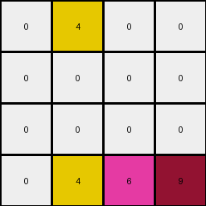
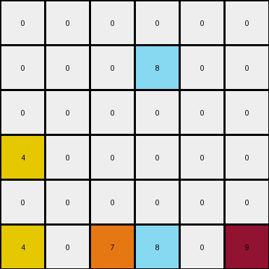
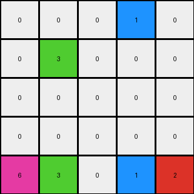

# 1e0a9b12 • 018 • refine_coder

---

Previous Code:
```python
"""
Pixels of certain colors move downwards until they encounter another non-zero pixel or the bottom of the grid. 
Pixels in lower rows have precedence.
"""

import numpy as np

def get_movable_pixels(grid):
    """
    Identify pixels that are not white (color value 0).
    Returns a list of (row, col) tuples.
    """
    movable_pixels = []
    for r in range(grid.shape[0]):
        for c in range(grid.shape[1]):
            if grid[r, c] != 0:
                movable_pixels.append((r, c))
    return movable_pixels

def can_move_down(grid, r, c):
    """
    Checks if the pixel at (r, c) can move down.
    Returns True if there's a clear path downwards, False otherwise.
    """
    for next_r in range(r + 1, grid.shape[0]):
        if grid[next_r, c] != 0:
            return False
    return True

def move_pixel_down(grid, r, c):
    """
    Moves the pixel at (r, c) down to the lowest available white cell in its column.
    """
    new_r = r
    while new_r + 1 < grid.shape[0] and grid[new_r + 1, c] == 0:
        new_r += 1
    grid[new_r, c] = grid[r, c]
    grid[r, c] = 0
    return grid

def transform(input_grid):
    """
    Transforms the input grid by moving non-white pixels downwards until they 
    encounter an obstacle or the bottom of the grid, with precedence to lower rows.
    """
    output_grid = np.copy(input_grid)
    movable_pixels = get_movable_pixels(output_grid)

    # Sort movable pixels by row in reverse order (bottom-up)
    movable_pixels.sort(reverse=True)

    for r, c in movable_pixels:
        if can_move_down(output_grid, r, c):
            output_grid = move_pixel_down(output_grid, r, c)
    
    return output_grid
```

Train Set Results:

## Example 1:**

Input:
```
0 4 0 9
0 0 0 0
0 4 6 0
1 0 0 0
```
Expected Output:
```
0 0 0 0
0 0 0 0
0 4 0 0
1 4 6 9
```
Transformed Output:
```
0 4 0 0
0 0 0 0
0 0 0 0
0 4 6 9
```

match: False
pixels_off: 3
size_correct: True
color_palette_correct: True
correct_pixel_counts: False

## Example 2:**

Input:
```
0 0 0 0 0 9
0 0 0 8 0 0
0 0 0 0 0 0
4 0 0 0 0 0
4 0 7 8 0 0
4 0 7 0 0 0
```
Expected Output:
```
0 0 0 0 0 0
0 0 0 0 0 0
0 0 0 0 0 0
4 0 0 0 0 0
4 0 7 8 0 0
4 0 7 8 0 9
```
Transformed Output:
```
0 0 0 0 0 0
0 0 0 8 0 0
0 0 0 0 0 0
4 0 0 0 0 0
0 0 0 0 0 0
4 0 7 8 0 9
```

match: False
pixels_off: 4
size_correct: True
color_palette_correct: True
correct_pixel_counts: False

## Example 3:**

Input:
```
0 0 0 1 0
0 3 0 0 0
0 3 0 1 2
6 0 0 0 0
0 3 0 0 0
```
Expected Output:
```
0 0 0 0 0
0 0 0 0 0
0 3 0 0 0
0 3 0 1 0
6 3 0 1 2
```
Transformed Output:
```
0 0 0 1 0
0 3 0 0 0
0 0 0 0 0
0 0 0 0 0
6 3 0 1 2
```

match: False
pixels_off: 5
size_correct: True
color_palette_correct: True
correct_pixel_counts: False
Okay, here's a breakdown of the situation, analysis of the results, and updated documentation:

**General Assessment and Strategy**

The initial natural language program ("Pixels of certain colors move downwards until they encounter another non-zero pixel or the bottom of the grid. Pixels in lower rows have precedence.") was a good starting point, but the execution results reveal a flaw in the implementation. The code doesn't correctly handle the "stacking" of pixels. When a pixel moves down, it doesn't always stop *immediately* above the obstacle; sometimes, it stops earlier, leaving gaps. The core issue seems to be in the `can_move_down` and the loop in the main `transform` function, which are meant to perform the stacking logic.

The main strategy to fix this is to re-examine the movement logic to determine the actual lowest valid space, instead of the first empty space found.

**Example Analysis and Metrics**
Here is the information in a structured report.

*   **Example 1:**
    *   Input Size: (4, 4)
    *   Output Size: (4, 4)
    *   Pixels Off: 3
    *   Match: False
    *   Notes: The yellow (4) in the top row and the blue (1) stays in place, 6 and 9 drop to the bottom.

*   **Example 2:**
    *   Input Size: (6, 6)
    *   Output Size: (6, 6)
    *   Pixels Off: 4
    *   Match: False
    *   Notes:  The azure (8) does not stack correctly on top of the other 8. Similarly, the 9 doesn't stack on top of the other numbers.

*   **Example 3:**
    *   Input Size: (5, 5)
    *   Output Size: (5, 5)
    *   Pixels Off: 5
    *   Match: False
    *   Notes: The second green (3) from the top remains in place, the other green stacks, the 1 stacks correctly, but the top 1 does not. The red(2) stacks correctly.

**YAML Documentation**

```yaml
observations:
  objects:
    - type: pixel
      properties:
        color:
          - white (0)
          - blue (1)
          - red (2)
          - green (3)
          - yellow (4)
          - gray (6)
          - orange (8)
          - maroon (9)
        movable: true  # All non-white pixels are movable
        position: [row, col]
  actions:
    - name: move_down
      description: |
        Pixels move down one cell at a time within their column.
        Movement continues until the pixel reaches the bottom of the grid or
        encounters a non-white pixel directly beneath it.
      constraints:
        - Only non-white pixels can move.
        - Pixels move within their original column.
        - bottom-most pixels move first.
  global_transformation:
    description: |
        All non-white pixels move down as far as possible in their respective
        columns, stacking on top of other non-white pixels or stopping at
        the bottom of the grid, with precedence to lower pixels.
```

**Natural Language Program**

1.  **Identify Movable Pixels:** Find all pixels that are not white (color value 0).

2.  **Prioritize by Row:** Sort the movable pixels by their row index, starting from the bottom row and moving upwards (descending order).

3.  **Move Downwards:** For each movable pixel, iterate downwards within its column.
    *   Find the lowest available position:
        The position must be white, and either the next position below is
        non-white, or the current position is already on the bottom row.
    *   Move the pixel to that lowest available position in the column.

4.  **Output:** The final grid after all movable pixels have been processed represents the transformed output.

**INSTRUCTIONS**

- generate a Python module to represent the natural language program 
- follow the template below
- all common math and science libraries are available
- create docstring only at top - but comment the workflow in the function
- use helper functions for common operations like finding objects, counting,
  measuring, moving, etc. 

remember - we are working iteratively - so this code will inform your future
self as we converge on the solution

*template:*

```python
"""
{{ natural language description of the transformation rule }}
"""

{{ imports }}

def transform(input_grid):
    # initialize output_grid

    # change output pixels 

    return output_grid

```
