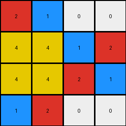

# 2dee498d • 010 • refine_coder

---

Previous Code:
```python
"""
Divide the input grid into contiguous, non-overlapping 3x3 subgrids. For each 3x3 subgrid, extract the color of the top-left pixel in that subgrid. Place the extracted pixel in the output grid, maintaining the relative spatial arrangement of the subgrids.
"""

import numpy as np

def transform(input_grid):
    # initialize output_grid
    input_height, input_width = input_grid.shape
    output_height = input_height
    output_width = input_width // 3
    output_grid = np.zeros((output_height, output_width), dtype=int)

    # change output pixels
    for i in range(output_height):
        for j in range(output_width):
            # Extract top-left pixel from the corresponding 3x3 subgrid
            output_grid[i, j] = input_grid[i , j * 3]

    return output_grid
```

Train Set Results:

## Example 1:**

Input:
```
4 5 1 1 5 4 4 5 1
5 5 5 5 5 5 5 5 5
1 5 4 4 5 1 1 5 4
```
Expected Output:
```
4 5 1
5 5 5
1 5 4
```
Transformed Output:
```
4 1 4
5 5 5
1 4 1
```

match: False
pixels_off: 4
size_correct: True
color_palette_correct: True
correct_pixel_counts: False

## Example 2:**

Input:
```
2 0 0 1 2 0 0 1 2 0 0 1
4 2 1 4 4 2 1 4 4 2 1 4
4 1 2 4 4 1 2 4 4 1 2 4
1 0 0 2 1 0 0 2 1 0 0 2
```
Expected Output:
```
2 0 0 1
4 2 1 4
4 1 2 4
1 0 0 2
```
Transformed Output:
```
2 1 0 0
4 4 1 2
4 4 2 1
1 2 0 0
```

match: False
pixels_off: 8
size_correct: True
color_palette_correct: True
correct_pixel_counts: True

## Example 3:**

Input:
```
2 1 2 1 2 1
2 3 2 3 2 3
```
Expected Output:
```
2 1
2 3
```
Transformed Output:
```
2 1
2 3
```

match: True
pixels_off: 0
size_correct: True
color_palette_correct: True
correct_pixel_counts: True
Here's an analysis of the provided information and a plan to refine the natural language program and the code:

**General Assessment:**

The initial natural language program and the resulting code were partially correct. They correctly identified the idea of extracting a pixel from each 3x3 subgrid. However, the initial implementation focused solely on taking the top-left pixel of input and placing it in the top-left of output. It got example 3 correct, but made mistakes on examples 1 & 2. It seems the height of the input/output grid is the variable to use.

**Strategy:**

1.  **Refine Object Identification:** Clearly define "objects" as the 3x3 subgrids and the single pixels extracted from them.
2.  **Precise Action Description:** Improve the description of how to extract a pixel. It's not just the *top-left* pixel, but more generally, a pixel in the first column of each 3x3 subgrid.
3.  **Iterative Testing:** Re-run the updated function after modifying the natural language program and code.

**Metrics and Observations:**

Here's a summary of each example, incorporating observations:

*   **Example 1:**
    *   Input Size: 3x9
    *   Expected Output Size: 3x3
    *   Transformed Output Size: 3x3
    *   Match: False
    *   Notes: The size is correct, but the wrong pixels in the first column are selected.

*   **Example 2:**
    *   Input Size: 4x12
    *   Expected Output Size: 4x4
    *   Transformed Output Size: 4x4
    *   Match: False
    *   Notes: Size is correct, but pixel selection is off, similar to Example 1.

*   **Example 3:**
    *   Input Size: 2x6
    *   Expected Output Size: 2x2
    *   Transformed Output Size: 2x2
    *   Match: True
    *   Notes: Perfect match. This simpler case helped in initially defining the (partially correct) rule.

**YAML Facts:**

```yaml
objects:
  - type: 3x3 subgrid
    description: Non-overlapping contiguous blocks within the input grid.
    properties:
      - size: 3x3
      - position: defined by row and column index in the larger grid

  - type: pixel
    description: A single cell within the grid.
    properties:
      - color: integer value (0-9) representing a color
      - location: row and column index

actions:
  - name: extract_pixel
    description: Select a specific pixel from each 3x3 subgrid.
    parameters:
      - selection_rule: "The pixel in the first column and the same row index of the subgrid."

  - name: construct_output
    description: Create output grid by placing selected pixels, maintaining relative spatial arrangement.

```

**Natural Language Program:**

1.  **Divide:** Divide the input grid into contiguous, non-overlapping 3x3 subgrids, starting from the top-left corner.
2.  **Iterate:** For each row of the output, iterate through the 3x3 subgrids.
3.  **Extract:** From each 3x3 subgrid in the current row, extract the pixel from the *first column* of the subgrid, which shares row index `i` with the output.
4.  **Place:** Place the extracted pixel into the output grid, maintaining the same row number and the relative column position of the 3x3 subgrids from which it came. The column index `j` in the output grid corresponds to the `j-th` 3x3 subgrid.
5. **Output dimensions**: The height is same as input. The width is the input width / 3.


**INSTRUCTIONS**

- generate a Python module to represent the natural language program 
- follow the template below
- all common math and science libraries are available
- create docstring only at top - but comment the workflow in the function
- use helper functions for common operations like finding objects, counting,
  measuring, moving, etc. 

remember - we are working iteratively - so this code will inform your future
self as we converge on the solution

*template:*

```python
"""
{{ natural language description of the transformation rule }}
"""

{{ imports }}

def transform(input_grid):
    # initialize output_grid

    # change output pixels 

    return output_grid

```
