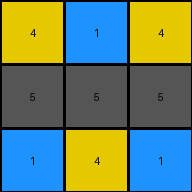

# 2dee498d • 012 • refine_coder

---

Previous Code:
```python
"""
Divide the input grid into contiguous, non-overlapping 3x3 subgrids. For each row, iterate through the 3x3 subgrids. From each 3x3 subgrid, extract the pixel from the first column of the subgrid, which shares the row index with the output. Place the extracted pixel into the output grid, maintaining the relative spatial arrangement of the subgrids.
"""

import numpy as np

def transform(input_grid):
    # initialize output_grid
    input_height, input_width = input_grid.shape
    output_height = input_height
    output_width = input_width // 3
    output_grid = np.zeros((output_height, output_width), dtype=int)

    # change output pixels
    for i in range(output_height):
        for j in range(output_width):
            # Extract pixel from the first column of the corresponding 3x3 subgrid
            output_grid[i, j] = input_grid[i , j * 3]

    return output_grid
```

Train Set Results:

## Example 1:**

Input:
```
4 5 1 1 5 4 4 5 1
5 5 5 5 5 5 5 5 5
1 5 4 4 5 1 1 5 4
```
Expected Output:
```
4 5 1
5 5 5
1 5 4
```
Transformed Output:
```
4 1 4
5 5 5
1 4 1
```

match: False
pixels_off: 4
size_correct: True
color_palette_correct: True
correct_pixel_counts: False

## Example 2:**

Input:
```
2 0 0 1 2 0 0 1 2 0 0 1
4 2 1 4 4 2 1 4 4 2 1 4
4 1 2 4 4 1 2 4 4 1 2 4
1 0 0 2 1 0 0 2 1 0 0 2
```
Expected Output:
```
2 0 0 1
4 2 1 4
4 1 2 4
1 0 0 2
```
Transformed Output:
```
2 1 0 0
4 4 1 2
4 4 2 1
1 2 0 0
```

match: False
pixels_off: 8
size_correct: True
color_palette_correct: True
correct_pixel_counts: True

## Example 3:**

Input:
```
2 1 2 1 2 1
2 3 2 3 2 3
```
Expected Output:
```
2 1
2 3
```
Transformed Output:
```
2 1
2 3
```

match: True
pixels_off: 0
size_correct: True
color_palette_correct: True
correct_pixel_counts: True
Here's an analysis of the provided information and a strategy for improving the natural language program and subsequently the code:

**General Assessment:**

The initial natural language program and the generated code were based on a limited understanding from the first training example. While the code perfectly transforms the third example, it fails on the first and second. The core issue lies in an oversimplification of the rule: it *only* takes the first element of each 3x3 subgrid. The expected outputs show that we need to extract a full column from the input, corresponding to every third column.

**Strategy:**

1.  **Re-evaluate the Core Concept:** The idea of dividing the input into 3x3 subgrids is not reflected in the expected output. Instead, the output width is one-third of the input width. The transformation rule should be focused on selecting specific columns, not 3x3 areas.
2.  **Refine Observations:** Carefully examine all examples again. The key is to recognize that the transformation takes columns 0, 3, 6, etc. from the input and places them into columns 0, 1, 2, etc. of the output.
3.  **Update Natural Language Program:** Rewrite the program to precisely describe the column-selection process.
4.  **Modify Code:** Adjust the code based on the new, refined program, focusing on correct column indexing.

**Example Metrics and Analysis:**

Here's a breakdown of each example:

*   **Example 1:**
    *   Input Size: 3x9
    *   Expected Output Size: 3x3
    *   Transformed Output Size: 3x3 (Size is correct, but content is wrong)
    *   Pixels Off: 4
    *   Observation: Only every third column is selected, but the wrong elements within that column are picked. The code only takes the first element of each 'conceptual' 3x3 block.
*   **Example 2:**
    *   Input Size: 4x12
    *   Expected Output Size: 4x4
    *   Transformed Output Size: 4x4 (Size correct, content wrong)
    *   Pixels Off: 8
    *   Observation: Similar to Example 1, the selection process is incorrect. It picks columns 0, 3, 6, and 9, but the wrong individual pixels are extracted within them.
*   **Example 3:**
    *   Input Size: 2x6
    *   Expected Output Size: 2x2
    *   Transformed Output Size: 2x2 (Correct)
    *   Pixels Off: 0
    *   Observation: This case works because the 3x3 concept aligns with using every first element in the selected columns. This is a coincidental success and does not validate the original, flawed program.

**YAML Fact Block:**

```yaml
task: 010
objects:
  input_grid:
    type: grid
    properties:
      height: variable
      width: variable
      colors: [0, 1, 2, 3, 4, 5]
  output_grid:
    type: grid
    properties:
      height: same as input_grid.height
      width: input_grid.width / 3
      colors: same as input_grid.colors
actions:
  - select_columns:
      input: input_grid
      output: output_grid
      rule: "Take columns from input_grid at indices 0, 3, 6,... and place them sequentially in output_grid."
```

**Natural Language Program:**

The transformation rule can be described as follows:

1.  The output grid has the same height as the input grid.
2.  The output grid's width is one-third the width of the input grid.
3.  For each row in the input grid, take the pixel values from the columns at indices 0, 3, 6, 9, and so on.
4.  Place these selected pixel values sequentially into the columns of the output grid, starting from column 0. In other words, the *i*-th selected column from the input becomes the *i*-th column in the output.

**INSTRUCTIONS**

- generate a Python module to represent the natural language program 
- follow the template below
- all common math and science libraries are available
- create docstring only at top - but comment the workflow in the function
- use helper functions for common operations like finding objects, counting,
  measuring, moving, etc. 

remember - we are working iteratively - so this code will inform your future
self as we converge on the solution

*template:*

```python
"""
{{ natural language description of the transformation rule }}
"""

{{ imports }}

def transform(input_grid):
    # initialize output_grid

    # change output pixels 

    return output_grid

```
