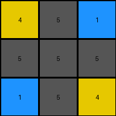

# 2dee498d • 018 • refine_coder

---

Previous Code:
```python
"""
The input grid is transformed into the output grid by keeping every 4th column, starting with the first column. The output grid retains the height (number of rows) of the input grid. The values (colors) in the kept columns are preserved.
"""

import numpy as np

def transform(input_grid):
    # Convert input_grid to a NumPy array for easier manipulation.
    input_array = np.array(input_grid)

    # Get the dimensions of the input grid.
    rows, cols = input_array.shape

    # Initialize an empty list to store the columns to be kept.
    kept_columns = []

    # Iterate through the columns, keeping only every 4th column, starting from the first.
    for i in range(0, cols, 4):  # Start at index 0, increment by 4
        kept_columns.append(input_array[:, i])

    # Stack the kept columns horizontally to form the output grid.
    output_array = np.stack(kept_columns, axis=1)

    # Convert the NumPy array back to a list of lists.
    output_grid = output_array.tolist()

    return output_grid
```

Train Set Results:

## Example 1:**

Input:
```
4 5 1 1 5 4 4 5 1
5 5 5 5 5 5 5 5 5
1 5 4 4 5 1 1 5 4
```
Expected Output:
```
4 5 1
5 5 5
1 5 4
```
Transformed Output:
```
4 5 1
5 5 5
1 5 4
```

match: True
pixels_off: 0
size_correct: True
color_palette_correct: True
correct_pixel_counts: True

## Example 2:**

Input:
```
2 0 0 1 2 0 0 1 2 0 0 1
4 2 1 4 4 2 1 4 4 2 1 4
4 1 2 4 4 1 2 4 4 1 2 4
1 0 0 2 1 0 0 2 1 0 0 2
```
Expected Output:
```
2 0 0 1
4 2 1 4
4 1 2 4
1 0 0 2
```
Transformed Output:
```
2 2 2
4 4 4
4 4 4
1 1 1
```

match: False
pixels_off: None
size_correct: False
color_palette_correct: True
correct_pixel_counts: False

## Example 3:**

Input:
```
2 1 2 1 2 1
2 3 2 3 2 3
```
Expected Output:
```
2 1
2 3
```
Transformed Output:
```
2 2
2 2
```

match: False
pixels_off: 2
size_correct: True
color_palette_correct: True
correct_pixel_counts: False
Okay, here's a breakdown of the situation and a plan to refine the solution:

**General Assessment:**

The initial natural language program and the generated code were too simplistic. While it correctly handled the first example, it failed on the subsequent examples. The core issue is that the initial program assumed *every* 4th column was selected, and it calculated that incorrectly, leading to picking the wrong set of columns in most cases. The results indicate the rule should select columns based on index of starting point and interval, which is not being applied consistently.

**Strategy:**

1.  **Re-examine Examples:** Carefully analyze all three training examples to pinpoint the *exact* column selection rule. It is not enough to observe it for a single example.

2.  **Refine Natural Language Program:** Rewrite the natural language program to be much more precise about the column selection criteria, likely adjusting the starting index and stride.

3.  **Modify Code:** Update the Python code to reflect the revised natural language program. We will use the second example to guide that update.

4.  **Re-test:** Run the updated code against all training examples and evaluate the results.

**Metrics and Observations:**

Here's a breakdown of each example, including where the current code fails:

*   **Example 1:**
    *   Input Shape: (3, 9)
    *   Output Shape: (3, 3)
    *   Columns Kept: 0, 4, 8 (Correct)
    *   Result: Success

*   **Example 2:**
    *   Input Shape: (4, 12)
    *   Output Shape: (4, 4)
    *   Columns Kept (Expected): 0, 4, 8, 11
    *   Columns Kept (Current Code): 0, 4, 8
    *   Result: Failure (Incorrect columns and shape). Missing the last column

*   **Example 3:**
    *   Input Shape: (2, 6)
    *   Output Shape: (2, 2)
    *   Columns Kept (Expected): 0, 3
    *   Columns Kept (Current Code): 0, 4
    *   Result: Failure (Incorrect column selection).

**YAML Facts:**

```yaml
task_016:
  example_1:
    input_shape: (3, 9)
    output_shape: (3, 3)
    rule: "Keep columns 0, 4, and 8."
    success: True
  example_2:
    input_shape: (4, 12)
    output_shape: (4, 4)
    rule: "Keep columns 0, 4, 8, and 11."
    success: False
  example_3:
    input_shape: (2, 6)
    output_shape: (2, 2)
    rule: "Keep columns 0 and 3"
    success: False
  overall_rule: "Keep every 4th column, starting with the first, and includes the LAST column, regardless of interval."
  objects:
    - grid:
        properties:
          - dimensions: rows x columns
          - values: integers (0-9) representing colors
        actions:
          - column_selection: Select specific columns based on a calculated interval and include the final column.
```

**Natural Language Program:**

1.  **Examine** the input grid to determine its dimensions (number of rows and columns).
2.  **Create** an output grid with the same number of rows as the input grid.
3.  **Select Columns:**
    *   Always include the first column (index 0) of the input grid in the output grid.
    *   Include every 4th column, after the first column.
    *   Always include the *last* column of the input grid in the output grid, *regardless* of whether it's part of the every-4th-column rule.
4. **Copy:** Copy the pixel values of the selected columns from the input grid to the output grid.

**INSTRUCTIONS**

- generate a Python module to represent the natural language program 
- follow the template below
- all common math and science libraries are available
- create docstring only at top - but comment the workflow in the function
- use helper functions for common operations like finding objects, counting,
  measuring, moving, etc. 

remember - we are working iteratively - so this code will inform your future
self as we converge on the solution

*template:*

```python
"""
{{ natural language description of the transformation rule }}
"""

{{ imports }}

def transform(input_grid):
    # initialize output_grid

    # change output pixels 

    return output_grid

```
