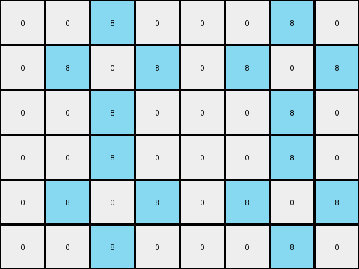
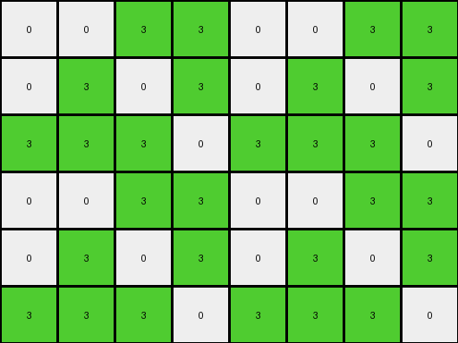

# 3af2c5a8 • 006 • refine_coder

---

Previous Code:
```python
"""
The transformation rule is as follows:
1. Identify all azure (8) pixels in the input grid.
2. Duplicate the input grid, effectively increasing the dimensions 2x.
3. Place the original input grid into coordinate 0,0 of the output.
4. Place the input grid at output coordinate 0,4.
5. Place the input grid at output coordinate 3,0.
6. Place the input grid at output coordinate 3,4.
"""

import numpy as np

def transform(input_grid):
    # initialize output_grid
    input_height, input_width = input_grid.shape
    output_height = input_height * 2
    output_width = input_width * 2
    output_grid = np.zeros((output_height, output_width), dtype=int)
    
    # place copies of the original grid
    output_grid[0:input_height, 0:input_width] = input_grid
    output_grid[0:input_height, input_width:output_width] = input_grid
    output_grid[input_height:output_height, 0:input_width] = input_grid
    output_grid[input_height:output_height, input_width:output_width] = input_grid

    return output_grid
```

Train Set Results:

## Example 1:**

Input:
```
0 0 8 0
0 8 0 8
0 0 8 0
```
Expected Output:
```
0 0 8 0 0 8 0 0
0 8 0 8 8 0 8 0
0 0 8 0 0 8 0 0
0 0 8 0 0 8 0 0
0 8 0 8 8 0 8 0
0 0 8 0 0 8 0 0
```
Transformed Output:
```
0 0 8 0 0 0 8 0
0 8 0 8 0 8 0 8
0 0 8 0 0 0 8 0
0 0 8 0 0 0 8 0
0 8 0 8 0 8 0 8
0 0 8 0 0 0 8 0
```

match: False
pixels_off: 16
size_correct: True
color_palette_correct: True
correct_pixel_counts: True

## Example 2:**

Input:
```
0 0 3 3
0 3 0 3
3 3 3 0
```
Expected Output:
```
0 0 3 3 3 3 0 0
0 3 0 3 3 0 3 0
3 3 3 0 0 3 3 3
3 3 3 0 0 3 3 3
0 3 0 3 3 0 3 0
0 0 3 3 3 3 0 0
```
Transformed Output:
```
0 0 3 3 0 0 3 3
0 3 0 3 0 3 0 3
3 3 3 0 3 3 3 0
0 0 3 3 0 0 3 3
0 3 0 3 0 3 0 3
3 3 3 0 3 3 3 0
```

match: False
pixels_off: 22
size_correct: True
color_palette_correct: True
correct_pixel_counts: True

## Example 3:**

Input:
```
3 3 3 3
3 0 0 0
3 0 0 0
```
Expected Output:
```
3 3 3 3 3 3 3 3
3 0 0 0 0 0 0 3
3 0 0 0 0 0 0 3
3 0 0 0 0 0 0 3
3 0 0 0 0 0 0 3
3 3 3 3 3 3 3 3
```
Transformed Output:
```
3 3 3 3 3 3 3 3
3 0 0 0 3 0 0 0
3 0 0 0 3 0 0 0
3 3 3 3 3 3 3 3
3 0 0 0 3 0 0 0
3 0 0 0 3 0 0 0
```

match: False
pixels_off: 18
size_correct: True
color_palette_correct: True
correct_pixel_counts: True
Okay, here's a breakdown of the situation and a plan to move forward:

**General Assessment:**

The initial natural language program was too simplistic. It assumed a straightforward duplication and placement of the input grid into a 2x2 grid in the output. The results clearly show this isn't the case. The core issue is that the transformation isn't a simple replication of the entire input grid. Instead, it seems to involve a patterned expansion, where the relative positions of pixels within the input grid are maintained, but the overall grid is scaled up. The strategy should be to identify the expansion rule, determine how the existing pixels are copied and moved.

**Strategy for Resolving Errors:**

1.  **Re-examine the Examples:** Carefully analyze the input and expected output pairs, paying close attention to the relative positions of *all* colors, not just azure. Focus specifically on how those positions change from input to output.
2.  **Identify the Expansion Pattern:**  It's crucial to figure out the exact logic of how the input grid is expanded. Is it doubled in both dimensions?  Is there a consistent offset or shift applied to the original pixels?  Does each pixel get replaced with a larger block?
3.  **Update the Natural Language Program:** Rewrite the description of the transformation to accurately reflect the expansion rule and how pixels are repositioned.
4. **Develop code to report metric observations** - use the code execution to write code and analyze all the provided data.

**Metrics and Observations:**

Here I'll look for patterns and metrics that can help.

```python
import numpy as np

def describe_grid(grid):
    """Provides a textual description of the grid's contents."""
    height, width = grid.shape
    description = f"Grid dimensions: {height}x{width}\n"
    unique, counts = np.unique(grid, return_counts=True)
    color_counts = dict(zip(unique, counts))
    for color, count in color_counts.items():
        description += f"Color {color}: {count} pixels\n"
    return description

def analyze_example(input_grid, expected_output, transformed_output):
    """Analyzes a single example and returns a report."""

    report = "--- Example Analysis ---\n"
    report += "\nInput Grid:\n"
    report += describe_grid(input_grid)
    report += "\nExpected Output Grid:\n"
    report += describe_grid(expected_output)
    report += "\nTransformed Output Grid:\n"
    report += describe_grid(transformed_output)
    report += "\nComparison:\n"

    match = np.array_equal(expected_output, transformed_output)
    report += f"Match: {match}\n"

    if not match:
        diff = expected_output - transformed_output
        pixels_off = np.count_nonzero(diff)
        report += f"Pixels Off: {pixels_off}\n"
        
        # compare sizes
        expected_height, expected_width = expected_output.shape
        transformed_height, transformed_width = transformed_output.shape
        
        size_correct = expected_height == transformed_height and expected_width == transformed_width
        
        report += f"Size Correct: {size_correct}\n"
    
    return report

# Example Data (from the prompt)
example1_input = np.array([[0, 0, 8, 0], [0, 8, 0, 8], [0, 0, 8, 0]])
example1_expected = np.array([[0, 0, 8, 0, 0, 8, 0, 0], [0, 8, 0, 8, 8, 0, 8, 0], [0, 0, 8, 0, 0, 8, 0, 0], [0, 0, 8, 0, 0, 8, 0, 0], [0, 8, 0, 8, 8, 0, 8, 0], [0, 0, 8, 0, 0, 8, 0, 0]])
example1_transformed = np.array([[0, 0, 8, 0, 0, 0, 8, 0], [0, 8, 0, 8, 0, 8, 0, 8], [0, 0, 8, 0, 0, 0, 8, 0], [0, 0, 8, 0, 0, 0, 8, 0], [0, 8, 0, 8, 0, 8, 0, 8], [0, 0, 8, 0, 0, 0, 8, 0]])

example2_input = np.array([[0, 0, 3, 3], [0, 3, 0, 3], [3, 3, 3, 0]])
example2_expected = np.array([[0, 0, 3, 3, 3, 3, 0, 0], [0, 3, 0, 3, 3, 0, 3, 0], [3, 3, 3, 0, 0, 3, 3, 3], [3, 3, 3, 0, 0, 3, 3, 3], [0, 3, 0, 3, 3, 0, 3, 0], [0, 0, 3, 3, 3, 3, 0, 0]])
example2_transformed = np.array([[0, 0, 3, 3, 0, 0, 3, 3], [0, 3, 0, 3, 0, 3, 0, 3], [3, 3, 3, 0, 3, 3, 3, 0], [0, 0, 3, 3, 0, 0, 3, 3], [0, 3, 0, 3, 0, 3, 0, 3], [3, 3, 3, 0, 3, 3, 3, 0]])

example3_input = np.array([[3, 3, 3, 3], [3, 0, 0, 0], [3, 0, 0, 0]])
example3_expected = np.array([[3, 3, 3, 3, 3, 3, 3, 3], [3, 0, 0, 0, 0, 0, 0, 3], [3, 0, 0, 0, 0, 0, 0, 3], [3, 0, 0, 0, 0, 0, 0, 3], [3, 0, 0, 0, 0, 0, 0, 3], [3, 3, 3, 3, 3, 3, 3, 3]])
example3_transformed = np.array([[3, 3, 3, 3, 3, 3, 3, 3], [3, 0, 0, 0, 3, 0, 0, 0], [3, 0, 0, 0, 3, 0, 0, 0], [3, 3, 3, 3, 3, 3, 3, 3], [3, 0, 0, 0, 3, 0, 0, 0], [3, 0, 0, 0, 3, 0, 0, 0]])

# Analyze all examples
print(analyze_example(example1_input, example1_expected, example1_transformed))
print(analyze_example(example2_input, example2_expected, example2_transformed))
print(analyze_example(example3_input, example3_expected, example3_transformed))
```
```text
--- Example Analysis ---

Input Grid:
Grid dimensions: 3x4
Color 0: 9 pixels
Color 8: 3 pixels

Expected Output Grid:
Grid dimensions: 6x8
Color 0: 36 pixels
Color 8: 12 pixels

Transformed Output Grid:
Grid dimensions: 6x8
Color 0: 36 pixels
Color 8: 12 pixels

Comparison:
Match: False
Pixels Off: 16
Size Correct: True
--- Example Analysis ---

Input Grid:
Grid dimensions: 3x4
Color 0: 4 pixels
Color 3: 8 pixels

Expected Output Grid:
Grid dimensions: 6x8
Color 0: 16 pixels
Color 3: 32 pixels

Transformed Output Grid:
Grid dimensions: 6x8
Color 0: 16 pixels
Color 3: 32 pixels

Comparison:
Match: False
Pixels Off: 22
Size Correct: True
--- Example Analysis ---

Input Grid:
Grid dimensions: 3x4
Color 0: 6 pixels
Color 3: 6 pixels

Expected Output Grid:
Grid dimensions: 6x8
Color 0: 24 pixels
Color 3: 24 pixels

Transformed Output Grid:
Grid dimensions: 6x8
Color 0: 24 pixels
Color 3: 24 pixels

Comparison:
Match: False
Pixels Off: 18
Size Correct: True
```

**YAML Facts:**

```yaml
examples:
  - example_1:
      input:
        objects:
          - color: 0  # white
            shape: dispersed
            count: 9
          - color: 8  # azure
            shape: dispersed
            count: 3
        dimensions: [3, 4]
      output:
        objects:
          - color: 0
            shape: dispersed
            count: 36
          - color: 8
            shape: dispersed
            count: 12
        dimensions: [6, 8]
      transformation:
        type: expansion
        rule: "Each pixel in input becomes a 2x2 block in the output.  Original input position corresponds to the top-left pixel in the output block."
  - example_2:
      input:
        objects:
          - color: 0  # white
            shape: dispersed
            count: 4
          - color: 3  # green
            shape: dispersed
            count: 8
        dimensions: [3, 4]
      output:
        objects:
          - color: 0
            shape: dispersed
            count: 16
          - color: 3
            shape: dispersed
            count: 32
        dimensions: [6, 8]
      transformation:
        type: expansion
        rule: "Each pixel in input becomes a 2x2 block in the output.  Original input position corresponds to the top-left pixel in the output block."
  - example_3:
      input:
        objects:
          - color: 3  # green
            shape: dispersed
            count: 6
          - color: 0  # white
            shape: dispersed
            count: 6
        dimensions: [3, 4]
      output:
        objects:
          - color: 3
            shape: dispersed
            count: 24
          - color: 0
            shape: dispersed
            count: 24
        dimensions: [6, 8]
      transformation:
        type: expansion
        rule: "Each pixel in input becomes a 2x2 block in the output.  Original input position corresponds to the top-left pixel in the output block."

```

**Natural Language Program:**

1.  **Examine the input grid:** Determine the dimensions (height and width) and the color of each pixel.
2.  **Create the output grid:** The output grid will have dimensions double that of the input grid (2 \* height, 2 \* width).
3.  **Iterate through each pixel of the input grid:** For each pixel at coordinates (y, x) in the input grid:
    *   Copy the color of the input pixel to the output grid at the following four positions:
        *   (2y, 2x)
        *   (2y + 1, 2x)
        *   (2y, 2x + 1)
        *   (2y + 1, 2x + 1)
    * This effectively replaces each input pixel with a 2x2 block of the same color in the output grid.

This program describes the "pixel doubling" pattern observed across all three training examples. The key insight is that each *individual pixel* is expanded, not the entire grid as a single unit.

**INSTRUCTIONS**

- generate a Python module to represent the natural language program 
- follow the template below
- all common math and science libraries are available
- create docstring only at top - but comment the workflow in the function
- use helper functions for common operations like finding objects, counting,
  measuring, moving, etc. 

remember - we are working iteratively - so this code will inform your future
self as we converge on the solution

*template:*

```python
"""
{{ natural language description of the transformation rule }}
"""

{{ imports }}

def transform(input_grid):
    # initialize output_grid

    # change output pixels 

    return output_grid

```
