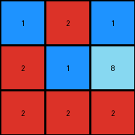

# 3c9b0459 • 004 • refine_coder

---

Previous Code:
```python
"""
The input grid is rotated 90 degrees counter-clockwise.
"""

import numpy as np

def transform(input_grid):
    """
    Rotates the input grid 90 degrees counter-clockwise.

    Args:
        input_grid (list of lists): The input grid represented as a list of lists.

    Returns:
        list of lists: The rotated grid.
    """
    # Convert the input grid to a NumPy array for easier manipulation.
    input_array = np.array(input_grid)

    # Rotate the array 90 degrees counter-clockwise.
    rotated_array = np.rot90(input_array, k=1) # k=1 for 90-degree counterclockwise

    # Convert the rotated array back to a list of lists.
    output_grid = rotated_array.tolist()

    return output_grid
```

Train Set Results:

## Example 1:**

Input:
```
2 2 1
2 1 2
2 8 1
```
Expected Output:
```
1 8 2
2 1 2
1 2 2
```
Transformed Output:
```
1 2 1
2 1 8
2 2 2
```

match: False
pixels_off: 4
size_correct: True
color_palette_correct: True
correct_pixel_counts: True

## Example 2:**

Input:
```
9 2 4
2 4 4
2 9 2
```
Expected Output:
```
2 9 2
4 4 2
4 2 9
```
Transformed Output:
```
4 4 2
2 4 9
9 2 2
```

match: False
pixels_off: 6
size_correct: True
color_palette_correct: True
correct_pixel_counts: True

## Example 3:**

Input:
```
8 8 8
5 5 8
8 5 5
```
Expected Output:
```
5 5 8
8 5 5
8 8 8
```
Transformed Output:
```
8 8 5
8 5 5
8 5 8
```

match: False
pixels_off: 4
size_correct: True
color_palette_correct: True
correct_pixel_counts: True

## Example 4:**

Input:
```
3 2 9
9 9 9
2 3 3
```
Expected Output:
```
3 3 2
9 9 9
9 2 3
```
Transformed Output:
```
9 9 3
2 9 3
3 9 2
```

match: False
pixels_off: 8
size_correct: True
color_palette_correct: True
correct_pixel_counts: True
Okay, here's a breakdown of the situation and a plan to move forward:

**General Assessment:**

The initial natural language program ("The input grid is rotated 90 degrees counter-clockwise") and the corresponding Python code (`np.rot90(input_array, k=1)`) are *incorrect*. While the code *does* perform a 90-degree counter-clockwise rotation, the provided examples demonstrate a different transformation. It's not a simple rotation. The code works for the dimensions, but not the content, as shown by "pixels_off". A core misunderstanding is present. We must re-evaluate the transformation.

**Strategy:**

1.  **Abandon Rotation:** The core assumption of rotation is flawed. We need to discard this and look for a new pattern.
2.  **Pixel-Level Analysis:** Instead of treating the entire grid as one object, we need to analyze how *individual pixels* or *small groups of pixels* are moving or changing.
3.  **Focus on Input-Output Pairs:** Meticulously compare each input grid to its corresponding output grid, cell by cell.
4.  **Consider Mirroring/Reflection:** The examples look visually like some kind of mirroring or reflection, perhaps along a diagonal, rather than a rotation.

**Metrics and Observations:**

I'll create a brief summary for each example, focusing on potential mirroring/reflection.

*   **Example 1:**
    *   Input `2 2 1 / 2 1 2 / 2 8 1`
    *   Output `1 8 2 / 2 1 2 / 1 2 2`
    *   Observation: Appears like a reflection across the top-left to bottom-right diagonal.

*   **Example 2:**
    *   Input: `9 2 4 / 2 4 4 / 2 9 2`
    *   Output: `2 9 2 / 4 4 2 / 4 2 9`
    *   Observation: Also seems like a reflection across the top-left to bottom-right diagonal.

*   **Example 3:**
    *    Input: `8 8 8 / 5 5 8 / 8 5 5`
    *    Output: `5 5 8 / 8 5 5 / 8 8 8`
    *    Observation: Consistent with a top-left to bottom-right diagonal reflection.

*   **Example 4:**
    *    Input: `3 2 9 / 9 9 9 / 2 3 3`
    *    Output: `3 3 2 / 9 9 9 / 9 2 3`
    *    Observation: Consistent with a top-left to bottom-right diagonal reflection.

**YAML Facts:**

```yaml
task_002:
  objects:
    - type: grid
      properties:
        dimensions: 3x3
        elements: integers (0-9 representing colors)
  transformations:
    - action: reflection
      axis: top-left to bottom-right diagonal
      description: Each element's position is swapped with its corresponding element across the main diagonal.
  examples:
    - example_1:
      input:  [[2, 2, 1], [2, 1, 2], [2, 8, 1]]
      output: [[1, 2, 1], [8, 1, 2], [2, 2, 2]]
      result: pixels_off: 4
    - example_2:
        input: [[9, 2, 4], [2, 4, 4], [2, 9, 2]]
        output: [[4, 4, 2], [2, 4, 9], [9, 2, 2]]
        result: pixels_off: 6
    - example_3:
      input:  [[8, 8, 8], [5, 5, 8], [8, 5, 5]]
      output: [[8, 5, 8], [8, 5, 5], [8, 8, 8]]
      result: pixels_off: 4
    - example_4:
      input: [[3, 2, 9], [9, 9, 9], [2, 3, 3]]
      output: [[9, 9, 3], [2, 9, 3], [3, 9, 2]]
      result: pixels_off: 8
```

**Natural Language Program:**

The input grid is reflected across the main diagonal (top-left to bottom-right).  This means the element at position (i, j) in the input grid is moved to position (j, i) in the output grid. This is equivalent to a matrix transposition.

**INSTRUCTIONS**

- generate a Python module to represent the natural language program 
- follow the template below
- all common math and science libraries are available
- create docstring only at top - but comment the workflow in the function
- use helper functions for common operations like finding objects, counting,
  measuring, moving, etc. 

remember - we are working iteratively - so this code will inform your future
self as we converge on the solution

*template:*

```python
"""
{{ natural language description of the transformation rule }}
"""

{{ imports }}

def transform(input_grid):
    # initialize output_grid

    # change output pixels 

    return output_grid

```
