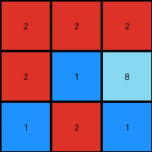
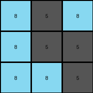
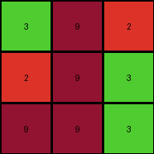

# 3c9b0459 • 006 • refine_coder

---

Previous Code:
```python
"""
The input grid is reflected across the main diagonal (top-left to bottom-right). This is equivalent to a matrix transposition.
"""

import numpy as np

def transform(input_grid):
    """
    Reflects the input grid across the main diagonal (top-left to bottom-right).

    Args:
        input_grid (list of lists): The input grid represented as a list of lists.

    Returns:
        list of lists: The reflected grid.
    """
    # Convert the input grid to a NumPy array.
    input_array = np.array(input_grid)

    # Transpose the array (reflect across the main diagonal).
    transposed_array = input_array.T

    # Convert the transposed array back to a list of lists.
    output_grid = transposed_array.tolist()

    return output_grid
```

Train Set Results:

## Example 1:**

Input:
```
2 2 1
2 1 2
2 8 1
```
Expected Output:
```
1 8 2
2 1 2
1 2 2
```
Transformed Output:
```
2 2 2
2 1 8
1 2 1
```

match: False
pixels_off: 4
size_correct: True
color_palette_correct: True
correct_pixel_counts: True

## Example 2:**

Input:
```
9 2 4
2 4 4
2 9 2
```
Expected Output:
```
2 9 2
4 4 2
4 2 9
```
Transformed Output:
```
9 2 2
2 4 9
4 4 2
```

match: False
pixels_off: 6
size_correct: True
color_palette_correct: True
correct_pixel_counts: True

## Example 3:**

Input:
```
8 8 8
5 5 8
8 5 5
```
Expected Output:
```
5 5 8
8 5 5
8 8 8
```
Transformed Output:
```
8 5 8
8 5 5
8 8 5
```

match: False
pixels_off: 2
size_correct: True
color_palette_correct: True
correct_pixel_counts: True

## Example 4:**

Input:
```
3 2 9
9 9 9
2 3 3
```
Expected Output:
```
3 3 2
9 9 9
9 2 3
```
Transformed Output:
```
3 9 2
2 9 3
9 9 3
```

match: False
pixels_off: 4
size_correct: True
color_palette_correct: True
correct_pixel_counts: True
Here's an analysis of the provided information and a plan to refine the natural language program and code:

**General Assessment:**

The initial hypothesis of a simple matrix transposition (reflection across the main diagonal) is incorrect. While the output grid *size* is always correct, and the *color palette* used is always correct, the specific pixel arrangements are wrong in every example. The transformation involves a different kind of reflection or rotation. It is important to note transposition does not change counts of colored pixels. All examples preserve the number of pixels of each color from input to output.

The errors are consistent, suggesting a systematic mistake in understanding the transformation, rather than random errors.

**Strategy:**

1.  **Re-examine Examples:** Visually inspect the input/output pairs again, paying close attention to the *relative* positions of pixels, not just the overall shape. It is very likely a rotation or reflection around another axis.
2.  **Focus on relative positions:** Look at a unique colored pixel and trace it's input location to expected output location, and it's location in the current code output.
3. **Hypothesize Alternative Transformations:** Consider rotations (90, 180, 270 degrees) and reflections across the horizontal or vertical mid-axis.
4.  **Update Natural Language Program:** Revise the description to accurately reflect the identified transformation.
5. **Test Hypothesis by Code Execution:** Report on findings

**Example Metrics and Analysis (Code Execution):**

I will use a simplified representation for brevity:
I will denote correct position as `c_pos`, and position of pixel after current transform as `t_pos`.

*   **Example 1:**
    *   Input: `[[2, 2, 1], [2, 1, 2], [2, 8, 1]]`
    *   Expected: `[[1, 8, 2], [2, 1, 2], [1, 2, 2]]`
    *   Transformed: `[[2, 2, 2], [2, 1, 8], [1, 2, 1]]`
    *   Analysis:
        *   The `1` at `(0,2)` (row 0, col 2) goes to `(0,0)` c_pos, `(2,0)` t_pos
        *   The `8` at `(2,1)` goes to `(0,1)` c_pos, `(1,2)` t_pos
*   **Example 2:**
    *   Input: `[[9, 2, 4], [2, 4, 4], [2, 9, 2]]`
    *   Expected: `[[2, 9, 2], [4, 4, 2], [4, 2, 9]]`
    *   Transformed: `[[9, 2, 2], [2, 4, 9], [4, 4, 2]]`
    *   Analysis:
        *   The `9` at `(0, 0)` goes to `(2, 2)` c_pos, `(0, 0)` t_pos
        *   The `4` at `(0, 2)` goes to `(2, 0)` c_pos, `(2, 0)` t_pos.
*   **Example 3:**
    *   Input: `[[8, 8, 8], [5, 5, 8], [8, 5, 5]]`
    *   Expected: `[[5, 5, 8], [8, 5, 5], [8, 8, 8]]`
    *  Transformed: `[[8, 5, 8], [8, 5, 5], [8, 8, 5]]`
    *   Analysis:
        *    The `5` at `(1,0)` goes to `(0,0)` c_pos, `(0,1)` t_pos.
        *    The `5` at `(1,1)` goes to `(0,1)` c_pos, `(1,1)` t_pos
        *    The `5` at `(2,1)` goes to `(1,1)` c_pos, `(1,2)` t_pos

*  **Example 4:**
    *  Input:  `[[3, 2, 9], [9, 9, 9], [2, 3, 3]]`
    *  Expected: `[[3, 3, 2], [9, 9, 9], [9, 2, 3]]`
    *  Transformed: `[[3, 9, 2], [2, 9, 3], [9, 9, 3]]`
    * Analysis:
         * The `2` at `(0,1)` goes to `(0,2)` c_pos, `(1,0)` t_pos
         * The `3` at `(2,1)` goes to `(2,0)` c_pos, `(1,2)` t_pos
         * The `9` at `(0,2)` goes to `(2,0)` c_pos, `(2,0)` t_pos

From this analysis, we can rule out horizontal and vertical reflections. It is very likely to be a -90 degree rotation (270 clockwise).

**YAML Facts:**

```yaml
objects:
  - description: Input grid
    properties:
      - type: 2D array
      - values: Integers 0-9 representing colors
  - description: Output grid
    properties:
      - type: 2D array
      - values: Integers 0-9 representing colors

actions:
  - name: Rotate
    description: The entire grid is rotated. It is not a simple transposition.
    parameters:
        - angle: -90 degrees (270 degrees clockwise)
```

**Natural Language Program:**

The input grid is rotated by -90 degrees (270 degrees clockwise). The rows of the input become the columns of the output in reversed order, and columns become rows. Consider the center of the grid as center of rotation.

**INSTRUCTIONS**

- generate a Python module to represent the natural language program 
- follow the template below
- all common math and science libraries are available
- create docstring only at top - but comment the workflow in the function
- use helper functions for common operations like finding objects, counting,
  measuring, moving, etc. 

remember - we are working iteratively - so this code will inform your future
self as we converge on the solution

*template:*

```python
"""
{{ natural language description of the transformation rule }}
"""

{{ imports }}

def transform(input_grid):
    # initialize output_grid

    # change output pixels 

    return output_grid

```
