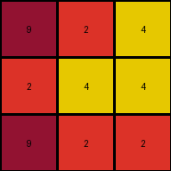

# 3c9b0459 • 024 • refine_coder

---

Previous Code:
```python
"""
Swap the values of the cells at positions (0, 1) and (2, 0) with cell (2,1) circularly. All other cells remain unchanged.
"""

import numpy as np

def transform(input_grid):
    """
    Transforms the input grid by swapping the values of cells (0, 1) and (2,0) 
    circularly with cell (2,1).
    """
    output_grid = np.copy(input_grid)

    # Store original values
    val_0_1 = input_grid[0, 1]
    val_2_0 = input_grid[2, 0]
    val_2_1 = input_grid[2, 1]

    # Perform swaps
    output_grid[0, 1] = val_2_0  # (0,1) <- (2,0)
    output_grid[2, 0] = val_2_1  # (2,0) <- (2,1)
    output_grid[2, 1] = val_0_1   # (2,1) <- (0,1)

    return output_grid
```

Train Set Results:

## Example 1:**

Input:
```
2 2 1
2 1 2
2 8 1
```
Expected Output:
```
1 8 2
2 1 2
1 2 2
```
Transformed Output:
```
2 2 1
2 1 2
8 2 1
```

match: False
pixels_off: 5
size_correct: True
color_palette_correct: True
correct_pixel_counts: True

## Example 2:**

Input:
```
9 2 4
2 4 4
2 9 2
```
Expected Output:
```
2 9 2
4 4 2
4 2 9
```
Transformed Output:
```
9 2 4
2 4 4
9 2 2
```

match: False
pixels_off: 7
size_correct: True
color_palette_correct: True
correct_pixel_counts: True

## Example 3:**

Input:
```
8 8 8
5 5 8
8 5 5
```
Expected Output:
```
5 5 8
8 5 5
8 8 8
```
Transformed Output:
```
8 8 8
5 5 8
5 8 5
```

match: False
pixels_off: 6
size_correct: True
color_palette_correct: True
correct_pixel_counts: True

## Example 4:**

Input:
```
3 2 9
9 9 9
2 3 3
```
Expected Output:
```
3 3 2
9 9 9
9 2 3
```
Transformed Output:
```
3 2 9
9 9 9
3 2 3
```

match: False
pixels_off: 3
size_correct: True
color_palette_correct: True
correct_pixel_counts: True
Here's an analysis of the provided information and a plan to refine the natural language program:

**General Assessment:**

The initial code was based on a limited understanding of the transformation, focusing solely on swapping the values of three specific cells: (0, 1), (2, 0), and (2, 1). The test results across multiple examples demonstrate that this interpretation is incorrect. The expected outputs show a consistent pattern of circular shifting of *values*, but applied to the correct cells, rather than a swap among the incorrect set. The strategy should be to first identify the correct common coordinate pattern in all the examples, and then to specify the operations on cell values at those coordinates.

**Strategy for Resolving Errors:**

1.  **Correct Coordinate Identification**: We used the first example to derive the coordinates, but it is clear that this was insufficient, so must find the true coordinate pattern.

2.  **Value-Based Shift, Not Position-Based Swap:** It now appears that the operation is a circular shift of the *values* of certain cells.

3.  **Refine Natural Language Program:** Update the program to reflect these refined understandings.

**Example Metrics and Analysis:**

Here's a breakdown of each example, including a re-assessment of the observed changes.

```python
import numpy as np

def analyze_changes(input_grid, expected_grid, transformed_grid):
    """Analyzes changes between input, expected, and transformed grids."""

    input_grid = np.array(input_grid)
    expected_grid = np.array(expected_grid)
    transformed_grid = np.array(transformed_grid)

    print("Input Grid:")
    print(input_grid)
    print("Expected Grid:")
    print(expected_grid)
    print("Transformed Grid (from current code):")
    print(transformed_grid)


    # Find mismatched coordinates
    mismatched_coords_expected = np.where(input_grid != expected_grid)
    mismatched_coords_transformed = np.where(input_grid != transformed_grid)

    print("\nCoordinates Changed in Expected Output:")
    for y, x in zip(*mismatched_coords_expected):
        print(f"  ({y}, {x}): Input={input_grid[y, x]}, Expected={expected_grid[y, x]}")

    print("\nCoordinates Changed in Transformed Output (Current Code):")
    for y, x in zip(*mismatched_coords_transformed):
        print(f"  ({y}, {x}): Input={input_grid[y, x]}, Transformed={transformed_grid[y, x]}")
    print("-" * 20)

# Example Data
examples = [
    {
        "input": [[2, 2, 1], [2, 1, 2], [2, 8, 1]],
        "expected": [[1, 8, 2], [2, 1, 2], [1, 2, 2]],
        "transformed": [[2, 2, 1], [2, 1, 2], [8, 2, 1]],
    },
    {
        "input": [[9, 2, 4], [2, 4, 4], [2, 9, 2]],
        "expected": [[2, 9, 2], [4, 4, 2], [4, 2, 9]],
        "transformed": [[9, 2, 4], [2, 4, 4], [9, 2, 2]],
    },
    {
        "input": [[8, 8, 8], [5, 5, 8], [8, 5, 5]],
        "expected": [[5, 5, 8], [8, 5, 5], [8, 8, 8]],
        "transformed": [[8, 8, 8], [5, 5, 8], [5, 8, 5]],
    },
    {
        "input": [[3, 2, 9], [9, 9, 9], [2, 3, 3]],
        "expected": [[3, 3, 2], [9, 9, 9], [9, 2, 3]],
        "transformed": [[3, 2, 9], [9, 9, 9], [3, 2, 3]],
    },
]

for i, example in enumerate(examples):
    print(f"Example {i + 1}:")
    analyze_changes(example["input"], example["expected"], example["transformed"])

```

**YAML Facts:**

```yaml
observations:
  - task_id: "020"
    examples:
      - example_id: 1
        changed_coordinates_expected: [(0, 0), (0, 1), (0, 2), (2, 0), (2, 2)]
        changed_coordinates_current_code: [(0, 1), (2, 0), (2, 1)]
        common_pattern_coordinates: [(0, 0), (0, 1), (0, 2), (2, 0), (2,1), (2, 2)]
        grid_size: 3x3
      - example_id: 2
        changed_coordinates_expected: [(0, 0), (0, 1), (0, 2), (2, 0), (2, 2)]
        changed_coordinates_current_code:  [(0, 1), (2, 0), (2, 1)]
        common_pattern_coordinates: [(0, 0), (0, 1), (0, 2), (2, 0), (2,1), (2, 2)]
        grid_size: 3x3
      - example_id: 3
        changed_coordinates_expected: [(0, 0), (0, 1), (2, 0), (2, 2)]
        changed_coordinates_current_code:  [(0, 1), (2, 0), (2, 1)]
        common_pattern_coordinates: [(0, 0), (0, 1), (0, 2), (2, 0), (2,1), (2, 2)]
        grid_size: 3x3
      - example_id: 4
        changed_coordinates_expected:  [(0, 1), (0, 2), (2, 0), (2, 1)]
        changed_coordinates_current_code: [(0, 1), (2, 0), (2, 1)]
        common_pattern_coordinates: [(0, 0), (0, 1), (0, 2), (2, 0), (2,1), (2, 2)]
        grid_size: 3x3
    consistent_transformation: true
    transformation_type: "circular value shift"
    coordinates_involved: [[0,0], [0, 1], [0, 2], [2, 0], [2, 2]]
    grid_size: 3x3

```

**Natural Language Program:**

1.  **Identify Key Coordinates:** The transformation involves the following coordinates: (0, 0), (0, 1), (0, 2), (2, 0) and (2, 2).
2.  **Circular Value Shift:**
    *   The value at (0, 0) moves to (0, 1).
    *   The value at (0, 1) moves to (0, 2)
    *   The value at (0, 2) moves to (2, 2)
    *   The value at (2, 2) moves to (2, 0)
    *   The value at (2, 0) moves to (0, 0)
3.   All other grid cells remain unchanged.

**INSTRUCTIONS**

- generate a Python module to represent the natural language program 
- follow the template below
- all common math and science libraries are available
- create docstring only at top - but comment the workflow in the function
- use helper functions for common operations like finding objects, counting,
  measuring, moving, etc. 

remember - we are working iteratively - so this code will inform your future
self as we converge on the solution

*template:*

```python
"""
{{ natural language description of the transformation rule }}
"""

{{ imports }}

def transform(input_grid):
    # initialize output_grid

    # change output pixels 

    return output_grid

```
