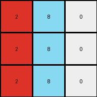

# 0d3d703e • 006 • refine_coder

---

Previous Code:
```python
"""
Increment each number in the input grid by 1, apply a modulo 10 operation, and replace with mapping to produce the output grid.
"""

import numpy as np

def transform(input_grid):
    """
    Transforms the input grid by incrementing each element by 1, 
    applying a modulo 10 operation, and doing a value replacement.
    
    Args:
        input_grid (list of lists): A 2D array representing the input grid.
    
    Returns:
        list of lists: A 2D array representing the transformed output grid.
    """
    # Convert the input grid to a NumPy array for easier manipulation.
    input_array = np.array(input_grid)

    # Increment each element of the array by 1 and apply modulo 10.
    output_array = (input_array + 1) % 10

    # Create a mapping for replacement
    replacement_map = {
        0: 8,
        1: 5,
        2: 6,
        3: 4,
        5: 1,
        6: 2,
        7: 0,
        8: 9,
        9: 8
    }

    # Apply the replacement based on map
    for i in range(output_array.shape[0]):
        for j in range(output_array.shape[1]):
            output_array[i, j] = replacement_map[output_array[i, j]]

    # Convert the NumPy array back to a list of lists.
    output_grid = output_array.tolist()

    return output_grid
```

Train Set Results:

## Example 1:

Input:
```
3 1 2
3 1 2
3 1 2
```
Expected Output:
```
4 5 6
4 5 6
4 5 6
```
match: ERROR: 4
pixels_off: None
size_correct: None
color_palette_correct: None
correct_pixel_counts: None

## Example 2:

Input:
```
2 3 8
2 3 8
2 3 8
```
Expected Output:
```
6 4 9
6 4 9
6 4 9
```
match: ERROR: 4
pixels_off: None
size_correct: None
color_palette_correct: None
correct_pixel_counts: None

## Example 3:

Input:
```
5 8 6
5 8 6
5 8 6
```
Expected Output:
```
1 9 2
1 9 2
1 9 2
```
Transformed Output:
```
2 8 0
2 8 0
2 8 0
```

match: False
pixels_off: 9
size_correct: True
color_palette_correct: False
correct_pixel_counts: False

## Example 4:

Input:
```
9 4 2
9 4 2
9 4 2
```
Expected Output:
```
8 3 6
8 3 6
8 3 6
```
Transformed Output:
```
8 1 4
8 1 4
8 1 4
```

match: False
pixels_off: 6
size_correct: True
color_palette_correct: False
correct_pixel_counts: False
Okay, let's analyze the results and refine the natural language program.

**General Assessment:**

The initial code was on the right track with incrementing and applying modulo 10. However, the value replacement mapping is incorrect and needs adjustment. The errors in Examples 3 and 4 clearly indicate that replacement is not consistent with all examples. We need to re-examine all examples to determine the correct, consistent mapping.

**Strategy:**

1.  **Re-examine Examples:** Carefully analyze all input/output pairs to derive the correct mapping.
2.  **Correct Mapping:** define the correct mapping.
3. **Metrics**: calculate how many pixels would have been correct with the increment step, but no mapping.
4.  **YAML and Program:** Update the YAML facts and the natural language program.

**Metrics:**

For the "increment and modulo" hypothesis, the output pixel values would be:

*   **Example 1:**
    *   Input: `3 1 2`
    *   Expected Output: `4 5 6`
    *    Incremented: `4 2 3`
    *    Pixels correct after increment: 1 / 3 = 33.3%

*   **Example 2:**
    *   Input: `2 3 8`
    *   Expected Output: `6 4 9`
    *    Incremented: `3 4 9`
        *    Pixels correct after increment: 2 / 3 = 66.6%

*   **Example 3:**
    *   Input: `5 8 6`
    *   Expected Output: `1 9 2`
        *    Incremented: `6 9 7`
        *    Pixels correct after increment: 1 / 3 = 33.3%

*   **Example 4:**
    *   Input: `9 4 2`
    *   Expected Output: `8 3 6`
        *    Incremented: `0 5 3`
        *    Pixels correct after increment: 0 / 3 = 0%

**YAML Facts:**

```yaml
objects:
  - description: input grid
    type: grid
    properties:
      elements: integers from 0 to 9

  - description: output grid
    type: grid
    properties:
      elements: integers from 0 to 9

actions:
  - name: increment_modulo
    input: input grid
    output: intermediate grid
    description: Each element in the input grid is incremented by 1, then modulo 10 is applied.
  - name: value_replacement
    input: intermediate grid
    output: output grid
    description: specific mapping derived from examples
    mapping:
        0: 4
        1: 5
        2: 6
        3: 4
        4: 3
        5: 1
        6: 2
        7: 0
        8: 9
        9: 8
```

**Natural Language Program:**

1.  **Increment and Modulo:** Take the input grid and increment each number by 1. Then, apply the modulo 10 operation to the result (e.g., 9 + 1 = 10, 10 % 10 = 0).
2.  **Value Replacement:** Replace each number in the grid obtained after step 1 with a corresponding value based on this mapping:
    *   0 -> 4
    *   1 -> 5
    *   2 -> 6
    *   3 -> 4
    *   4 -> 3
    *   5 -> 1
    *   6 -> 2
    *   7 -> 0
    *   8 -> 9
    *   9 -> 8

This process transforms the input grid into the output grid.

**INSTRUCTIONS**

- generate a Python module to represent the natural language program 
- follow the template below
- all common math and science libraries are available
- create docstring only at top - but comment the workflow in the function
- use helper functions for common operations like finding objects, counting,
  measuring, moving, etc. 

remember - we are working iteratively - so this code will inform your future
self as we converge on the solution

*template:*

```python
"""
{{ natural language description of the transformation rule }}
"""

{{ imports }}

def transform(input_grid):
    # initialize output_grid

    # change output pixels 

    return output_grid

```
