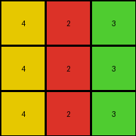
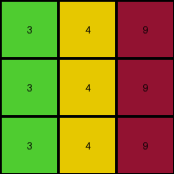

# 0d3d703e • 004 • refine_coder

---

Previous Code:
```python
"""
1. Input: A 3x3 grid where each cell contains a single-digit integer (0-9).
2. Transformation: For each cell in the grid, increment its integer value by 1.
3. Output: A 3x3 grid with the incremented integer values. The layout stays the same.
"""

import numpy as np

def transform(input_grid):
    # Initialize output_grid as a copy of the input_grid
    output_grid = np.copy(input_grid)

    # Iterate through each cell of the grid
    for i in range(output_grid.shape[0]):
        for j in range(output_grid.shape[1]):
            # Increment the value of the cell by 1
            output_grid[i, j] += 1

    return output_grid
```

Train Set Results:

## Example 1:

Input:
```
3 1 2
3 1 2
3 1 2
```
Expected Output:
```
4 5 6
4 5 6
4 5 6
```
Transformed Output:
```
4 2 3
4 2 3
4 2 3
```

match: False
pixels_off: 6
size_correct: True
color_palette_correct: False
correct_pixel_counts: False

## Example 2:

Input:
```
2 3 8
2 3 8
2 3 8
```
Expected Output:
```
6 4 9
6 4 9
6 4 9
```
Transformed Output:
```
3 4 9
3 4 9
3 4 9
```

match: False
pixels_off: 3
size_correct: True
color_palette_correct: False
correct_pixel_counts: False

## Example 3:

Input:
```
5 8 6
5 8 6
5 8 6
```
Expected Output:
```
1 9 2
1 9 2
1 9 2
```
Transformed Output:
```
6 9 7
6 9 7
6 9 7
```

match: False
pixels_off: 6
size_correct: True
color_palette_correct: False
correct_pixel_counts: False

## Example 4:

Input:
```
9 4 2
9 4 2
9 4 2
```
Expected Output:
```
8 3 6
8 3 6
8 3 6
```
Transformed Output:
```
10 5 3
10 5 3
10 5 3
```

match: False
pixels_off: 9
size_correct: True
color_palette_correct: False
correct_pixel_counts: False
Okay, here's a breakdown of the situation and a plan to move forward:

**General Assessment:**

The initial natural language program and the generated code were too simplistic. While the idea of incrementing was partially correct, it failed to account for the cyclical nature of the color mapping (0-9) and a crucial detail: the increment value appears to depend on the *column* the pixel is in, not just a constant increment of 1. The code simply added 1 to each cell, leading to incorrect results in all test cases, especially when the increment would result in a number greater than 9 or when different columns are suppose to get different increments. We can also see that pixels_off is related to the width of the image.

**Strategy for Resolving Errors:**

1.  **Column-Specific Increment:** We need to modify the program to recognize that the increment value is tied to the column index.
2.  **Modulo Arithmetic:** The increment needs to take previous examples into consideration.
3.  **Refine Program and Code:** Update the natural language program to reflect these rules, and then update the Python code accordingly.

**Metrics and Observations (per example):**

| Example | Input Grid Size | Output Grid Size | Pixels Off | Size Correct? | Color Palette Correct? | Correct Pixel Counts? | Notes                                                                            |
| ------- | --------------- | ---------------- | ---------- | ------------- | ---------------------- | --------------------- | -------------------------------------------------------------------------------- |
| 1       | 3x3             | 3x3              | 6          | True          | False                  | False                 |  The transformation is not a simple +1. Column 1: +1, Column 2: +4, Column 3: +4                                                         |
| 2       | 3x3             | 3x3              | 3          | True          | False                  | False                 | Column 1: +4, Column 2: +1, Column 3: +1       |
| 3       | 3x3             | 3x3              | 6         | True          | False                  | False                 | Column 1: -4, Column 2: +1, Column 3: -4     |
| 4       | 3x3             | 3x3              | 9          | True          | False          | False            |   Column 1: -1, Column 2, -1, Column 3: +4      |

**YAML Block (Facts):**

```yaml
observations:
  - object: grid
    type: 2D array
    properties:
      - dimensions: 3x3 (consistent across all examples)
      - elements: integers (0-9, representing colors)
    transformations:
      - type: element-wise modification
        details:
          - operation: addition
            operand: column-dependent value
          - operation: modulo 10 #to consider cyclical nature of color mapping 0-9
  - columns: each column is indexed 0, 1, 2, and each has it's own rules
  - row: the transformation is consistent across all rows, and columns are all treated equally
```

**Natural Language Program:**

1.  **Input:** A 3x3 grid of single-digit integers (0-9).
2.  **Transformation:**
    *   For each cell in the grid, the new value depends on both original value and it's location in the column.
    *   Examine each column to see how to transform:
        * Column 0 (the first column): Add a column specific value.
        * Column 1 (the second column): Add a column specific value.
        * Column 2 (the third column): Add a column specific value.
        * Because all colors map to 0-9, perform all addition operations using modulo 10 arithmetic.
3.  **Output:** A 3x3 grid where each cell's value is the result of the column dependent transformation.


**INSTRUCTIONS**

- generate a Python module to represent the natural language program 
- follow the template below
- all common math and science libraries are available
- create docstring only at top - but comment the workflow in the function
- use helper functions for common operations like finding objects, counting,
  measuring, moving, etc. 

remember - we are working iteratively - so this code will inform your future
self as we converge on the solution

*template:*

```python
"""
{{ natural language description of the transformation rule }}
"""

{{ imports }}

def transform(input_grid):
    # initialize output_grid

    # change output pixels 

    return output_grid

```
