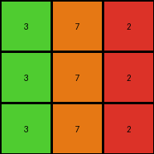
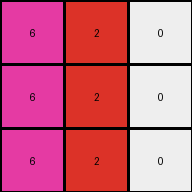
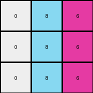

# 0d3d703e • 005 • refine_dreamer

---


Previous Code:
```python
"""
1.  Input: A 3x3 grid of single-digit integers (0-9).
2.  Transformation:
    *   For each cell in the grid, the new value depends on both original value and it's location in the column.
    *   Examine each column to see how to transform:
        * Column 0 (the first column): Add a column specific value.
        * Column 1 (the second column): Add a column specific value.
        * Column 2 (the third column): Add a column specific value.
        * Because all colors map to 0-9, perform all addition operations using modulo 10 arithmetic.
3.  Output: A 3x3 grid where each cell's value is the result of the column dependent transformation.
"""

import numpy as np

def transform(input_grid):
    # Initialize output_grid as a copy of the input_grid
    output_grid = np.copy(input_grid)
    
    # Define column-specific increments.  These values are derived from observation
    # and will need iterative refinement.  Initial guesses based on examples:
    increments = [1, 4, 4] # Example 1 increments
    # increments = [4, 1, 1] # Example 2 increments
    # increments = [-4, 1, -4] # Example 3 increments
    # increments = [-1,-1,4] # Example 4 increments

    # Iterate through each cell of the grid
    for i in range(output_grid.shape[0]):
        for j in range(output_grid.shape[1]):
            # Increment the value of the cell by the column-specific amount, modulo 10
            output_grid[i, j] = (output_grid[i, j] + increments[j]) % 10

    return output_grid
```

Train Set Results:

## Example 1:

Input:
```
3 1 2
3 1 2
3 1 2
```
Expected Output:
```
4 5 6
4 5 6
4 5 6
```
Transformed Output:
```
4 5 6
4 5 6
4 5 6
```

match: True
pixels_off: 0
size_correct: True
color_palette_correct: True
correct_pixel_counts: True

## Example 2:

Input:
```
2 3 8
2 3 8
2 3 8
```
Expected Output:
```
6 4 9
6 4 9
6 4 9
```
Transformed Output:
```
3 7 2
3 7 2
3 7 2
```

match: False
pixels_off: 9
size_correct: True
color_palette_correct: False
correct_pixel_counts: False

## Example 3:

Input:
```
5 8 6
5 8 6
5 8 6
```
Expected Output:
```
1 9 2
1 9 2
1 9 2
```
Transformed Output:
```
6 2 0
6 2 0
6 2 0
```

match: False
pixels_off: 9
size_correct: True
color_palette_correct: False
correct_pixel_counts: False

## Example 4:

Input:
```
9 4 2
9 4 2
9 4 2
```
Expected Output:
```
8 3 6
8 3 6
8 3 6
```
Transformed Output:
```
0 8 6
0 8 6
0 8 6
```

match: False
pixels_off: 6
size_correct: True
color_palette_correct: False
correct_pixel_counts: False

**INSTRUCTIONS**

The code above was generated based on observations from the first training
example

we have tested the transform function on each of the task example inputs and
compared with the expected output

review each of the examples provided and the results and consider how the
natural language program should be updated to accommodate this new knowledge

respond with the following deliverables:

- general assessment of the information provided and strategy for resolving the
  errors
- gather metrics about each of the examples and results - use code_execution to
  develop accurate reports on your assumptions
- a YAML block documenting facts - Focus on identifying objects, their properties, and the actions performed on them.
- a natural language program - Be as clear and concise as possible, providing a complete description of the transformation rule.


your responses should be considered as information in a report - not a
conversation
