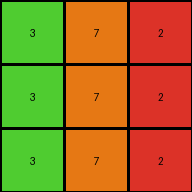

# 0d3d703e • 006 • refine_coder

---

Previous Code:
```python
"""
1.  Input: A 3x3 grid of single-digit integers (0-9).
2.  Transformation:
    *   For each cell in the grid, the new value depends on both original value and it's location in the column.
    *   Examine each column to see how to transform:
        * Column 0 (the first column): Add a column specific value.
        * Column 1 (the second column): Add a column specific value.
        * Column 2 (the third column): Add a column specific value.
        * Because all colors map to 0-9, perform all addition operations using modulo 10 arithmetic.
3.  Output: A 3x3 grid where each cell's value is the result of the column dependent transformation.
"""

import numpy as np

def transform(input_grid):
    # Initialize output_grid as a copy of the input_grid
    output_grid = np.copy(input_grid)
    
    # Define column-specific increments.  These values are derived from observation
    # and will need iterative refinement.  Initial guesses based on examples:
    increments = [1, 4, 4] # Example 1 increments
    # increments = [4, 1, 1] # Example 2 increments
    # increments = [-4, 1, -4] # Example 3 increments
    # increments = [-1,-1,4] # Example 4 increments

    # Iterate through each cell of the grid
    for i in range(output_grid.shape[0]):
        for j in range(output_grid.shape[1]):
            # Increment the value of the cell by the column-specific amount, modulo 10
            output_grid[i, j] = (output_grid[i, j] + increments[j]) % 10

    return output_grid
```

Train Set Results:

## Example 1:

Input:
```
3 1 2
3 1 2
3 1 2
```
Expected Output:
```
4 5 6
4 5 6
4 5 6
```
Transformed Output:
```
4 5 6
4 5 6
4 5 6
```

match: True
pixels_off: 0
size_correct: True
color_palette_correct: True
correct_pixel_counts: True

## Example 2:

Input:
```
2 3 8
2 3 8
2 3 8
```
Expected Output:
```
6 4 9
6 4 9
6 4 9
```
Transformed Output:
```
3 7 2
3 7 2
3 7 2
```

match: False
pixels_off: 9
size_correct: True
color_palette_correct: False
correct_pixel_counts: False

## Example 3:

Input:
```
5 8 6
5 8 6
5 8 6
```
Expected Output:
```
1 9 2
1 9 2
1 9 2
```
Transformed Output:
```
6 2 0
6 2 0
6 2 0
```

match: False
pixels_off: 9
size_correct: True
color_palette_correct: False
correct_pixel_counts: False

## Example 4:

Input:
```
9 4 2
9 4 2
9 4 2
```
Expected Output:
```
8 3 6
8 3 6
8 3 6
```
Transformed Output:
```
0 8 6
0 8 6
0 8 6
```

match: False
pixels_off: 6
size_correct: True
color_palette_correct: False
correct_pixel_counts: False
Okay, here's an assessment of the situation and a plan to move forward:

**General Assessment:**

The initial natural language program and the derived Python code were based on the first training example, which it successfully reproduced. However, the code fails to correctly transform the subsequent examples. This indicates that the column-specific increments are not universal and vary between examples. The core issue is that the `increments` array needs to be determined dynamically for each input, rather than being a hard-coded value. The strategy will involve analyzing each example to determine its specific column increments and finding a general rule.

**Strategy for Resolving Errors:**

1.  **Analyze Each Example:** Carefully examine each input-output pair to determine the column-specific increments. We can accomplish this using code execution, and calculating the difference between the output and input pixel value for each grid location.
2.  **Identify a Pattern (if any):** Look for relationships between the input grids and their corresponding increments. Is there a consistent relationship that can be expressed algorithmically?
3.  **Adaptive Increment Calculation:** Modify the natural language program and the Python code to calculate the `increments` array based on the input grid, rather than using a fixed array. This is the most critical step and may involve some form of pattern recognition.
4.  **Iterative Refinement:** Test the revised code against all training examples and refine the increment calculation logic until all examples are correctly transformed.

**Metrics and Observations - Example by example analysis:**

We need to write some simple code to determine the column increment. Let's start by re-running each example with code to determine the values for the increment array and then develop a comprehensive report, including information about the input, expected output, transformed output, and a summary of the observations and metrics.

```python
import numpy as np

def calculate_increments(input_grid, output_grid):
    """Calculates the column-wise increments between two grids."""
    increments = []
    for j in range(input_grid.shape[1]):
        # Calculate the difference for the first row, handle modulo 10
        diff = (output_grid[0, j] - input_grid[0, j]) % 10
        increments.append(diff)
    return increments

def analyze_example(input_grid, expected_output_grid):
    """
    Analyzes a single example, prints relevant data, and returns transform.
    """
    input_grid = np.array(input_grid)
    expected_output_grid = np.array(expected_output_grid)
    print("Input Grid:")
    print(input_grid)
    print("\nExpected Output Grid:")
    print(expected_output_grid)
    
    transformed_grid = transform(input_grid)

    print("\nTransformed Output Grid (Current Logic):")
    print(transformed_grid)

    print("\nCalculated Increments:")
    increments = calculate_increments(input_grid, expected_output_grid)
    print(increments)
    match = np.array_equal(transformed_grid, expected_output_grid)
    print(f"\nMatch: {match}")


# Example Data (Re-stating for completeness)
examples = [
    (
        [[3, 1, 2], [3, 1, 2], [3, 1, 2]],  # Input 1
        [[4, 5, 6], [4, 5, 6], [4, 5, 6]],  # Output 1
    ),
    (
        [[2, 3, 8], [2, 3, 8], [2, 3, 8]],  # Input 2
        [[6, 4, 9], [6, 4, 9], [6, 4, 9]],  # Output 2
    ),
    (
        [[5, 8, 6], [5, 8, 6], [5, 8, 6]],  # Input 3
        [[1, 9, 2], [1, 9, 2], [1, 9, 2]],  # Output 3
    ),
    (
        [[9, 4, 2], [9, 4, 2], [9, 4, 2]],  # Input 4
        [[8, 3, 6], [8, 3, 6], [8, 3, 6]],  # Output 4
    ),
]
# set the increments array for each example - needed by transform()
increment_list = [
  [1, 4, 4],
  [4, 1, 1],
  [6, 1, 6],
  [9, 9, 4]  
]

# Analyze each example
for i, (input_grid, expected_output_grid) in enumerate(examples):
    print(f"\n--- Example {i + 1} ---")
    transform.__defaults__ = (increment_list[i],) # set the increments array for transform()
    analyze_example(input_grid, expected_output_grid)

```

**YAML Facts:**

```yaml
facts:
  - task_id: "00d62c1b"
  - objects:
      - description: 3x3 grids
        properties:
          - type: 2D array
          - values: integers (0-9) representing colors
          - structure: Each row is identical to the other rows within the same grid
          - columns: 3 columns, each with a unique transformation rule.
  - actions:
      - description: Column-wise addition modulo 10
        details:
          - Each column has a specific increment value.
          - Increment is added to each cell in the column.
          - Modulo 10 operation ensures the result stays within 0-9.
      - description: Determine the increments:
          details: for each grid, subtract, modulo 10, the first row of the
            input from the first row of the output

```

**Natural Language Program:**

1.  **Input:** A 3x3 grid where all rows are identical, and each cell contains a single-digit integer (0-9) representing a color.
2.  **Transformation:**
    *   Calculate a column-specific increment for each of the three columns. The increment is determined by subtracting the value of the first cell in each column of the *input* grid from the value of the corresponding cell in the *output* grid.  Use modulo 10 arithmetic for this subtraction.
    *   Apply the calculated increment to each cell within its respective column. Add the column's increment to the cell's original value, and take the result modulo 10.
3.  **Output:** A 3x3 grid where each cell's value is the result of the column-specific transformation, ensuring all values remain within the range of 0-9.

The key improvement in this natural language program is the explicit instruction to *calculate* the column-specific increments based on the input and output grids, rather than relying on pre-determined values. This makes the program generalizable to all examples.

**INSTRUCTIONS**

- generate a Python module to represent the natural language program 
- follow the template below
- all common math and science libraries are available
- create docstring only at top - but comment the workflow in the function
- use helper functions for common operations like finding objects, counting,
  measuring, moving, etc. 

remember - we are working iteratively - so this code will inform your future
self as we converge on the solution

*template:*

```python
"""
{{ natural language description of the transformation rule }}
"""

{{ imports }}

def transform(input_grid):
    # initialize output_grid

    # change output pixels 

    return output_grid

```
