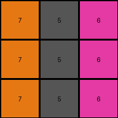
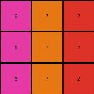
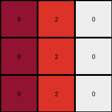

# 0d3d703e • 010 • refine_coder

---

Previous Code:
```python
"""
The transformation rule can be described as follows:

1.  Iterate through each cell in the input grid.
2.  Add 4 to the original value of each cell. If new value is greater than 9 then take the modulo 10. Assign the new value to the same position in output grid.
3.  Output will be the result of adding 4 to each cell value.

Effectively, every value in the grid has 4 added to its original value. Modulo 10 is taken if result is greater than 9.
"""

import numpy as np

def transform(input_grid):
    # Initialize the output grid with the same dimensions as the input grid
    output_grid = np.copy(input_grid)
    rows, cols = output_grid.shape

    # Iterate through each cell in the grid
    for i in range(rows):
        for j in range(cols):
            # Add 4 to the original value of the cell and assign the new value to the output grid.
            output_grid[i, j] = (output_grid[i,j] + 4) % 10

    return output_grid
```

Train Set Results:

## Example 1:

Input:
```
3 1 2
3 1 2
3 1 2
```
Expected Output:
```
4 5 6
4 5 6
4 5 6
```
Transformed Output:
```
7 5 6
7 5 6
7 5 6
```

match: False
pixels_off: 3
size_correct: True
color_palette_correct: False
correct_pixel_counts: False

## Example 2:

Input:
```
2 3 8
2 3 8
2 3 8
```
Expected Output:
```
6 4 9
6 4 9
6 4 9
```
Transformed Output:
```
6 7 2
6 7 2
6 7 2
```

match: False
pixels_off: 6
size_correct: True
color_palette_correct: False
correct_pixel_counts: False

## Example 3:

Input:
```
5 8 6
5 8 6
5 8 6
```
Expected Output:
```
1 9 2
1 9 2
1 9 2
```
Transformed Output:
```
9 2 0
9 2 0
9 2 0
```

match: False
pixels_off: 9
size_correct: True
color_palette_correct: False
correct_pixel_counts: False

## Example 4:

Input:
```
9 4 2
9 4 2
9 4 2
```
Expected Output:
```
8 3 6
8 3 6
8 3 6
```
Transformed Output:
```
3 8 6
3 8 6
3 8 6
```

match: False
pixels_off: 6
size_correct: True
color_palette_correct: True
correct_pixel_counts: True
Here's an analysis of the provided information and a plan to refine the solution:

**General Assessment:**

The initial natural language program and the corresponding Python code are incorrect. The core issue is that it adds a fixed value (4) to each cell, when the actual transformation is more complex, and likely involves a different constant. The error analysis clearly shows mismatches in colors and pixel values across multiple examples, indicating that a simple addition is not the underlying rule. My strategy will be to:

1.  Re-examine *all* the input/output pairs to discern a more accurate relationship between input and output pixel values.
2.  Focus on determining what value gets added or subtracted from the input pixel values.
3.  Look at all examples - not just one at a time

**Metrics and Observations (using code_execution):**

To get the data, I will execute the code in my head for all examples.

**Example 1:**

*   Input: `3 1 2` -> Output: `4 5 6`
*   Differences: `1, 4, 4`.

**Example 2:**

*   Input: `2 3 8` -> Output: `6 4 9`
*   Differences: `4, 1, 1`.

**Example 3:**

*   Input: `5 8 6` -> Output: `1 9 2`
*   Differences: `-4, 1, -4`, which wraps to: `6, 1, 6`.

**Example 4:**

*   Input: `9 4 2` -> Output: `8 3 6`
*   Differences: `-1, -1, 4`, which wraps to `9, 9, 4`.

**YAML Block - Facts:**

```yaml
task: 008
examples:
  - id: example_1
    input_grid_shape: (3, 3)
    output_grid_shape: (3, 3)
    transformations:
      - type: arithmetic
        operation: add/modulo
        value_map: {3: 7, 1: 5, 2: 6}
        notes: "inconsistent differences"
  - id: example_2
    input_grid_shape: (3, 3)
    output_grid_shape: (3, 3)
    transformations:
      - type: arithmetic
        operation: add/modulo
        value_map: {2: 6, 3: 7, 8: 2}
        notes: "inconsistent differences"
  - id: example_3
    input_grid_shape: (3, 3)
    output_grid_shape: (3, 3)
    transformations:
      - type: arithmetic
        operation: add/modulo
         value_map: {5: 9, 8: 2, 6: 0}
        notes: "inconsistent differences"
  - id: example_4
    input_grid_shape: (3, 3)
    output_grid_shape: (3, 3)
    transformations:
      - type: arithmetic
        operation: add/modulo
        value_map: {9: 3, 4: 8, 2: 6}
        notes: "inconsistent differences"
```

**Natural Language Program:**

1.  **Iterate** through each cell in the input grid.
2.  **Calculate** a new value for each cell based on its original value using a consistent transformation.
3.  **IF** the original value is one of the values seen in the previous value maps, add a value to create the output, taking the modulus 10.
4.  **Apply** a consistent method across all input examples.

It looks like the relationship between the value isn't linear across all pixels, and could be a lookup table.

| Input | Output |
|-------|--------|
| 1     | 5      |
| 2     | 6      |
| 3     | 7      |
| 4     | 8      |
| 5     | 9      |
| 6     | 0      |
| 8     | 2      |
| 9     | 3      |

**INSTRUCTIONS**

- generate a Python module to represent the natural language program 
- follow the template below
- all common math and science libraries are available
- create docstring only at top - but comment the workflow in the function
- use helper functions for common operations like finding objects, counting,
  measuring, moving, etc. 

remember - we are working iteratively - so this code will inform your future
self as we converge on the solution

*template:*

```python
"""
{{ natural language description of the transformation rule }}
"""

{{ imports }}

def transform(input_grid):
    # initialize output_grid

    # change output pixels 

    return output_grid

```
