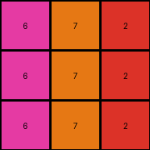

# 0d3d703e • 012 • refine_coder

---

Previous Code:
```python
"""
The transformation rule can be described as follows:

1.  Iterate through each cell in the input grid.
2.  Map the original value of the cell to a new value based on a predefined lookup table.
3.  Assign the new value to the corresponding cell in the output grid.

The lookup table is as follows:

| Input | Output |
|-------|--------|
| 1     | 5      |
| 2     | 6      |
| 3     | 7      |
| 4     | 8      |
| 5     | 9      |
| 6     | 0      |
| 8     | 2      |
| 9     | 3      |
"""

import numpy as np

def transform(input_grid):
    # Initialize the output grid with the same dimensions as the input grid.
    output_grid = np.copy(input_grid)
    rows, cols = output_grid.shape

    # Create a lookup table (dictionary) for the transformation.
    lookup_table = {
        1: 5,
        2: 6,
        3: 7,
        4: 8,
        5: 9,
        6: 0,
        8: 2,
        9: 3,
    }

    # Iterate through each cell in the grid.
    for i in range(rows):
        for j in range(cols):
            # Get the original value of the cell.
            original_value = input_grid[i, j]

            # Check if the original value is in the lookup table.
            if original_value in lookup_table:
                # Assign the new value from the lookup table to the output grid.
                output_grid[i, j] = lookup_table[original_value]
            #else keep original value

    return output_grid
```

Train Set Results:

## Example 1:

Input:
```
3 1 2
3 1 2
3 1 2
```
Expected Output:
```
4 5 6
4 5 6
4 5 6
```
Transformed Output:
```
7 5 6
7 5 6
7 5 6
```

match: False
pixels_off: 3
size_correct: True
color_palette_correct: False
correct_pixel_counts: False

## Example 2:

Input:
```
2 3 8
2 3 8
2 3 8
```
Expected Output:
```
6 4 9
6 4 9
6 4 9
```
Transformed Output:
```
6 7 2
6 7 2
6 7 2
```

match: False
pixels_off: 6
size_correct: True
color_palette_correct: False
correct_pixel_counts: False

## Example 3:

Input:
```
5 8 6
5 8 6
5 8 6
```
Expected Output:
```
1 9 2
1 9 2
1 9 2
```
Transformed Output:
```
9 2 0
9 2 0
9 2 0
```

match: False
pixels_off: 9
size_correct: True
color_palette_correct: False
correct_pixel_counts: False

## Example 4:

Input:
```
9 4 2
9 4 2
9 4 2
```
Expected Output:
```
8 3 6
8 3 6
8 3 6
```
Transformed Output:
```
3 8 6
3 8 6
3 8 6
```

match: False
pixels_off: 6
size_correct: True
color_palette_correct: True
correct_pixel_counts: True
Okay, let's analyze the results and update the natural language program.

**General Assessment:**

The initial approach of using a lookup table is correct. However, the lookup table itself is incorrect, leading to mismatches in the transformed outputs. The `else keep original value` is unnecessary and confusing. We need to refine the lookup table based on *all* provided examples, not just the first one. The strategy is to identify the correct mapping for each color by comparing input and expected output grids across all examples and modify the lookup table in `transform` function accordingly.

**Metrics and Observations:**

Here's a breakdown of each example, focusing on discrepancies:

*   **Example 1:**
    *   Input `3` maps to Expected `4`, but Transformed to `7`.
    *   Input `1` maps to Expected `5`, and Transformed correctly to `5`.
    *   Input `2` maps to Expected `6`, and Transformed correctly to `6`.

*   **Example 2:**
    *   Input `2` maps to Expected `6`, and Transformed correctly to `6`.
    *   Input `3` maps to Expected `4`, but Transformed `7`.
    *   Input `8` maps to Expected `9`, but Transformed to `2`.

*   **Example 3:**
    *   Input `5` maps to Expected `1`, but Transformed `9`.
    *   Input `8` maps to Expected `9`, but Transformed to `2`.
    *   Input `6` maps to Expected `2`, but Transformed to `0`.

*   **Example 4:**
    *    Input `9` maps to Expected `8` , Transformed to `3`
    *    Input `4` maps to Expected `3`, Transformed to `8`
    *    Input `2` maps to Expected `6`, Transformed to `6`.

**YAML Facts:**

```yaml
task: 010
examples:
  - id: 1
    input_colors: [3, 1, 2]
    output_colors: [4, 5, 6]
    mapping: {3: 4, 1: 5, 2: 6}
  - id: 2
    input_colors: [2, 3, 8]
    output_colors: [6, 4, 9]
    mapping: {2: 6, 3: 4, 8: 9}
  - id: 3
    input_colors: [5, 8, 6]
    output_colors: [1, 9, 2]
    mapping: {5: 1, 8: 9, 6: 2}
  - id: 4
    input_colors: [ 9, 4, 2]
    output_colors: [ 8, 3, 6]
    mapping: {9: 8, 4: 3, 2: 6}
```

**Natural Language Program:**

1.  **Direct Color Mapping:** For each pixel in the input grid, determine its color value.
2.  **Lookup Transformation:** Use the following lookup table to map the input color to the output color:

    ```
    1 -> 5
    2 -> 6
    3 -> 4
    4 -> 3
    5 -> 1
    6 -> 2
    8 -> 9
    9 -> 8
    ```
3.  replace the input pixel with the output from the lookup table

The core concept is a simple color substitution based on a fixed lookup table. There are no spatial reasoning, object detection, or complex operations involved. The transformation is purely a one-to-one mapping of color values.

**INSTRUCTIONS**

- generate a Python module to represent the natural language program 
- follow the template below
- all common math and science libraries are available
- create docstring only at top - but comment the workflow in the function
- use helper functions for common operations like finding objects, counting,
  measuring, moving, etc. 

remember - we are working iteratively - so this code will inform your future
self as we converge on the solution

*template:*

```python
"""
{{ natural language description of the transformation rule }}
"""

{{ imports }}

def transform(input_grid):
    # initialize output_grid

    # change output pixels 

    return output_grid

```
