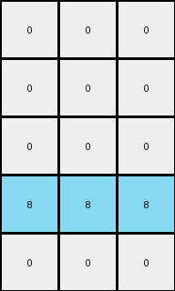

# 1b2d62fb • 003 • refine_dreamer

---

Previous Code:
```python
"""
The transformation rule detects a vertical line of blue (1) pixels, collapses the grid horizontally, and replaces the detected feature with a horizontal line of azure (8) pixels in the fourth row. The rest of the output grid is filled with white (0) pixels.
"""

import numpy as np

def find_vertical_line(grid, color):
    """Finds the column index of a vertical line of the specified color."""
    height, width = grid.shape
    for j in range(width):
        is_line = True
        for i in range(height):
            if grid[i, j] != color:
                is_line = False
                break
        if is_line:
            return j
    return -1  # Return -1 if no such line is found

def transform(input_grid):
    """Transforms the input grid according to the described rule."""
    # Find the vertical blue line
    blue_column = find_vertical_line(input_grid, 1)

    # Initialize the output grid (5x3, filled with 0s)
    output_grid = np.zeros((5, 3), dtype=int)

    # Condense and place the azure line in the output grid at row index 3 (fourth row)
    if blue_column != -1:
        output_grid[3, :] = 8

    return output_grid
```

Train Set Results:

## Example 1:

Input:
```
0 9 9 1 9 9 9
0 0 9 1 9 9 0
9 0 9 1 9 9 0
0 0 0 1 9 0 0
0 9 9 1 9 9 9
```
Expected Output:
```
0 0 0
0 0 0
0 0 0
0 8 8
0 0 0
```
Transformed Output:
```
0 0 0
0 0 0
0 0 0
8 8 8
0 0 0
```

match: False
pixels_off: 1
size_correct: True
color_palette_correct: True
correct_pixel_counts: False

## Example 2:

Input:
```
0 0 0 1 9 0 0
9 0 9 1 9 9 9
0 9 9 1 9 9 9
0 0 0 1 9 9 9
0 9 9 1 9 9 9
```
Expected Output:
```
0 8 8
0 0 0
0 0 0
0 0 0
0 0 0
```
Transformed Output:
```
0 0 0
0 0 0
0 0 0
8 8 8
0 0 0
```

match: False
pixels_off: 5
size_correct: True
color_palette_correct: True
correct_pixel_counts: False

## Example 3:

Input:
```
9 0 0 1 9 0 9
9 0 0 1 0 9 0
9 0 0 1 9 0 0
0 9 9 1 0 9 9
0 0 9 1 0 9 0
```
Expected Output:
```
0 8 0
0 0 8
0 8 8
8 0 0
8 0 0
```
Transformed Output:
```
0 0 0
0 0 0
0 0 0
8 8 8
0 0 0
```

match: False
pixels_off: 7
size_correct: True
color_palette_correct: True
correct_pixel_counts: False

## Example 4:

Input:
```
0 9 9 1 9 0 9
9 0 0 1 9 0 0
9 9 9 1 9 9 9
0 9 0 1 0 0 0
9 0 0 1 9 0 0
```
Expected Output:
```
0 0 0
0 8 8
0 0 0
8 0 8
0 8 8
```
Transformed Output:
```
0 0 0
0 0 0
0 0 0
8 8 8
0 0 0
```

match: False
pixels_off: 5
size_correct: True
color_palette_correct: True
correct_pixel_counts: False

## Example 5:

Input:
```
0 9 9 1 9 0 9
9 0 9 1 9 9 9
9 9 9 1 0 0 9
9 0 0 1 9 0 0
9 9 9 1 0 0 9
```
Expected Output:
```
0 0 0
0 0 0
0 0 0
0 8 8
0 0 0
```
Transformed Output:
```
0 0 0
0 0 0
0 0 0
8 8 8
0 0 0
```

match: False
pixels_off: 1
size_correct: True
color_palette_correct: True
correct_pixel_counts: False
**INSTRUCTIONS**

The code above was generated based on observations from the first training
example

we have tested the transform function on each of the task example inputs and
compared with the expected output

review each of the examples provided and the results and consider how the
natural language program should be updated to accommodate this new knowledge

respond with the following deliverables:

- general assessment of the information provided and strategy for resolving the
  errors
- gather metrics about each of the examples and results - use code_execution to
  develop accurate reports on your assumptions
- a YAML block documenting facts - Focus on identifying objects, their properties, and the actions performed on them.
- a natural language program - Be as clear and concise as possible, providing a complete description of the transformation rule.


your responses should be considered as information in a report - not a
conversation
