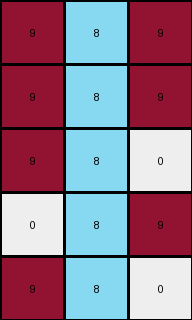

# 1b2d62fb • 015 • refine_dreamer

---


Previous Code:
```python
"""
1.  **Identify the Target Column:** Find the column in the input grid that is entirely filled with blue (1) pixels.
2.  **Extract Columns:** Extract the target column, one to the right of the blue pixels, and one to the left of the blue pixels.
3.  **Construct Output:** Create a new grid using the extracted columns.
4.  Change color. Change all of the blue (1) pixels to azure (8) pixels.
5.  Maintain the other non-blue pixels with original color and location relative to the central column.
"""

import numpy as np

def find_blue_column(grid):
    # Iterate through each column
    for j in range(grid.shape[1]):
        # Check if all elements in the column are equal to 1 (blue)
        if np.all(grid[:, j] == 1):
            return j  # Return the index of the blue column
    return -1  # Return -1 if no such column is found

def transform(input_grid):
    # Find the index of the blue column
    blue_column_index = find_blue_column(input_grid)

    # Handle the case where no blue column is found (should not happen, per task instructions, but still good to check.)
    if blue_column_index == -1:
        return None # Or raise an exception, or return a copy of the input, or whatever is appropriate

    # Determine the range of columns to extract.

    left_column_index = blue_column_index - 1
    right_column_index = blue_column_index + 1

    #check column bounds
    if left_column_index < 0:
        left_column_index = 0
    if right_column_index > input_grid.shape[1]-1:
        right_column_index = input_grid.shape[1]-1

    # Extract columns including bounds check.
    extracted_columns = []
    if left_column_index >= 0:
      extracted_columns.append(input_grid[:, left_column_index])
    extracted_columns.append(input_grid[:,blue_column_index])

    if right_column_index < input_grid.shape[1]:
        extracted_columns.append(input_grid[:, right_column_index])

    # Create the output grid
    output_grid = np.stack(extracted_columns, axis=1)

    #change blue to azure
    output_grid[output_grid == 1] = 8

    return output_grid
```

Train Set Results:

## Example 1:

Input:
```
0 9 9 1 9 9 9
0 0 9 1 9 9 0
9 0 9 1 9 9 0
0 0 0 1 9 0 0
0 9 9 1 9 9 9
```
Expected Output:
```
0 0 0
0 0 0
0 0 0
0 8 8
0 0 0
```
Transformed Output:
```
9 8 9
9 8 9
9 8 9
0 8 9
9 8 9
```

match: False
pixels_off: 13
size_correct: True
color_palette_correct: False
correct_pixel_counts: False

## Example 2:

Input:
```
0 0 0 1 9 0 0
9 0 9 1 9 9 9
0 9 9 1 9 9 9
0 0 0 1 9 9 9
0 9 9 1 9 9 9
```
Expected Output:
```
0 8 8
0 0 0
0 0 0
0 0 0
0 0 0
```
Transformed Output:
```
0 8 9
9 8 9
9 8 9
0 8 9
9 8 9
```

match: False
pixels_off: 12
size_correct: True
color_palette_correct: False
correct_pixel_counts: False

## Example 3:

Input:
```
9 0 0 1 9 0 9
9 0 0 1 0 9 0
9 0 0 1 9 0 0
0 9 9 1 0 9 9
0 0 9 1 0 9 0
```
Expected Output:
```
0 8 0
0 0 8
0 8 8
8 0 0
8 0 0
```
Transformed Output:
```
0 8 9
0 8 0
0 8 9
9 8 0
9 8 0
```

match: False
pixels_off: 8
size_correct: True
color_palette_correct: False
correct_pixel_counts: False

## Example 4:

Input:
```
0 9 9 1 9 0 9
9 0 0 1 9 0 0
9 9 9 1 9 9 9
0 9 0 1 0 0 0
9 0 0 1 9 0 0
```
Expected Output:
```
0 0 0
0 8 8
0 0 0
8 0 8
0 8 8
```
Transformed Output:
```
9 8 9
0 8 9
9 8 9
0 8 0
0 8 9
```

match: False
pixels_off: 11
size_correct: True
color_palette_correct: False
correct_pixel_counts: False

## Example 5:

Input:
```
0 9 9 1 9 0 9
9 0 9 1 9 9 9
9 9 9 1 0 0 9
9 0 0 1 9 0 0
9 9 9 1 0 0 9
```
Expected Output:
```
0 0 0
0 0 0
0 0 0
0 8 8
0 0 0
```
Transformed Output:
```
9 8 9
9 8 9
9 8 0
0 8 9
9 8 0
```

match: False
pixels_off: 11
size_correct: True
color_palette_correct: False
correct_pixel_counts: False

**INSTRUCTIONS**

The code above was generated based on observations from the first training
example

we have tested the transform function on each of the task example inputs and
compared with the expected output

review each of the examples provided and the results and consider how the
natural language program should be updated to accommodate this new knowledge

respond with the following deliverables:

- general assessment of the information provided and strategy for resolving the
  errors
- gather metrics about each of the examples and results - use code_execution to
  develop accurate reports on your assumptions
- a YAML block documenting facts - Focus on identifying objects, their properties, and the actions performed on them.
- a natural language program - Be as clear and concise as possible, providing a complete description of the transformation rule.


your responses should be considered as information in a report - not a
conversation
