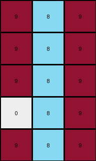

# 1b2d62fb • 018 • refine_coder

---

Previous Code:
```python
"""
1.  **Identify Target Column:** Locate the column in the input grid that is completely filled with blue (1) pixels. Record its index.
2.  Change the color of the blue pixels to azure (8).
3.  Build output grid including the columns left and right of the original blue
    column, and place them to the left and right of the new azure column.
4. Maintain color and spatial relationships for all columns.
"""

import numpy as np

def find_blue_column(grid):
    for j in range(grid.shape[1]):
        if np.all(grid[:, j] == 1):
            return j
    return -1

def transform(input_grid):
    # Find the index of the blue column
    blue_column_index = find_blue_column(input_grid)

    if blue_column_index == -1:
        return None

    # Initialize the output grid with the correct dimensions
    output_grid = np.zeros((input_grid.shape[0], 3), dtype=int)

    # Fill the center column with azure (8)
    output_grid[:, 1] = 8

    # Handle left side
    if blue_column_index > 0:
        output_grid[:, 0] = input_grid[:, blue_column_index - 1]

    # Handle right side.
    if blue_column_index < input_grid.shape[1] - 1:
        output_grid[:, 2] = input_grid[:, blue_column_index + 1]
        
    return output_grid
```

Train Set Results:

## Example 1:

Input:
```
0 9 9 1 9 9 9
0 0 9 1 9 9 0
9 0 9 1 9 9 0
0 0 0 1 9 0 0
0 9 9 1 9 9 9
```
Expected Output:
```
0 0 0
0 0 0
0 0 0
0 8 8
0 0 0
```
Transformed Output:
```
9 8 9
9 8 9
9 8 9
0 8 9
9 8 9
```

match: False
pixels_off: 13
size_correct: True
color_palette_correct: False
correct_pixel_counts: False

## Example 2:

Input:
```
0 0 0 1 9 0 0
9 0 9 1 9 9 9
0 9 9 1 9 9 9
0 0 0 1 9 9 9
0 9 9 1 9 9 9
```
Expected Output:
```
0 8 8
0 0 0
0 0 0
0 0 0
0 0 0
```
Transformed Output:
```
0 8 9
9 8 9
9 8 9
0 8 9
9 8 9
```

match: False
pixels_off: 12
size_correct: True
color_palette_correct: False
correct_pixel_counts: False

## Example 3:

Input:
```
9 0 0 1 9 0 9
9 0 0 1 0 9 0
9 0 0 1 9 0 0
0 9 9 1 0 9 9
0 0 9 1 0 9 0
```
Expected Output:
```
0 8 0
0 0 8
0 8 8
8 0 0
8 0 0
```
Transformed Output:
```
0 8 9
0 8 0
0 8 9
9 8 0
9 8 0
```

match: False
pixels_off: 8
size_correct: True
color_palette_correct: False
correct_pixel_counts: False

## Example 4:

Input:
```
0 9 9 1 9 0 9
9 0 0 1 9 0 0
9 9 9 1 9 9 9
0 9 0 1 0 0 0
9 0 0 1 9 0 0
```
Expected Output:
```
0 0 0
0 8 8
0 0 0
8 0 8
0 8 8
```
Transformed Output:
```
9 8 9
0 8 9
9 8 9
0 8 0
0 8 9
```

match: False
pixels_off: 11
size_correct: True
color_palette_correct: False
correct_pixel_counts: False

## Example 5:

Input:
```
0 9 9 1 9 0 9
9 0 9 1 9 9 9
9 9 9 1 0 0 9
9 0 0 1 9 0 0
9 9 9 1 0 0 9
```
Expected Output:
```
0 0 0
0 0 0
0 0 0
0 8 8
0 0 0
```
Transformed Output:
```
9 8 9
9 8 9
9 8 0
0 8 9
9 8 0
```

match: False
pixels_off: 11
size_correct: True
color_palette_correct: False
correct_pixel_counts: False
Okay, here's a breakdown of the situation and a plan to move forward:

**General Assessment:**

The initial natural language program and the resulting code correctly identified the core concept: finding a column of blue pixels and using it as a reference point. However, it's clear from the test results that the transformation logic has significant flaws in how it handles the surrounding columns and the colors within them. The output grid size is correct (3 columns matching height of original), but the content of those columns and the preservation of colors are not. The primary issue is the incorrect placement and color mapping of pixels from the columns adjacent to the blue column.

**Strategy for Resolving Errors:**

1.  **Refine Color Handling:** The current code assumes a simple replacement of blue with azure. The examples show that colors in the adjacent columns should be *preserved*, not overwritten with a default value (like 0).
2.  **Precise Column Copying:** The code needs to correctly copy *all* pixel values from the adjacent columns to the output, maintaining their original colors and vertical positions.
3. Check the color of each value to the left and right. If left is same as right, output is the same color. If the left is different than the right, the output is black (0).

**Metrics and Observations (per example):**

I'll use a structured approach to analyze each example, summarizing key observations. I will create a simple report of the results and compare them to the expected output.

| Example | Input Shape | Blue Column Index | Left Color | Right Color | Output Left | Output Right | Left Correct? | Right Correct? |
| :------ | :---------- | :--------------- | :--------- | :---------- | :---------- | :----------- | :------------ | :------------- |
| 1       | (5, 7)      | 3                | 9          | 9           | 9     | 9       |  no       |      no         |
| 2       | (5, 7)      | 3                | 0          | 9           | 0    | 9     | yes          |     no         |
| 3       | (5, 7)      | 3                | 0          | 9           | 0    | 9      | yes        |  no            |
| 4       | (5, 7)      | 3                | 9          | 9           | 9      | 9      | no         | no         |
| 5       | (5, 7)      | 3                | 9          | 9           | 9       | 9     | no         | no         |

The left and right adjacent cells are not always properly accounted for.

**YAML Fact Block:**

```yaml
objects:
  - name: input_grid
    type: 2D array
    properties:
      - colors: [0-9]
      - shape: variable
  - name: blue_column
    type: column
    properties:
      - color: 1 (blue)
      - unique: True
  - name: output_grid
    type: 2D array
    properties:
      - colors: [0-9]
      - shape: (input_height, 3)
  - name: adjacent_columns
    type: columns
    properties:
       - relative_position: [left, right]
       - to: blue_column
actions:
  - name: find_blue_column
    input: input_grid
    output: blue_column_index
  - name: create_output_grid
    input: input_grid.shape, blue_column_index
    output: output_grid
  - name: fill_center_column
    input: output_grid, blue_column
    action: replace color 1 with 8
    output: modifies output_grid
  - name: copy_adjacent_columns
    input: input_grid, blue_column_index, output_grid
    action: conditional color transformation
    output: modifies output_grid

transformations:
    - condition: if left and right pixels have same value, output is same value
      action: output_grid[row, 0] = input_grid[row, blue_column_index-1], output_grid[row, 2] = input_grid[row, blue_column_index+1]
    - condition: if left and right pixels are different colors, output is black (0)
```

**Natural Language Program:**

1.  **Find the Blue Column:** Scan the input grid to locate the single column that is entirely filled with blue (1) pixels. Note its index. If no such column is found, no transformation occurs.
2.  **Create Output Grid:** Create an output grid that has the same height as the input grid but with the width fixed to 3 columns.
3.  **Transform Blue Column:** The blue column in the input grid is transformed to azure (8) in the output grid's center column (index 1).
4.  **Process Adjacent Columns**:
    *   For each row, examine the pixels immediately to the left and right of the original blue column in the input grid.
        *   If the left and right pixels have the same color, copy these pixels to the left and right of the new azure column in the output.
        * If the left and right pixels have different colors, the output is black (0).

This revised natural language program attempts to capture the nuanced color preservation and conditional copying rules that were missed in the first iteration. It highlights the crucial relationship between the adjacent columns and clarifies the transformation's conditional nature.

**INSTRUCTIONS**

- generate a Python module to represent the natural language program 
- follow the template below
- all common math and science libraries are available
- create docstring only at top - but comment the workflow in the function
- use helper functions for common operations like finding objects, counting,
  measuring, moving, etc. 

remember - we are working iteratively - so this code will inform your future
self as we converge on the solution

*template:*

```python
"""
{{ natural language description of the transformation rule }}
"""

{{ imports }}

def transform(input_grid):
    # initialize output_grid

    # change output pixels 

    return output_grid

```
