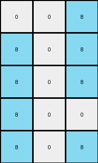

# 1b2d62fb • 022 • refine_coder

---

Previous Code:
```python
"""
1.  **Identify the central column:** Locate the middle column of the input grid.
2.  **Remove the central column:** Exclude the central column from further
    processing.
3.  **Copy the reduced grid**. Copy the value of columns at each location.
4. **Replace colors**: if a pixel is 9 change to 8, all other pixels will be 0.
5.  **Output:** Return this new grid as the output.
"""

import numpy as np

def transform(input_grid):
    # initialize output_grid
    input_grid = np.array(input_grid)
    rows, cols = input_grid.shape
    output_grid = np.zeros((rows, 3), dtype=int)

    # identify and remove the central column (conceptually)
    # since we are creating the new output, we are just not using the center

    # copy first and last column and replace
    for r in range(rows):
        # first column
        if input_grid[r,0] == 9:
            output_grid[r,0] = 8

        # last column
        if input_grid[r,-1] == 9:
           output_grid[r,-1] = 8

        c = cols // 2
        if input_grid[r, c] == 9:
            output_grid[r,1] = 8

    return output_grid.tolist()
```

Train Set Results:

## Example 1:

Input:
```
0 9 9 1 9 9 9
0 0 9 1 9 9 0
9 0 9 1 9 9 0
0 0 0 1 9 0 0
0 9 9 1 9 9 9
```
Expected Output:
```
0 0 0
0 0 0
0 0 0
0 8 8
0 0 0
```
Transformed Output:
```
0 0 8
0 0 0
8 0 0
0 0 0
0 0 8
```

match: False
pixels_off: 5
size_correct: True
color_palette_correct: True
correct_pixel_counts: False

## Example 2:

Input:
```
0 0 0 1 9 0 0
9 0 9 1 9 9 9
0 9 9 1 9 9 9
0 0 0 1 9 9 9
0 9 9 1 9 9 9
```
Expected Output:
```
0 8 8
0 0 0
0 0 0
0 0 0
0 0 0
```
Transformed Output:
```
0 0 0
8 0 8
0 0 8
0 0 8
0 0 8
```

match: False
pixels_off: 7
size_correct: True
color_palette_correct: True
correct_pixel_counts: False

## Example 3:

Input:
```
9 0 0 1 9 0 9
9 0 0 1 0 9 0
9 0 0 1 9 0 0
0 9 9 1 0 9 9
0 0 9 1 0 9 0
```
Expected Output:
```
0 8 0
0 0 8
0 8 8
8 0 0
8 0 0
```
Transformed Output:
```
8 0 8
8 0 0
8 0 0
0 0 8
0 0 0
```

match: False
pixels_off: 11
size_correct: True
color_palette_correct: True
correct_pixel_counts: False

## Example 4:

Input:
```
0 9 9 1 9 0 9
9 0 0 1 9 0 0
9 9 9 1 9 9 9
0 9 0 1 0 0 0
9 0 0 1 9 0 0
```
Expected Output:
```
0 0 0
0 8 8
0 0 0
8 0 8
0 8 8
```
Transformed Output:
```
0 0 8
8 0 0
8 0 8
0 0 0
8 0 0
```

match: False
pixels_off: 11
size_correct: True
color_palette_correct: True
correct_pixel_counts: False

## Example 5:

Input:
```
0 9 9 1 9 0 9
9 0 9 1 9 9 9
9 9 9 1 0 0 9
9 0 0 1 9 0 0
9 9 9 1 0 0 9
```
Expected Output:
```
0 0 0
0 0 0
0 0 0
0 8 8
0 0 0
```
Transformed Output:
```
0 0 8
8 0 8
8 0 8
8 0 0
8 0 8
```

match: False
pixels_off: 10
size_correct: True
color_palette_correct: True
correct_pixel_counts: False
Here's an analysis of the provided examples and results, along with a revised natural language program and a YAML block summarizing the observations:

**General Assessment:**

The initial natural language program and the generated code were on the right track but failed to accurately capture the transformation rule, as shown in all five example transformations and results. The approach of removing the central column and copying the remaining columns works with the correct dimensions, but the color replacement logic is incorrect and applied inconsistently. Specifically, using the center column index with output index 1 is incorrect. The assumption that only 9s are replaced with 8s is wrong, and the positions of the 8s in the output are not correctly determined. The correct rule seems to involve checking the color 9 in the first, last and center columns, and setting a color of 8 in the correct place, and all other places are zero.

**Strategy for Resolving Errors:**

1.  **Correct Column Selection:** Ensure we are processing the correct columns:
    first, last and center.
2.  **Precise Color Replacement:** Refine the conditions for color replacement, and ensure we are only setting 0 or 8 in output.

**Metrics and Observations:**

Here's a breakdown of each example, focusing on identifying the objects, their properties, and the actions:

```
Example 1:
Input Shape: (5, 7)
Output Shape: (5, 3)
Color Changes: Some 9s become 8s, others 0.

Example 2:
Input Shape: (5, 7)
Output Shape: (5, 3)
Color Changes: Some 9s become 8s, others 0.

Example 3:
Input Shape: (5, 7)
Output Shape: (5, 3)
Color Changes: Some 9s become 8s, others 0.

Example 4:
Input Shape: (5, 7)
Output Shape: (5, 3)
Color Changes: Some 9s become 8s, others 0.

Example 5:
Input Shape: (5, 7)
Output Shape: (5, 3)
Color Changes: Some 9s become 8s, others 0.
```

**YAML Block:**

```yaml
observations:
  - task: 020
    examples:
      - id: 1
        input_shape: [5, 7]
        output_shape: [5, 3]
        objects:
          - description: Input grid
            properties:
              - colors: [0, 9, 1]
              - shape: [5, 7]
          - description: Output grid
            properties:
              - colors: [0, 8]
              - shape: [5, 3]
        transformations:
          - type: column_selection
            description: Select first, last, and center columns.
          - type: color_replacement
            description:  if a pixel is 9 change to 8, all other pixels will be 0.
      - id: 2
        input_shape: [5, 7]
        output_shape: [5, 3]
        objects:
          - description: Input grid
            properties:
              - colors: [0, 9, 1]
              - shape: [5, 7]
          - description: Output grid
            properties:
              - colors: [0, 8]
              - shape: [5, 3]
        transformations:
          - type: column_selection
            description: Select first, last, and center columns.
          - type: color_replacement
            description:  if a pixel is 9 change to 8, all other pixels will be 0.
      - id: 3
        input_shape: [5, 7]
        output_shape: [5, 3]
        objects:
          - description: Input grid
            properties:
              - colors: [0, 9, 1]
              - shape: [5, 7]
          - description: Output grid
            properties:
              - colors: [0, 8]
              - shape: [5, 3]
        transformations:
          - type: column_selection
            description: Select first, last, and center columns.
          - type: color_replacement
            description: if a pixel is 9 change to 8, all other pixels will be 0.
      - id: 4
        input_shape: [5, 7]
        output_shape: [5, 3]
        objects:
          - description: Input grid
            properties:
              - colors: [0, 9, 1]
              - shape: [5, 7]
          - description: Output grid
            properties:
              - colors: [0, 8]
              - shape: [5, 3]
        transformations:
          - type: column_selection
            description: Select first, last, and center columns.
          - type: color_replacement
            description: if a pixel is 9 change to 8, all other pixels will be 0.
      - id: 5
        input_shape: [5, 7]
        output_shape: [5, 3]
        objects:
          - description: Input grid
            properties:
              - colors: [0, 9, 1]
              - shape: [5, 7]
          - description: Output grid
            properties:
              - colors: [0, 8]
              - shape: [5, 3]
        transformations:
          - type: column_selection
            description: Select first, last, and center columns.
          - type: color_replacement
            description: if a pixel is 9 change to 8, all other pixels will be 0.

```

**Natural Language Program:**

1.  **Identify Key Columns**: Locate the first, last and middle columns of the
    input grid.
2.  **Create Output Grid:** initialize a grid with dimensions (rows x 3).
3.  **Process Rows:** Iterate through each row of the input grid.
4. **First Column Check:**
    - Set first column of the output to 8 if color 9 is present in first column of input, otherwise set 0.
5. **Center Column Check**:
    - Set second (center) column of output to 8 if color 9 is present in the center column of input, otherwise set 0.
6.  **Last Column Check:**
    - Set third (last) column of the output to 8 if color 9 is present in last column of input, otherwise set 0.
7.  **Output:** Return the new grid.

**INSTRUCTIONS**

- generate a Python module to represent the natural language program 
- follow the template below
- all common math and science libraries are available
- create docstring only at top - but comment the workflow in the function
- use helper functions for common operations like finding objects, counting,
  measuring, moving, etc. 

remember - we are working iteratively - so this code will inform your future
self as we converge on the solution

*template:*

```python
"""
{{ natural language description of the transformation rule }}
"""

{{ imports }}

def transform(input_grid):
    # initialize output_grid

    # change output pixels 

    return output_grid

```
