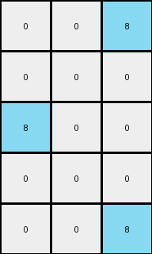
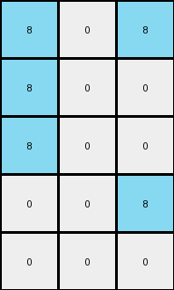
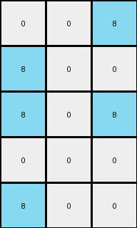
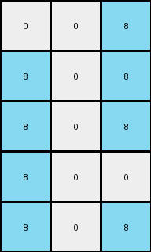

# 1b2d62fb • 023 • refine_dreamer

---


Previous Code:
```python
"""
1.  **Identify Key Columns**: Locate the first, last and middle columns of the
    input grid.
2.  **Create Output Grid:** initialize a grid with dimensions (rows x 3).
3.  **Process Rows:** Iterate through each row of the input grid.
4. **First Column Check:**
    - Set first column of the output to 8 if color 9 is present in first column of input, otherwise set 0.
5. **Center Column Check**:
    - Set second (center) column of output to 8 if color 9 is present in the center column of input, otherwise set 0.
6.  **Last Column Check:**
    - Set third (last) column of the output to 8 if color 9 is present in last column of input, otherwise set 0.
7.  **Output:** Return the new grid.
"""

import numpy as np

def transform(input_grid):
    # initialize output_grid
    input_grid = np.array(input_grid)
    rows, cols = input_grid.shape
    output_grid = np.zeros((rows, 3), dtype=int)

    # process each row
    for r in range(rows):
        # first column check
        if input_grid[r, 0] == 9:
            output_grid[r, 0] = 8

        # center column check
        center_col = cols // 2
        if input_grid[r, center_col] == 9:
            output_grid[r, 1] = 8

        # last column check
        if input_grid[r, -1] == 9:
            output_grid[r, 2] = 8

    return output_grid.tolist()
```

Train Set Results:

## Example 1:

Input:
```
0 9 9 1 9 9 9
0 0 9 1 9 9 0
9 0 9 1 9 9 0
0 0 0 1 9 0 0
0 9 9 1 9 9 9
```
Expected Output:
```
0 0 0
0 0 0
0 0 0
0 8 8
0 0 0
```
Transformed Output:
```
0 0 8
0 0 0
8 0 0
0 0 0
0 0 8
```

match: False
pixels_off: 5
size_correct: True
color_palette_correct: True
correct_pixel_counts: False

## Example 2:

Input:
```
0 0 0 1 9 0 0
9 0 9 1 9 9 9
0 9 9 1 9 9 9
0 0 0 1 9 9 9
0 9 9 1 9 9 9
```
Expected Output:
```
0 8 8
0 0 0
0 0 0
0 0 0
0 0 0
```
Transformed Output:
```
0 0 0
8 0 8
0 0 8
0 0 8
0 0 8
```

match: False
pixels_off: 7
size_correct: True
color_palette_correct: True
correct_pixel_counts: False

## Example 3:

Input:
```
9 0 0 1 9 0 9
9 0 0 1 0 9 0
9 0 0 1 9 0 0
0 9 9 1 0 9 9
0 0 9 1 0 9 0
```
Expected Output:
```
0 8 0
0 0 8
0 8 8
8 0 0
8 0 0
```
Transformed Output:
```
8 0 8
8 0 0
8 0 0
0 0 8
0 0 0
```

match: False
pixels_off: 11
size_correct: True
color_palette_correct: True
correct_pixel_counts: False

## Example 4:

Input:
```
0 9 9 1 9 0 9
9 0 0 1 9 0 0
9 9 9 1 9 9 9
0 9 0 1 0 0 0
9 0 0 1 9 0 0
```
Expected Output:
```
0 0 0
0 8 8
0 0 0
8 0 8
0 8 8
```
Transformed Output:
```
0 0 8
8 0 0
8 0 8
0 0 0
8 0 0
```

match: False
pixels_off: 11
size_correct: True
color_palette_correct: True
correct_pixel_counts: False

## Example 5:

Input:
```
0 9 9 1 9 0 9
9 0 9 1 9 9 9
9 9 9 1 0 0 9
9 0 0 1 9 0 0
9 9 9 1 0 0 9
```
Expected Output:
```
0 0 0
0 0 0
0 0 0
0 8 8
0 0 0
```
Transformed Output:
```
0 0 8
8 0 8
8 0 8
8 0 0
8 0 8
```

match: False
pixels_off: 10
size_correct: True
color_palette_correct: True
correct_pixel_counts: False

**INSTRUCTIONS**

The code above was generated based on observations from the first training
example

we have tested the transform function on each of the task example inputs and
compared with the expected output

review each of the examples provided and the results and consider how the
natural language program should be updated to accommodate this new knowledge

respond with the following deliverables:

- general assessment of the information provided and strategy for resolving the
  errors
- gather metrics about each of the examples and results - use code_execution to
  develop accurate reports on your assumptions
- a YAML block documenting facts - Focus on identifying objects, their properties, and the actions performed on them.
- a natural language program - Be as clear and concise as possible, providing a complete description of the transformation rule.


your responses should be considered as information in a report - not a
conversation
