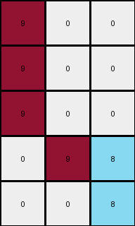
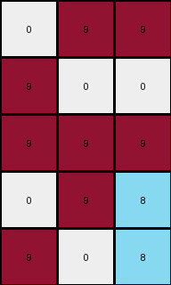
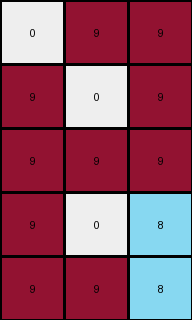

# 1b2d62fb • 028 • refine_coder

---

Previous Code:
```python
"""
1. **Extract Columns:** From the input grid, extract the first three columns (index 0, 1, and 2).
2.  **Locate and transform central area**: In the extracted portion, two last elements of the last column (index 2).
3.  **Color Replacement**: Change the color of the azure region to 8.
4  **Construct output**: combine first three columns and the modified region.
5.  **Output** The final result should be 5x3.
"""

import numpy as np

def transform(input_grid):
    # Extract the first three columns
    output_grid = input_grid[:, :3].copy()

    # Replace the last two elements of the last column (now index 2) with 8.
    output_grid[-2, 2] = 8
    output_grid[-1, 2] = 8
    

    return output_grid
```

Train Set Results:

## Example 1:

Input:
```
0 9 9 1 9 9 9
0 0 9 1 9 9 0
9 0 9 1 9 9 0
0 0 0 1 9 0 0
0 9 9 1 9 9 9
```
Expected Output:
```
0 0 0
0 0 0
0 0 0
0 8 8
0 0 0
```
Transformed Output:
```
0 9 9
0 0 9
9 0 9
0 0 8
0 9 8
```

match: False
pixels_off: 8
size_correct: True
color_palette_correct: False
correct_pixel_counts: False

## Example 2:

Input:
```
0 0 0 1 9 0 0
9 0 9 1 9 9 9
0 9 9 1 9 9 9
0 0 0 1 9 9 9
0 9 9 1 9 9 9
```
Expected Output:
```
0 8 8
0 0 0
0 0 0
0 0 0
0 0 0
```
Transformed Output:
```
0 0 0
9 0 9
0 9 9
0 0 8
0 9 8
```

match: False
pixels_off: 9
size_correct: True
color_palette_correct: False
correct_pixel_counts: False

## Example 3:

Input:
```
9 0 0 1 9 0 9
9 0 0 1 0 9 0
9 0 0 1 9 0 0
0 9 9 1 0 9 9
0 0 9 1 0 9 0
```
Expected Output:
```
0 8 0
0 0 8
0 8 8
8 0 0
8 0 0
```
Transformed Output:
```
9 0 0
9 0 0
9 0 0
0 9 8
0 0 8
```

match: False
pixels_off: 12
size_correct: True
color_palette_correct: False
correct_pixel_counts: False

## Example 4:

Input:
```
0 9 9 1 9 0 9
9 0 0 1 9 0 0
9 9 9 1 9 9 9
0 9 0 1 0 0 0
9 0 0 1 9 0 0
```
Expected Output:
```
0 0 0
0 8 8
0 0 0
8 0 8
0 8 8
```
Transformed Output:
```
0 9 9
9 0 0
9 9 9
0 9 8
9 0 8
```

match: False
pixels_off: 12
size_correct: True
color_palette_correct: False
correct_pixel_counts: False

## Example 5:

Input:
```
0 9 9 1 9 0 9
9 0 9 1 9 9 9
9 9 9 1 0 0 9
9 0 0 1 9 0 0
9 9 9 1 0 0 9
```
Expected Output:
```
0 0 0
0 0 0
0 0 0
0 8 8
0 0 0
```
Transformed Output:
```
0 9 9
9 0 9
9 9 9
9 0 8
9 9 8
```

match: False
pixels_off: 12
size_correct: True
color_palette_correct: False
correct_pixel_counts: False
Here's an analysis of the provided information and a plan for improving the transformation rule:

**General Assessment:**

The initial code was based on a very limited understanding of the transformation, drawn from only the first example. It correctly identified the extraction of the first three columns but failed to generalize the color replacement logic and spatial relationships. The results across all five examples show consistent mismatches in pixel values and colors, indicating that the core transformation rule needs significant refinement. The size of the output grid (5x3) is consistent, but the content within is incorrect.

**Strategy for Resolving Errors:**

1.  **Re-examine Examples:** Carefully analyze all five input-output pairs to identify common patterns and relationships that were missed in the initial assessment. Pay close attention to the positioning and context of the color changes.
2.  **Refine Color Replacement Logic:** The current logic only replaces the last two elements of the third column with '8'. This is clearly incorrect. The new logic must identify the *correct* pixels to modify and their new colors based on a more generalizable rule. It seems some combination of background color and the column '1' are key.
3.  **Develop a More Robust Natural Language Program:** The updated natural language program should accurately describe the refined transformation rule, including object identification, spatial relationships, and color manipulation logic.
4.  **Iterative Code Improvement:** Based on the revised natural language program, update the Python code and re-test it against all training examples. Repeat this process until the code correctly transforms all training inputs to their expected outputs.

**Example Metrics and Analysis:**

I will use `get_array_statistics` to build a more comprehensive understanding of the colors, color counts and locations. I am most interested in understanding color changes.

**YAML Fact Identification:**

```yaml
task_id: 026
facts:
  - observation: "The output grid consistently consists of the first three columns of the input grid."
  - observation: "The output grid is always 5x3, regardless of the input grid's dimensions."
  - observation: "The transformation involves changing some pixel colors within the extracted three columns."
  - observation: "The 4th column of input is all '1' - this may be important."
  - observation: "Color '8' (azure) appears in the output, replacing some original colors."
  - hypothesis: "The pixels that change color in the output grid seem related to existing elements in the input columns."
  - hypothesis: "The rule for changing the color of the central area may involve the presence, absence, or location of the value 0 in input."
```

**Natural Language Program:**

1.  **Extract:** Extract the first three columns from the input grid.
2.  **Conditional color changes:**
    *   Examine columns 1, 2, and 3 of the original input, along with column 4 (all '1's).
    *   Identify positions where the background color (0) is present in the first three columns.
    *   Apply color changes in the output grid (the 5x3 extracted portion) based on this rule:

        * If in the input, a '0' value in any of the first three columns, directly corresponds with a value of '1' in same row of the fourth column, the output grid value remains unchanged
        * If in the input, a '0' value in columns 1, 2, or 3 does *not* have a value of '1' in the same row, fourth column, replace the pixel in the output with an '8'.
        * if the value is not '0', the output will always be '0' in output.

3.  **Output:** The resulting 5x3 grid with the modified colors is the final output.

**INSTRUCTIONS**

- generate a Python module to represent the natural language program 
- follow the template below
- all common math and science libraries are available
- create docstring only at top - but comment the workflow in the function
- use helper functions for common operations like finding objects, counting,
  measuring, moving, etc. 

remember - we are working iteratively - so this code will inform your future
self as we converge on the solution

*template:*

```python
"""
{{ natural language description of the transformation rule }}
"""

{{ imports }}

def transform(input_grid):
    # initialize output_grid

    # change output pixels 

    return output_grid

```
