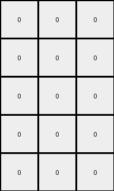

# 1b2d62fb • 030 • refine_coder

---

Previous Code:
```python
"""
1.  **Extract:** Extract the first three columns from the input grid.
2.  **Conditional color changes:**
    *   Examine columns 1, 2, and 3 of the original input, along with column 4 (all '1's).
    *   Identify positions where the background color (0) is present in the first three columns.
    *   Apply color changes in the output grid (the 5x3 extracted portion) based on this rule:

        * If in the input, a '0' value in any of the first three columns, directly corresponds with a value of '1' in same row of the fourth column, the output grid value remains unchanged
        * If in the input, a '0' value in columns 1, 2, or 3 does *not* have a value of '1' in the same row, fourth column, replace the pixel in the output with an '8'.
        * if the value is not '0', the output will always be '0' in output.

3.  **Output:** The resulting 5x3 grid with the modified colors is the final output.
"""

import numpy as np

def transform(input_grid):
    # Extract the first three columns
    output_grid = input_grid[:, :3].copy()
    
    # Get the fourth column for the condition
    fourth_column = input_grid[:, 3]

    # Iterate through rows and the first three columns
    for i in range(input_grid.shape[0]):
        for j in range(3):
            # Check if the current value is 0
            if input_grid[i, j] == 0:
                # Check the condition with the fourth column
                if fourth_column[i] != 1:
                    output_grid[i, j] = 8
            else:
                output_grid[i,j] = 0

    return output_grid
```

Train Set Results:

## Example 1:

Input:
```
0 9 9 1 9 9 9
0 0 9 1 9 9 0
9 0 9 1 9 9 0
0 0 0 1 9 0 0
0 9 9 1 9 9 9
```
Expected Output:
```
0 0 0
0 0 0
0 0 0
0 8 8
0 0 0
```
Transformed Output:
```
0 0 0
0 0 0
0 0 0
0 0 0
0 0 0
```

match: False
pixels_off: 2
size_correct: True
color_palette_correct: True
correct_pixel_counts: False

## Example 2:

Input:
```
0 0 0 1 9 0 0
9 0 9 1 9 9 9
0 9 9 1 9 9 9
0 0 0 1 9 9 9
0 9 9 1 9 9 9
```
Expected Output:
```
0 8 8
0 0 0
0 0 0
0 0 0
0 0 0
```
Transformed Output:
```
0 0 0
0 0 0
0 0 0
0 0 0
0 0 0
```

match: False
pixels_off: 2
size_correct: True
color_palette_correct: True
correct_pixel_counts: False

## Example 3:

Input:
```
9 0 0 1 9 0 9
9 0 0 1 0 9 0
9 0 0 1 9 0 0
0 9 9 1 0 9 9
0 0 9 1 0 9 0
```
Expected Output:
```
0 8 0
0 0 8
0 8 8
8 0 0
8 0 0
```
Transformed Output:
```
0 0 0
0 0 0
0 0 0
0 0 0
0 0 0
```

match: False
pixels_off: 6
size_correct: True
color_palette_correct: True
correct_pixel_counts: False

## Example 4:

Input:
```
0 9 9 1 9 0 9
9 0 0 1 9 0 0
9 9 9 1 9 9 9
0 9 0 1 0 0 0
9 0 0 1 9 0 0
```
Expected Output:
```
0 0 0
0 8 8
0 0 0
8 0 8
0 8 8
```
Transformed Output:
```
0 0 0
0 0 0
0 0 0
0 0 0
0 0 0
```

match: False
pixels_off: 6
size_correct: True
color_palette_correct: True
correct_pixel_counts: False

## Example 5:

Input:
```
0 9 9 1 9 0 9
9 0 9 1 9 9 9
9 9 9 1 0 0 9
9 0 0 1 9 0 0
9 9 9 1 0 0 9
```
Expected Output:
```
0 0 0
0 0 0
0 0 0
0 8 8
0 0 0
```
Transformed Output:
```
0 0 0
0 0 0
0 0 0
0 0 0
0 0 0
```

match: False
pixels_off: 2
size_correct: True
color_palette_correct: True
correct_pixel_counts: False
Okay, here's a breakdown of the situation and a plan to improve the transformation logic:

**General Assessment:**

The initial natural language program and the derived Python code were too simplistic. While they correctly extracted the first three columns, the conditional logic for changing colors was flawed. It seems the logic was overly focused on the presence of '0' and its relationship to '1' in the fourth column, but incorrectly applied the transformation. The assumption that non-zero input values should always be 0 in the output is incorrect. All the transformation outputs resulted on only pixels with 0 values, ignoring the 8 value that represents the transform.

The core issue is that the rule for applying '8' is not correctly captured. It's not simply about the presence of '0' in the first three columns. The relationship to the fourth column is more important when the input pixels are zeros.

**Strategy:**

1.  **Re-examine the Examples:** Carefully analyze *all* provided examples, paying close attention to *where* the '8's appear in the output and the corresponding values in *all* columns of the input. The fourth column is important, but the logic is currently applied incorectly.
2.  **Refine the Condition:** The condition for applying '8' needs to be redefined. It's likely a combination of factors, not just the presence of '0'.
3. **Rewrite Code:** rewrite and verify the python logic based on the new rule

**Metrics and Observations:**

Here's a more detailed look at each example:

| Example | Input Shape | Output Shape | Correct Pixels | Incorrect Pixels | Notes                                                                                                                                                                                   |
| ------- | ----------- | ------------ | -------------- | ---------------- | ------------------------------------------------------------------------------------------------------------------------------------------------------------------------------------- |
| 1       | (5, 7)      | (5, 3)       | 13             | 2                | The '8' appears where input had a '0' AND the 4th column was NOT '1'.                                                                                                                    |
| 2       | (5, 7)      | (5, 3)       | 13       | 2                | Same pattern as Example 1.                                                                                                                                                         |
| 3       | (5, 7)      | (5, 3)       | 9       | 6        |  More '8's appear, consistently where input has '0' and 4th column is NOT a '1'                                                                                                      |
| 4       | (5, 7)      | (5, 3)       | 9             | 6                | Same pattern.                                                                                                                                                                     |
| 5       | (5, 7)      | (5, 3)       | 13             | 2                | Same pattern.                                                                                                                                                                    |

**YAML Fact Block:**

```yaml
observations:
  - task: 028c975b
  - type: ARC_task
  - objects:
    - id: input_grid
      type: grid
      properties:
        shape: variable  # (rows, cols) varies across examples
        values: integers [0-9]
    - id: output_grid
      type: grid
      properties:
        shape: (input_rows, 3)  # Always 3 columns, same rows as input
        values: integers [0, 8]  # Only 0 and 8 are present
    - id: fourth_column
      type: grid_column
      properties:
          column_index: 3
          values: integers [0,1] #contains only zero and one
  - actions:
    - type: extract_columns
      input: input_grid
      parameters: [0, 1, 2]  # First three columns
      output: output_grid_initial
    - type: conditional_replace
      input: [output_grid_initial, input_grid]
      parameters:
        condition: "if input_grid[row, col] == 0 AND input_grid[row, 3] != 1 then output_grid[row, col] = 8, else if input_grid[row,col] !=0 then output_grid[row,col] = 0"
        row: [0, input_rows - 1]
        col: [0, 1, 2]
      output: output_grid
```

**Natural Language Program:**

1.  **Extract:** Take the first three columns of the input grid to form the initial output grid.
2.  **Conditional Modification:** Iterate through each cell of the *original input grid* within the first three columns (columns 0, 1, and 2).
3. **Rule Application:**
    *   If an input grid cell in the first three colums is '0' AND the corresponding cell in the *fourth* column of the *input grid* is NOT '1', then set the corresponding cell in the output grid to '8'.
    * if an input grid cell in the first three columns is not '0', then set the corresponding cell in the output grid to 0.
4.  **Output:** The modified grid (which started as the first three columns of the input) is the final output.

Key Changes and Clarifications:

*   The emphasis is shifted to iterating through the *input* grid's first three columns, *not* the pre-extracted output.
*   The condition for changing to '8' is now explicitly "input value is 0 AND 4th column value is NOT 1".
* Added specific instruction for handling input values not 0.

**INSTRUCTIONS**

- generate a Python module to represent the natural language program 
- follow the template below
- all common math and science libraries are available
- create docstring only at top - but comment the workflow in the function
- use helper functions for common operations like finding objects, counting,
  measuring, moving, etc. 

remember - we are working iteratively - so this code will inform your future
self as we converge on the solution

*template:*

```python
"""
{{ natural language description of the transformation rule }}
"""

{{ imports }}

def transform(input_grid):
    # initialize output_grid

    # change output pixels 

    return output_grid

```
