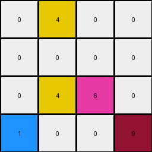
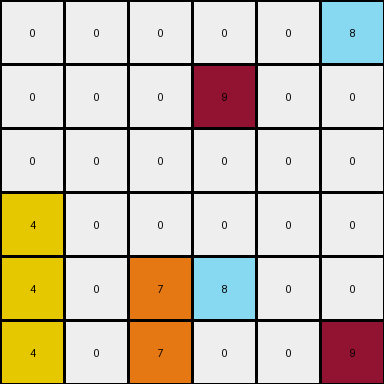

# 1e0a9b12 • 009 • refine_dreamer

---

Previous Code:
```python
"""
The transformation rule is as follows:
1. Identify the maroon (9) pixel and the azure (8) pixel in the input grid.
2. Move the maroon (9) pixel to the bottom right corner of the grid.
3. Move the azure (8) pixel to the position that was vacated by the maroon (9) pixel.
4. All other object locations remain in the original input.
"""

import numpy as np

def find_pixel_by_color(grid, color):
    # Find the coordinates of a pixel with a specific color.
    coords = np.where(grid == color)
    if len(coords[0]) > 0:
        return (coords[0][0], coords[1][0])
    return None

def transform(input_grid):
    # Initialize output_grid as a copy of the input_grid
    output_grid = np.copy(input_grid)
    
    # Find the maroon (9) pixel
    maroon_pixel_pos = find_pixel_by_color(input_grid, 9)
    
    # Find the azure (8) pixel
    azure_pixel_pos = find_pixel_by_color(input_grid, 8)

    # Move maroon (9) to bottom right
    if maroon_pixel_pos:
        output_grid[maroon_pixel_pos] = input_grid[input_grid.shape[0]-1, input_grid.shape[1]-1]  #put whatever was in bottom corner where 9 was
        output_grid[input_grid.shape[0]-1, input_grid.shape[1]-1] = 9

    # Move azure (8) to original maroon (9) position.
    if maroon_pixel_pos and azure_pixel_pos:
        output_grid[azure_pixel_pos] = input_grid[maroon_pixel_pos] #put the value of old 9 location into 8 location in output
        output_grid[maroon_pixel_pos] = 8 # place 8 in old 9 location

    return output_grid
```

Train Set Results:

## Example 1:

Input:
```
0 4 0 9
0 0 0 0
0 4 6 0
1 0 0 0
```
Expected Output:
```
0 0 0 0
0 0 0 0
0 4 0 0
1 4 6 9
```
Transformed Output:
```
0 4 0 0
0 0 0 0
0 4 6 0
1 0 0 9
```

match: False
pixels_off: 4
size_correct: True
color_palette_correct: True
correct_pixel_counts: True

## Example 2:

Input:
```
0 0 0 0 0 9
0 0 0 8 0 0
0 0 0 0 0 0
4 0 0 0 0 0
4 0 7 8 0 0
4 0 7 0 0 0
```
Expected Output:
```
0 0 0 0 0 0
0 0 0 0 0 0
0 0 0 0 0 0
4 0 0 0 0 0
4 0 7 8 0 0
4 0 7 8 0 9
```
Transformed Output:
```
0 0 0 0 0 8
0 0 0 9 0 0
0 0 0 0 0 0
4 0 0 0 0 0
4 0 7 8 0 0
4 0 7 0 0 9
```

match: False
pixels_off: 3
size_correct: True
color_palette_correct: True
correct_pixel_counts: False

## Example 3:

Input:
```
0 0 0 1 0
0 3 0 0 0
0 3 0 1 2
6 0 0 0 0
0 3 0 0 0
```
Expected Output:
```
0 0 0 0 0
0 0 0 0 0
0 3 0 0 0
0 3 0 1 0
6 3 0 1 2
```
Transformed Output:
```
0 0 0 1 0
0 3 0 0 0
0 3 0 1 2
6 0 0 0 0
0 3 0 0 0
```

match: False
pixels_off: 10
size_correct: True
color_palette_correct: True
correct_pixel_counts: True
**INSTRUCTIONS**

The code above was generated based on observations from the first training
example

we have tested the transform function on each of the task example inputs and
compared with the expected output

review each of the examples provided and the results and consider how the
natural language program should be updated to accommodate this new knowledge

respond with the following deliverables:

- general assessment of the information provided and strategy for resolving the
  errors
- gather metrics about each of the examples and results - use code_execution to
  develop accurate reports on your assumptions
- a YAML block documenting facts - Focus on identifying objects, their properties, and the actions performed on them.
- a natural language program - Be as clear and concise as possible, providing a complete description of the transformation rule.


your responses should be considered as information in a report - not a
conversation
