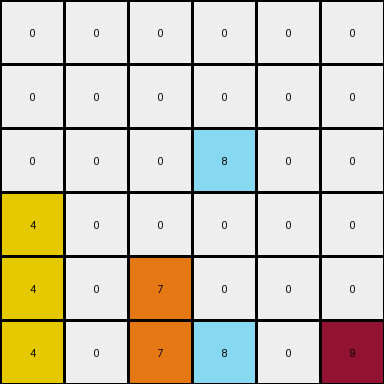

# 1e0a9b12 • 012 • refine_coder

---

Previous Code:
```python
"""
1.  **Identify all objects**: An object is defined as a single pixel.
2.  **Shift Down**: Every object in the grid attempts to move down by one row.
3. **Blocked**: Objects that have another object directly beneath it in the input grid do not change their position.
4.  **Bottom Right**: If there is a maroon (9) pixel, it moves to the bottom-right corner of the grid, regardless of whether it's blocked. The existing value in bottom-right is removed.
"""

import numpy as np

def transform(input_grid):
    # Initialize output_grid as a copy of the input_grid
    output_grid = np.copy(input_grid)
    rows, cols = input_grid.shape

    # Shift Down and Blocked
    for r in range(rows - 1, -1, -1):  # Iterate from bottom to top
        for c in range(cols):
            if r < rows - 1:  # Not the bottom row
                if input_grid[r+1, c] == 0: # if empty space below, we can move down
                    output_grid[r+1, c] = input_grid[r,c]
                    output_grid[r,c] = 0 # clear original location since it moved

    # Bottom Right (Maroon 9)
    maroon_present = False
    for r in range(rows):
        for c in range(cols):
            if output_grid[r, c] == 9:
                maroon_present = True
                output_grid[r, c] = 0  # Clear the original maroon position
                break  # only one maroon, exit inner loop.
        if maroon_present:
            break
    if maroon_present:
        output_grid[rows - 1, cols - 1] = 9

    return output_grid
```

Train Set Results:

## Example 1:

Input:
```
0 4 0 9
0 0 0 0
0 4 6 0
1 0 0 0
```
Expected Output:
```
0 0 0 0
0 0 0 0
0 4 0 0
1 4 6 9
```
Transformed Output:
```
0 0 0 0
0 4 0 0
0 0 0 0
1 4 6 9
```

match: False
pixels_off: 2
size_correct: True
color_palette_correct: True
correct_pixel_counts: True

## Example 2:

Input:
```
0 0 0 0 0 9
0 0 0 8 0 0
0 0 0 0 0 0
4 0 0 0 0 0
4 0 7 8 0 0
4 0 7 0 0 0
```
Expected Output:
```
0 0 0 0 0 0
0 0 0 0 0 0
0 0 0 0 0 0
4 0 0 0 0 0
4 0 7 8 0 0
4 0 7 8 0 9
```
Transformed Output:
```
0 0 0 0 0 0
0 0 0 0 0 0
0 0 0 8 0 0
4 0 0 0 0 0
4 0 7 0 0 0
4 0 7 8 0 9
```

match: False
pixels_off: 2
size_correct: True
color_palette_correct: True
correct_pixel_counts: True

## Example 3:

Input:
```
0 0 0 1 0
0 3 0 0 0
0 3 0 1 2
6 0 0 0 0
0 3 0 0 0
```
Expected Output:
```
0 0 0 0 0
0 0 0 0 0
0 3 0 0 0
0 3 0 1 0
6 3 0 1 2
```
Transformed Output:
```
0 0 0 0 0
0 3 0 1 0
0 0 0 0 0
0 3 0 1 2
6 3 0 0 0
```

match: False
pixels_off: 6
size_correct: True
color_palette_correct: True
correct_pixel_counts: True
Here's an assessment of the provided information and a strategy for resolving the errors, along with the requested deliverables:

**General Assessment and Strategy**

The initial natural language program and corresponding code were a good first attempt, capturing the basic idea of downward movement and the special rule for the maroon (9) pixel. However, the errors in the test cases reveal a flaw in the "Shift Down" logic. The current implementation only moves pixels down if the space *immediately* below is empty. It doesn't account for "cascading" moves, where a pixel might need to move down multiple rows if there are multiple empty spaces below it. The strategy is to enhance the downward movement to be iterative.

**Example Metrics and Analysis**

Here's a breakdown of each example:

*   **Example 1:**
    *   Input Shape: (4, 4)
    *   Output Shape: (4, 4)
    *   Pixels Off: 2
    *   Issue: The '4' in the second column doesn't drop to the bottom because another '4' is blocking it earlier in the drop. The second '0' is missing too.
*   **Example 2:**
    *   Input Shape: (6, 6)
    *   Output Shape: (6, 6)
    *   Pixels Off: 2
    *   Issue: Similar to Example 1, the `8` does not move to the correct place.
*   **Example 3:**
    *   Input Shape: (5, 5)
    *   Output Shape: (5, 5)
    *   Pixels Off: 6
    *    Issue: more complex - several don't cascade

**YAML Fact Block**

```yaml
objects:
  - description: Single pixels of any color.
    properties:
      color:
        type: integer (0-9)
        description: Represents the color of the pixel.
      position:
        type: tuple (row, column)
        description: The location of the pixel in the grid.

actions:
  - name: Shift Down
    description: >
      Each pixel attempts to move down as many rows as possible. The movement
      stops if it encounters another pixel (of any color, including 0/white) or
      the bottom edge of the grid.
  - name: Maroon to Bottom-Right
    description: >
      If a maroon pixel (color 9) is present, it moves to the bottom-right
      corner of the grid.  The value in the bottom right is overwritten and
      cleared from its previous position.

```

**Natural Language Program**

1.  **Identify Objects:** Treat each individual pixel in the input grid as a separate object.

2.  **Iterative Shift Down:** For each object (pixel), attempt to move it down one row at a time. Continue moving the object down until it reaches the bottom row or encounters another object (any non-empty cell) directly below it.

3. **Bottom-Right (Maroon):** If a maroon colored object (value 9) exists in the grid, move it to the bottom-right cell of the grid. Any object that had that location is removed. The maroon object is removed from its previous position.

**INSTRUCTIONS**

- generate a Python module to represent the natural language program 
- follow the template below
- all common math and science libraries are available
- create docstring only at top - but comment the workflow in the function
- use helper functions for common operations like finding objects, counting,
  measuring, moving, etc. 

remember - we are working iteratively - so this code will inform your future
self as we converge on the solution

*template:*

```python
"""
{{ natural language description of the transformation rule }}
"""

{{ imports }}

def transform(input_grid):
    # initialize output_grid

    # change output pixels 

    return output_grid

```
