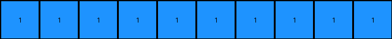

# 1fad071e • 015 • refine_dreamer

---

Previous Code:
```python
"""
The transformation counts the number of horizontally separated blue regions in the input grid and creates a single-row output grid where each cell corresponds to one of these regions. The presence of any blue region creates a blue pixel; otherwise, the result will be a white pixel.
"""

import numpy as np

def count_horizontal_blue_regions(grid):
    """Counts distinct blue regions separated horizontally."""
    count = 0
    in_blue_region = False
    for row in grid:
        for cell in row:
            if cell == 1:  # Blue
                if not in_blue_region:
                    count += 1
                    in_blue_region = True
            else:
                in_blue_region = False
        in_blue_region = False #reset at end of row
    return count

def transform(input_grid):
    """Transforms the input grid to output grid"""
    # Convert to numpy array for easier manipulation.
    grid = np.array(input_grid)

    # Count distinct blue regions horizontally.
    blue_region_count = count_horizontal_blue_regions(grid)
    
    # Create output grid.
    if blue_region_count > 0:
        output_grid = np.ones((1, blue_region_count), dtype=int)
    else:
      output_grid = np.zeros((1,1),dtype=int)

    return output_grid.tolist()
```

Train Set Results:

## Example 1:

Input:
```
0 0 0 0 2 2 0 0 1
0 1 1 0 2 2 0 0 0
0 1 1 0 0 0 0 2 2
0 0 0 0 0 0 0 2 2
1 0 2 2 0 0 0 0 0
0 0 2 2 0 1 1 0 0
0 0 0 0 0 1 1 0 0
0 0 0 0 0 0 0 0 0
0 1 0 0 0 0 0 0 1
```
Expected Output:
```
1 1 0 0 0
```
Transformed Output:
```
1 1 1 1 1 1 1 1
```

match: False
pixels_off: None
size_correct: False
color_palette_correct: True
correct_pixel_counts: False

## Example 2:

Input:
```
1 1 0 2 0 0 0 0 2
1 1 0 0 0 1 1 0 0
0 0 0 2 0 1 1 0 0
0 0 0 0 0 0 0 0 1
0 1 1 0 2 2 0 0 0
0 1 1 0 2 2 0 0 2
0 0 0 0 0 0 0 0 0
0 0 0 2 2 0 1 1 0
0 1 0 2 2 0 1 1 0
```
Expected Output:
```
1 1 1 1 0
```
Transformed Output:
```
1 1 1 1 1 1 1 1 1 1
```

match: False
pixels_off: None
size_correct: False
color_palette_correct: True
correct_pixel_counts: False

## Example 3:

Input:
```
2 2 0 1 1 0 0 0 0
2 2 0 1 1 0 0 1 1
1 0 0 0 0 0 0 1 1
0 2 2 0 0 0 0 0 0
0 2 2 0 1 1 0 1 0
0 0 0 0 1 1 0 0 0
0 0 0 0 2 0 0 0 0
0 1 1 0 0 0 0 2 2
0 1 1 0 0 1 0 2 2
```
Expected Output:
```
1 1 1 1 0
```
Transformed Output:
```
1 1 1 1 1 1 1 1 1 1 1
```

match: False
pixels_off: None
size_correct: False
color_palette_correct: True
correct_pixel_counts: False
**INSTRUCTIONS**

The code above was generated based on observations from the first training
example

we have tested the transform function on each of the task example inputs and
compared with the expected output

review each of the examples provided and the results and consider how the
natural language program should be updated to accommodate this new knowledge

respond with the following deliverables:

- general assessment of the information provided and strategy for resolving the
  errors
- gather metrics about each of the examples and results - use code_execution to
  develop accurate reports on your assumptions
- a YAML block documenting facts - Focus on identifying objects, their properties, and the actions performed on them.
- a natural language program - Be as clear and concise as possible, providing a complete description of the transformation rule.


your responses should be considered as information in a report - not a
conversation
