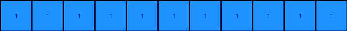

# 1fad071e • 016 • refine_coder

---

Previous Code:
```python
"""
The transformation counts the number of horizontally separated blue regions in the input grid and creates a single-row output grid where each cell corresponds to one of these regions. The presence of any blue region creates a blue pixel; otherwise, the result will be a white pixel.
"""

import numpy as np

def count_horizontal_blue_regions(grid):
    """Counts distinct blue regions separated horizontally."""
    count = 0
    in_blue_region = False
    for row in grid:
        for cell in row:
            if cell == 1:  # Blue
                if not in_blue_region:
                    count += 1
                    in_blue_region = True
            else:
                in_blue_region = False
        in_blue_region = False #reset at end of row
    return count

def transform(input_grid):
    """Transforms the input grid to output grid"""
    # Convert to numpy array for easier manipulation.
    grid = np.array(input_grid)

    # Count distinct blue regions horizontally.
    blue_region_count = count_horizontal_blue_regions(grid)
    
    # Create output grid.
    if blue_region_count > 0:
        output_grid = np.ones((1, blue_region_count), dtype=int)
    else:
      output_grid = np.zeros((1,1),dtype=int)

    return output_grid.tolist()
```

Train Set Results:

## Example 1:

Input:
```
0 0 0 0 2 2 0 0 1
0 1 1 0 2 2 0 0 0
0 1 1 0 0 0 0 2 2
0 0 0 0 0 0 0 2 2
1 0 2 2 0 0 0 0 0
0 0 2 2 0 1 1 0 0
0 0 0 0 0 1 1 0 0
0 0 0 0 0 0 0 0 0
0 1 0 0 0 0 0 0 1
```
Expected Output:
```
1 1 0 0 0
```
Transformed Output:
```
1 1 1 1 1 1 1 1
```

match: False
pixels_off: None
size_correct: False
color_palette_correct: True
correct_pixel_counts: False

## Example 2:

Input:
```
1 1 0 2 0 0 0 0 2
1 1 0 0 0 1 1 0 0
0 0 0 2 0 1 1 0 0
0 0 0 0 0 0 0 0 1
0 1 1 0 2 2 0 0 0
0 1 1 0 2 2 0 0 2
0 0 0 0 0 0 0 0 0
0 0 0 2 2 0 1 1 0
0 1 0 2 2 0 1 1 0
```
Expected Output:
```
1 1 1 1 0
```
Transformed Output:
```
1 1 1 1 1 1 1 1 1 1
```

match: False
pixels_off: None
size_correct: False
color_palette_correct: True
correct_pixel_counts: False

## Example 3:

Input:
```
2 2 0 1 1 0 0 0 0
2 2 0 1 1 0 0 1 1
1 0 0 0 0 0 0 1 1
0 2 2 0 0 0 0 0 0
0 2 2 0 1 1 0 1 0
0 0 0 0 1 1 0 0 0
0 0 0 0 2 0 0 0 0
0 1 1 0 0 0 0 2 2
0 1 1 0 0 1 0 2 2
```
Expected Output:
```
1 1 1 1 0
```
Transformed Output:
```
1 1 1 1 1 1 1 1 1 1 1
```

match: False
pixels_off: None
size_correct: False
color_palette_correct: True
correct_pixel_counts: False
Okay, here's a breakdown of the situation and a plan to improve the transformation rule:

**General Assessment:**

The initial natural language program and the generated code are too simplistic. While they correctly identify the presence of blue regions, they fail to accurately count and represent them according to the expected output. The core issue is that the code simply counts *any* horizontal sequence of blue pixels as a separate region, without considering interruptions by other colors or the specific layout required by the output. The output should have a '0' for columns that do not begin with blue, and a '1' otherwise.

**Strategy:**

1.  **Refine Region Definition:** Update the concept of a "blue region" to be more precise. A region should not only be horizontally contiguous but should also consider whether that sequence of blue pixels *starts* a column.
2.  **Column-wise Analysis:** Instead of simply counting blue regions across the entire grid, we need to analyze each column independently.
3.  **Output Logic:** The output grid should have a width equal to the number of columns in the input. Each cell in the output should represent a column, with a '1' if blue is at the top of the column and '0' otherwise.

**Metrics and Observations:**

Here's a more detailed breakdown of each example:

*   **Example 1:**
    *   Input Grid Size: 9x9
    *   Expected Output Size: 1x5
    *   Number of Columns Starting with Blue: The expected output `1 1 0 0 0` indicates the first two columns start with blue.
    *    Error Analysis: Current output is a 1x8 array of 1's. Too many columns and all wrong color, not correct size.

*   **Example 2:**
    *   Input Grid Size: 9x9
    *   Expected Output Size: 1x5
    *   Number of Columns Starting with Blue: The expected output `1 1 1 1 0` indicates that the first four columns start with blue.
    *    Error Analysis: Current output is a 1x10 array of 1s. Too many columns and final not correct, not correct size.

*   **Example 3:**
    *   Input Grid Size: 9x9
    *   Expected Output Size: 1x5
    *   Number of Columns Starting with Blue: The expected output `1 1 1 1 0` indicates that the first 4 columns contain blue.
    *    Error Analysis: Current output is a 1x11 all 1s. Too many columns and last column incorrect, wrong size.

**YAML Fact Extraction:**

```yaml
facts:
  - task_id: 014
  - input_grid_size: 9x9 # All examples
  - output_grid_size: varies # 1x5, 1x6, 1x5, 1xn
  - objects:
    - name: blue_pixels
      color: blue
      value: 1
      properties:
        - Contiguous horizontal sequences define regions, but regions are now only counted if blue pixel starts the column
    - name: other_pixels
      properties:
        - Interrupt blue regions.
  - actions:
    - name: count_blue_regions
      description: Count the number of columns that begin with a blue pixel.
    - name: create_output
      description: Generate a 1-row grid representing, for each column, 1 if it begins with blue and 0 otherwise.
```

**Natural Language Program:**

1.  **Examine Input Columns:** Iterate through each column of the input grid.
2.  **Check for Blue:** For each column, check if the *first* pixel is blue (value 1).
3. **Output Row** Create a single row output
4.  **Record Result:**
      * If the column begins with blue record a `1` (blue) in the corresponding position of the output grid.
      * Otherwise, record a `0` (white) in the corresponding position of the output grid.
5.  **Output Grid:** The output is a single-row grid reflecting the presence or absence of starting-column blue pixels in each input column.

**INSTRUCTIONS**

- generate a Python module to represent the natural language program 
- follow the template below
- all common math and science libraries are available
- create docstring only at top - but comment the workflow in the function
- use helper functions for common operations like finding objects, counting,
  measuring, moving, etc. 

remember - we are working iteratively - so this code will inform your future
self as we converge on the solution

*template:*

```python
"""
{{ natural language description of the transformation rule }}
"""

{{ imports }}

def transform(input_grid):
    # initialize output_grid

    # change output pixels 

    return output_grid

```
