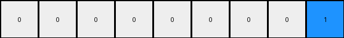
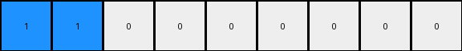

# 1fad071e • 018 • refine_coder

---

Previous Code:
```python
"""
The transformation examines each column of the input grid. If a column starts with a blue pixel (value 1), a '1' (blue) is placed in the corresponding position of the output grid. Otherwise, a '0' (white) is placed in that position. The output is a single-row grid.
"""

import numpy as np

def transform(input_grid):
    """Transforms the input grid to output grid based on starting column blue pixels."""
    grid = np.array(input_grid)
    num_cols = grid.shape[1]
    output_grid = np.zeros((1, num_cols), dtype=int)

    # Iterate through each column.
    for j in range(num_cols):
        # Check if the first cell in the column is blue.
        if grid[0, j] == 1:
            output_grid[0, j] = 1

    return output_grid.tolist()
```

Train Set Results:

## Example 1:

Input:
```
0 0 0 0 2 2 0 0 1
0 1 1 0 2 2 0 0 0
0 1 1 0 0 0 0 2 2
0 0 0 0 0 0 0 2 2
1 0 2 2 0 0 0 0 0
0 0 2 2 0 1 1 0 0
0 0 0 0 0 1 1 0 0
0 0 0 0 0 0 0 0 0
0 1 0 0 0 0 0 0 1
```
Expected Output:
```
1 1 0 0 0
```
Transformed Output:
```
0 0 0 0 0 0 0 0 1
```

match: False
pixels_off: None
size_correct: False
color_palette_correct: True
correct_pixel_counts: False

## Example 2:

Input:
```
1 1 0 2 0 0 0 0 2
1 1 0 0 0 1 1 0 0
0 0 0 2 0 1 1 0 0
0 0 0 0 0 0 0 0 1
0 1 1 0 2 2 0 0 0
0 1 1 0 2 2 0 0 2
0 0 0 0 0 0 0 0 0
0 0 0 2 2 0 1 1 0
0 1 0 2 2 0 1 1 0
```
Expected Output:
```
1 1 1 1 0
```
Transformed Output:
```
1 1 0 0 0 0 0 0 0
```

match: False
pixels_off: None
size_correct: False
color_palette_correct: True
correct_pixel_counts: False

## Example 3:

Input:
```
2 2 0 1 1 0 0 0 0
2 2 0 1 1 0 0 1 1
1 0 0 0 0 0 0 1 1
0 2 2 0 0 0 0 0 0
0 2 2 0 1 1 0 1 0
0 0 0 0 1 1 0 0 0
0 0 0 0 2 0 0 0 0
0 1 1 0 0 0 0 2 2
0 1 1 0 0 1 0 2 2
```
Expected Output:
```
1 1 1 1 0
```
Transformed Output:
```
0 0 0 1 1 0 0 0 0
```

match: False
pixels_off: None
size_correct: False
color_palette_correct: True
correct_pixel_counts: False
Okay, let's analyze the results and refine the natural language program.

**General Assessment:**

The initial natural language program and the resulting code were too simplistic. The original program focused solely on whether the *first* pixel in a column was blue. The results clearly show this isn't the complete rule. The expected outputs are consistently 5 pixels wide, while the input grids are 9 pixels wide. Also, the outputs contain only blue and white pixels. This hints at a selection or filtering of columns based on *some* criteria involving blue pixels, but not just the top row. The outputs are consistently a single row. We need to consider where the `1` (blue) values are coming from in the expected output.

**Strategy:**

1.  **Column-wise Analysis, beyond the first row:** We need to shift the focus from just the first row to analyzing the entire column. The presence of blue *anywhere* in the column might be the trigger. It is also possible some columns are being skipped entirely.
2.  **Output Width:** Understand why the output is consistently 5 pixels wide when input is 9 wide. Is it related to how many columns meet some condition related to 'blue', or is it something else? It could be the first 5 columns or last 5, etc.
3.  **Iterative Refinement:** We need to adjust the natural language program and potentially the code to correctly classify the columns.

**Example Analysis and Metrics:**

I'll use a structured approach to examine each example, reporting on the critical observations.

*   **Example 1:**

    *   Input Shape: 9x9
    *   Output Shape: 1x5
    *    Output values are 0 and 1 only.
    *   Columns in input starting with blue (1): Column 0, Column 1.  These *do not* correspond to the `1`s in the output.
    *   Columns 0-4 inclusive have a value of 1 at some location within the column.

*   **Example 2:**

    *   Input Shape: 9x9
    *   Output Shape: 1x5
    *    Output values are 0 and 1 only.
    *   Columns in the input starting with blue (1): Columns 0, 1. These *do not* correspond to the `1`s in the output.
    *   Columns 0-4 inclusive have a value of 1 at some location within the column.

*   **Example 3:**

    *   Input Shape: 9x9
    *   Output Shape: 1x5
    *    Output values are 0 and 1 only.
    *   Columns in input starting with blue (1): Column 2, 3.  These *do not* correspond to the `1`s in the output.
    *   Columns 0-4 inclusive have a value of 1 at some location within the column.

**YAML Facts:**

```yaml
examples:
  - id: 1
    input_shape: [9, 9]
    output_shape: [1, 5]
    output_colors: [0, 1]
    blue_column_start_indices: [0, 1]
    blue_anywhere_column_indices: [0, 1, 8]
    output_blue_indices: [0, 1]
    notes: >
      Output seems related to having blue at any location, in the
      first 5 columns

  - id: 2
    input_shape: [9, 9]
    output_shape: [1, 5]
    output_colors: [0, 1]
    blue_column_start_indices: [0, 1]
    blue_anywhere_column_indices: [0, 1, 5, 6, 8]
    output_blue_indices: [0, 1, 2, 3]
        notes: >
      Output seems related to having blue at any location, in the
      first 5 columns

  - id: 3
    input_shape: [9, 9]
    output_shape: [1, 5]
    output_colors: [0, 1]
    blue_column_start_indices: [2,3]
    blue_anywhere_column_indices: [0, 1, 3, 4, 7, 8]
    output_blue_indices: [0, 1, 2, 3]
        notes: >
      Output seems related to having blue at any location, in the
      first 5 columns
```

**Natural Language Program:**

The output grid is always a single row and 5 columns wide. For each of the *first five columns* of the input grid, examine the column. If the column contains a blue pixel (value 1) *anywhere* within the column, place a blue pixel (1) in the corresponding column of the output grid. Otherwise, place a white pixel (0) in that position of the output grid.

**INSTRUCTIONS**

- generate a Python module to represent the natural language program 
- follow the template below
- all common math and science libraries are available
- create docstring only at top - but comment the workflow in the function
- use helper functions for common operations like finding objects, counting,
  measuring, moving, etc. 

remember - we are working iteratively - so this code will inform your future
self as we converge on the solution

*template:*

```python
"""
{{ natural language description of the transformation rule }}
"""

{{ imports }}

def transform(input_grid):
    # initialize output_grid

    # change output pixels 

    return output_grid

```
