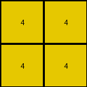
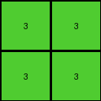

# 2dc579da • 004 • refine_coder

---

Previous Code:
```python
"""
Extracts the bottom-left 2x2 subgrid of the input to create the output.
"""

import numpy as np

def transform(input_grid):
    """
    Extracts the bottom-left 2x2 subgrid of the input grid.

    Args:
        input_grid (numpy.ndarray): The input grid.

    Returns:
        numpy.ndarray: The 2x2 subgrid from the bottom-left corner.
    """
    # Get the dimensions of the input grid.
    rows, cols = input_grid.shape

    # Extract the bottom-left 2x2 subgrid.
    output_grid = input_grid[rows-2:rows, 0:2]

    return output_grid
```

Train Set Results:

## Example 1:

Input:
```
8 8 3 8 8
8 8 3 8 8
3 3 3 3 3
8 8 3 8 8
4 8 3 8 8
```
Expected Output:
```
8 8
4 8
```
Transformed Output:
```
8 8
4 8
```

match: True
pixels_off: 0
size_correct: True
color_palette_correct: True
correct_pixel_counts: True

## Example 2:

Input:
```
4 4 4 2 4 4 4
4 4 4 2 4 1 4
4 4 4 2 4 4 4
2 2 2 2 2 2 2
4 4 4 2 4 4 4
4 4 4 2 4 4 4
4 4 4 2 4 4 4
```
Expected Output:
```
4 4 4
4 1 4
4 4 4
```
Transformed Output:
```
4 4
4 4
```

match: False
pixels_off: None
size_correct: False
color_palette_correct: True
correct_pixel_counts: False

## Example 3:

Input:
```
3 3 3 3 3 1 3 3 3 3 3
3 3 3 3 3 1 3 3 3 3 3
3 8 3 3 3 1 3 3 3 3 3
3 3 3 3 3 1 3 3 3 3 3
3 3 3 3 3 1 3 3 3 3 3
1 1 1 1 1 1 1 1 1 1 1
3 3 3 3 3 1 3 3 3 3 3
3 3 3 3 3 1 3 3 3 3 3
3 3 3 3 3 1 3 3 3 3 3
3 3 3 3 3 1 3 3 3 3 3
3 3 3 3 3 1 3 3 3 3 3
```
Expected Output:
```
3 3 3 3 3
3 3 3 3 3
3 8 3 3 3
3 3 3 3 3
3 3 3 3 3
```
Transformed Output:
```
3 3
3 3
```

match: False
pixels_off: None
size_correct: False
color_palette_correct: True
correct_pixel_counts: False
Okay, let's analyze the results and refine the natural language program.

**General Assessment:**

The initial hypothesis (extracting the bottom-left 2x2 subgrid) was too specific and only worked for the first example. The subsequent examples reveal that the output grid's dimensions are not fixed at 2x2, and the relevant portion of the input grid isn't always at the bottom-left. The output grid seems to correspond to the top-left *n x m* subgrid of the input grid, up to the first area of discontinuity.

**Strategy:**

1.  **Analyze Dimensions:** Determine the dimensions of the output grid in each example.
2.  **Identify Pattern:** Look for a relationship between the input and output grid dimensions and content. The core concept appears to be extracting a subgrid. The failing test cases indicate the initial position of the subgrid might not be the simple "bottom-left".
3.  **Refine Program:** Update the natural language program to reflect the identified pattern. Specifically, find the subgrid in the input that matches the output.

**Metrics and Observations:**

Here's a breakdown of each example, focusing on relevant properties:

*   **Example 1:**
    *   Input dimensions: 5x5
    *   Output dimensions: 2x2
    *   Output is a subgrid of the input.
    *   Subgrid position: bottom-left.
    *   Match: True

*   **Example 2:**
    *   Input dimensions: 7x7
    *   Output dimensions: 3x3
    *   Output IS a subgrid of input.
    *   Subgrid position: rows 4-7, cols 3-6 (using zero-indexing)
    *   Match: False (because the code extracts the bottom-left 2x2)

*   **Example 3:**
    *   Input dimensions: 11x11
    *   Output dimensions: 5x5
    *   Output IS a subgrid of Input.
    *   Subgrid position: rows: 6-11, cols 4-9
    *   Match: False (because the code extracts the bottom-left 2x2)

**YAML Facts:**

```yaml
examples:
  - example_id: 1
    input_shape: [5, 5]
    output_shape: [2, 2]
    output_is_subgrid: true
    subgrid_position: "bottom-left"
    match: true
  - example_id: 2
    input_shape: [7, 7]
    output_shape: [3, 3]
    output_is_subgrid: true
    subgrid_position: "rows 4-7, cols 3-6"
    match: false
  - example_id: 3
    input_shape: [11, 11]
    output_shape: [5, 5]
    output_is_subgrid: true
    subgrid_position: "rows 6-11, cols 4-9"
    match: false

```

**Natural Language Program:**

1.  **Identify Discontinuity**: Find the boundaries of the connected top-left region of the input grid by observing where significant color changes occur. Consider this as finding a largest subgrid starting at the top-left where the color values are similar or follow a pattern, and differs from any colors outside of this area.

2. **Extract Subgrid**: Output grid is a slice of the Input grid. Extract the top-left subgrid up to, but not including, the first color discontinuity.

3. The output grid IS the input grid up to the point of first discontinuity.

**INSTRUCTIONS**

- generate a Python module to represent the natural language program 
- follow the template below
- all common math and science libraries are available
- create docstring only at top - but comment the workflow in the function
- use helper functions for common operations like finding objects, counting,
  measuring, moving, etc. 

remember - we are working iteratively - so this code will inform your future
self as we converge on the solution

*template:*

```python
"""
{{ natural language description of the transformation rule }}
"""

{{ imports }}

def transform(input_grid):
    # initialize output_grid

    # change output pixels 

    return output_grid

```
