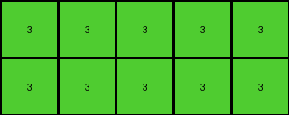

# 2dc579da • 005 • refine_dreamer

---


Previous Code:
```python
"""
Extracts the top-left subgrid from the input grid, stopping at the first major discontinuity in color.
"""

import numpy as np

def find_discontinuity(grid):
    """
    Finds the point of first discontinuity in the grid, starting from the top-left.
    Discontinuity is defined as a change in color that breaks a perceived pattern.

    Args:
        grid (numpy.ndarray): The input grid.

    Returns:
        tuple: (row_end, col_end), the indices (exclusive) up to which the subgrid is continuous.
    """
    rows, cols = grid.shape
    row_end = rows
    col_end = cols

    # Check for vertical discontinuity
    for r in range(1, rows):
        if not np.all(grid[r, :min(col_end, grid.shape[1])] == grid[0, :min(col_end, grid.shape[1])]):
            row_end = r
            break
            
    # Check for horizontal discontinuity.
    for c in range(1, cols):
        if not np.all(grid[:min(row_end,grid.shape[0]), c] == grid[:min(row_end, grid.shape[0]), 0]):
            col_end = c
            break

    return row_end, col_end

def transform(input_grid):
    """
    Extracts the top-left subgrid of the input grid, stopping at the first discontinuity.

    Args:
        input_grid (numpy.ndarray): The input grid.

    Returns:
        numpy.ndarray: The extracted subgrid.
    """
    # Find the point of discontinuity.
    row_end, col_end = find_discontinuity(input_grid)

    # Extract the subgrid.
    output_grid = input_grid[:row_end, :col_end]

    return output_grid
```

Train Set Results:

## Example 1:

Input:
```
8 8 3 8 8
8 8 3 8 8
3 3 3 3 3
8 8 3 8 8
4 8 3 8 8
```
Expected Output:
```
8 8
4 8
```
Transformed Output:
```
8 8
8 8
```

match: False
pixels_off: 1
size_correct: True
color_palette_correct: True
correct_pixel_counts: False

## Example 2:

Input:
```
4 4 4 2 4 4 4
4 4 4 2 4 1 4
4 4 4 2 4 4 4
2 2 2 2 2 2 2
4 4 4 2 4 4 4
4 4 4 2 4 4 4
4 4 4 2 4 4 4
```
Expected Output:
```
4 4 4
4 1 4
4 4 4
```
Transformed Output:
```
4 4 4
```

match: False
pixels_off: None
size_correct: False
color_palette_correct: True
correct_pixel_counts: False

## Example 3:

Input:
```
3 3 3 3 3 1 3 3 3 3 3
3 3 3 3 3 1 3 3 3 3 3
3 8 3 3 3 1 3 3 3 3 3
3 3 3 3 3 1 3 3 3 3 3
3 3 3 3 3 1 3 3 3 3 3
1 1 1 1 1 1 1 1 1 1 1
3 3 3 3 3 1 3 3 3 3 3
3 3 3 3 3 1 3 3 3 3 3
3 3 3 3 3 1 3 3 3 3 3
3 3 3 3 3 1 3 3 3 3 3
3 3 3 3 3 1 3 3 3 3 3
```
Expected Output:
```
3 3 3 3 3
3 3 3 3 3
3 8 3 3 3
3 3 3 3 3
3 3 3 3 3
```
Transformed Output:
```
3 3 3 3 3
3 3 3 3 3
```

match: False
pixels_off: None
size_correct: False
color_palette_correct: True
correct_pixel_counts: False

**INSTRUCTIONS**

The code above was generated based on observations from the first training
example

we have tested the transform function on each of the task example inputs and
compared with the expected output

review each of the examples provided and the results and consider how the
natural language program should be updated to accommodate this new knowledge

respond with the following deliverables:

- general assessment of the information provided and strategy for resolving the
  errors
- gather metrics about each of the examples and results - use code_execution to
  develop accurate reports on your assumptions
- a YAML block documenting facts - Focus on identifying objects, their properties, and the actions performed on them.
- a natural language program - Be as clear and concise as possible, providing a complete description of the transformation rule.


your responses should be considered as information in a report - not a
conversation
