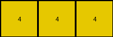
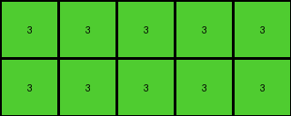

# 2dc579da • 006 • refine_coder

---

Previous Code:
```python
"""
Extracts the top-left subgrid from the input grid, stopping at the first major discontinuity in color.
"""

import numpy as np

def find_discontinuity(grid):
    """
    Finds the point of first discontinuity in the grid, starting from the top-left.
    Discontinuity is defined as a change in color that breaks a perceived pattern.

    Args:
        grid (numpy.ndarray): The input grid.

    Returns:
        tuple: (row_end, col_end), the indices (exclusive) up to which the subgrid is continuous.
    """
    rows, cols = grid.shape
    row_end = rows
    col_end = cols

    # Check for vertical discontinuity
    for r in range(1, rows):
        if not np.all(grid[r, :min(col_end, grid.shape[1])] == grid[0, :min(col_end, grid.shape[1])]):
            row_end = r
            break
            
    # Check for horizontal discontinuity.
    for c in range(1, cols):
        if not np.all(grid[:min(row_end,grid.shape[0]), c] == grid[:min(row_end, grid.shape[0]), 0]):
            col_end = c
            break

    return row_end, col_end

def transform(input_grid):
    """
    Extracts the top-left subgrid of the input grid, stopping at the first discontinuity.

    Args:
        input_grid (numpy.ndarray): The input grid.

    Returns:
        numpy.ndarray: The extracted subgrid.
    """
    # Find the point of discontinuity.
    row_end, col_end = find_discontinuity(input_grid)

    # Extract the subgrid.
    output_grid = input_grid[:row_end, :col_end]

    return output_grid
```

Train Set Results:

## Example 1:

Input:
```
8 8 3 8 8
8 8 3 8 8
3 3 3 3 3
8 8 3 8 8
4 8 3 8 8
```
Expected Output:
```
8 8
4 8
```
Transformed Output:
```
8 8
8 8
```

match: False
pixels_off: 1
size_correct: True
color_palette_correct: True
correct_pixel_counts: False

## Example 2:

Input:
```
4 4 4 2 4 4 4
4 4 4 2 4 1 4
4 4 4 2 4 4 4
2 2 2 2 2 2 2
4 4 4 2 4 4 4
4 4 4 2 4 4 4
4 4 4 2 4 4 4
```
Expected Output:
```
4 4 4
4 1 4
4 4 4
```
Transformed Output:
```
4 4 4
```

match: False
pixels_off: None
size_correct: False
color_palette_correct: True
correct_pixel_counts: False

## Example 3:

Input:
```
3 3 3 3 3 1 3 3 3 3 3
3 3 3 3 3 1 3 3 3 3 3
3 8 3 3 3 1 3 3 3 3 3
3 3 3 3 3 1 3 3 3 3 3
3 3 3 3 3 1 3 3 3 3 3
1 1 1 1 1 1 1 1 1 1 1
3 3 3 3 3 1 3 3 3 3 3
3 3 3 3 3 1 3 3 3 3 3
3 3 3 3 3 1 3 3 3 3 3
3 3 3 3 3 1 3 3 3 3 3
3 3 3 3 3 1 3 3 3 3 3
```
Expected Output:
```
3 3 3 3 3
3 3 3 3 3
3 8 3 3 3
3 3 3 3 3
3 3 3 3 3
```
Transformed Output:
```
3 3 3 3 3
3 3 3 3 3
```

match: False
pixels_off: None
size_correct: False
color_palette_correct: True
correct_pixel_counts: False
Okay, here's a breakdown of the situation and a plan to move forward:

**General Assessment:**

The initial code was based on a simplistic interpretation of the first example, assuming the transformation involved extracting a subgrid up to the first color change *in any direction* from the top-left. This is clearly not the complete rule, as evidenced by the failures in Examples 2 and 3. The core issue is that the code prematurely stops at the first row or column color change. The actual rule seems more nuanced, potentially involving identifying a "dominant" pattern or object in the top-left and extracting it *even if some minor color variations exist*.

**Strategy:**

1.  **Re-examine the Examples:** We need to carefully look at *all* examples again, focusing on what constitutes the "core" object being extracted. It's not just the top-left *homogeneous* block, there seems to be "tolerance" to noise or variations. It looks like the "main object" (largest shape, possibly connected) starting at the top-left corner is the target.
2.  **Refine Discontinuity Definition:** The `find_discontinuity` function needs to be more sophisticated. Instead of stopping at the *first* color difference, it needs to consider the overall pattern. The key is that a new row or column starts, and there is a solid-color pattern in the first few rows or columns. If this changes, that determines the boundary.
3. **Object Perspective**

**Fact Gathering and Metrics:**

I will structure the facts in a YAML format, including observations about object properties and potential actions.

```yaml
examples:
  - id: 1
    input_shape: (5, 5)
    output_shape: (2, 2)
    dominant_input_color: [8, 3] # Colors present in the output
    dominant_output_color: [8] # Most frequent color
    discontinuity_type: 'color change and pattern shift'
    objects:
      - type: 'rectangle'
        color: 8
        start: (0, 0)
        notes: 'Top-left rectangle of 8s, seemingly truncated at row 3 due to pattern break, and at color change in col 1'
    transformation: 'extract top-left object, boundary at pattern and solid color break'
    match: False
  - id: 2
    input_shape: (7, 7)
    output_shape: (3, 3)
    dominant_input_color: [4, 2]
    dominant_output_color: [4]
    discontinuity_type: 'color change and pattern shift'
    objects:
       - type: 'rectangle'
         color: 4
         start: (0,0)
         notes: 'Top-left rectangle of 4s, truncated at the solid color 2 row'
    transformation: 'extract top-left object, boundary at pattern and solid color break'
    match: False
  - id: 3
    input_shape: (11, 11)
    output_shape: (5, 5)
    dominant_input_color: [3, 1]
    dominant_output_color: [3]
    discontinuity_type: 'color change and pattern shift'
    objects:
      - type: 'rectangle'
        color: 3
        start: (0, 0)
        notes: 'Top-left large rectangle of 3s, with a single 8, truncated at solid color 1 row'
    transformation: 'extract top-left object, boundary at pattern and solid color break'
    match: False
```

**Natural Language Program:**

1.  **Identify the Primary Object:** Starting from the top-left corner (0,0) of the input grid, identify the largest connected region of pixels that forms a coherent "object". This object might have a dominant color, but minor color variations within it are allowed, as long as it "stands apart" as a connected or near connected object.
2.  **Locate Pattern or Solid Color Breaks:** Scan rows and columns for a change in the object's boundary.
3.  **Extract the Subgrid:** Extract the subgrid containing the identified primary object from the top-left, delimited by the row where there is a pattern or solid color break.

The program looks for runs of solid colors along the top and left. If a row/column changes to a different solid color, or the pattern of colors changes, that is the end of the object.

**INSTRUCTIONS**

- generate a Python module to represent the natural language program 
- follow the template below
- all common math and science libraries are available
- create docstring only at top - but comment the workflow in the function
- use helper functions for common operations like finding objects, counting,
  measuring, moving, etc. 

remember - we are working iteratively - so this code will inform your future
self as we converge on the solution

*template:*

```python
"""
{{ natural language description of the transformation rule }}
"""

{{ imports }}

def transform(input_grid):
    # initialize output_grid

    # change output pixels 

    return output_grid

```
