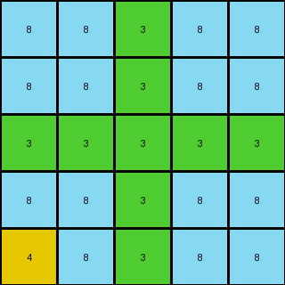

# 2dc579da • 009 • refine_dreamer

---


Previous Code:
```python
"""
Finds the blue (value 1) pixel in the input, and creates a 3x3 output grid centered on that blue pixel, 
copying the colors of the surrounding pixels from the input. All other parts of the input grid are discarded.
"""

import numpy as np

def find_blue_pixel(grid):
    # Find coordinates of the blue pixel (value 1)
    blue_pixels = np.where(grid == 1)
    if len(blue_pixels[0]) == 1:
      return blue_pixels[0][0], blue_pixels[1][0]  # (row, col)
    return None

def transform(input_grid):
    # Find the blue pixel
    blue_pixel_coords = find_blue_pixel(input_grid)

    # Handle the case where there's no single blue pixel or multiple
    if blue_pixel_coords is None:
        return input_grid.copy()

    blue_row, blue_col = blue_pixel_coords

    # Initialize the output grid with a default value (e.g., 0)
    output_grid = np.zeros((3, 3), dtype=int)

    # Extract the 3x3 region around the blue pixel
    for i in range(3):
        for j in range(3):
            input_row = blue_row - 1 + i
            input_col = blue_col - 1 + j

            # Check if the indices are within the bounds of the input grid
            if 0 <= input_row < input_grid.shape[0] and 0 <= input_col < input_grid.shape[1]:
                output_grid[i, j] = input_grid[input_row, input_col]
            # else leave them as the default value (0)
            

    return output_grid
```

Train Set Results:

## Example 1:

Input:
```
8 8 3 8 8
8 8 3 8 8
3 3 3 3 3
8 8 3 8 8
4 8 3 8 8
```
Expected Output:
```
8 8
4 8
```
Transformed Output:
```
8 8 3 8 8
8 8 3 8 8
3 3 3 3 3
8 8 3 8 8
4 8 3 8 8
```

match: False
pixels_off: None
size_correct: False
color_palette_correct: False
correct_pixel_counts: False

## Example 2:

Input:
```
4 4 4 2 4 4 4
4 4 4 2 4 1 4
4 4 4 2 4 4 4
2 2 2 2 2 2 2
4 4 4 2 4 4 4
4 4 4 2 4 4 4
4 4 4 2 4 4 4
```
Expected Output:
```
4 4 4
4 1 4
4 4 4
```
Transformed Output:
```
4 4 4
4 1 4
4 4 4
```

match: True
pixels_off: 0
size_correct: True
color_palette_correct: True
correct_pixel_counts: True

## Example 3:

Input:
```
3 3 3 3 3 1 3 3 3 3 3
3 3 3 3 3 1 3 3 3 3 3
3 8 3 3 3 1 3 3 3 3 3
3 3 3 3 3 1 3 3 3 3 3
3 3 3 3 3 1 3 3 3 3 3
1 1 1 1 1 1 1 1 1 1 1
3 3 3 3 3 1 3 3 3 3 3
3 3 3 3 3 1 3 3 3 3 3
3 3 3 3 3 1 3 3 3 3 3
3 3 3 3 3 1 3 3 3 3 3
3 3 3 3 3 1 3 3 3 3 3
```
Expected Output:
```
3 3 3 3 3
3 3 3 3 3
3 8 3 3 3
3 3 3 3 3
3 3 3 3 3
```
Transformed Output:
```
3 3 3 3 3 1 3 3 3 3 3
3 3 3 3 3 1 3 3 3 3 3
3 8 3 3 3 1 3 3 3 3 3
3 3 3 3 3 1 3 3 3 3 3
3 3 3 3 3 1 3 3 3 3 3
1 1 1 1 1 1 1 1 1 1 1
3 3 3 3 3 1 3 3 3 3 3
3 3 3 3 3 1 3 3 3 3 3
3 3 3 3 3 1 3 3 3 3 3
3 3 3 3 3 1 3 3 3 3 3
3 3 3 3 3 1 3 3 3 3 3
```

match: False
pixels_off: None
size_correct: False
color_palette_correct: False
correct_pixel_counts: False

**INSTRUCTIONS**

The code above was generated based on observations from the first training
example

we have tested the transform function on each of the task example inputs and
compared with the expected output

review each of the examples provided and the results and consider how the
natural language program should be updated to accommodate this new knowledge

respond with the following deliverables:

- general assessment of the information provided and strategy for resolving the
  errors
- gather metrics about each of the examples and results - use code_execution to
  develop accurate reports on your assumptions
- a YAML block documenting facts - Focus on identifying objects, their properties, and the actions performed on them.
- a natural language program - Be as clear and concise as possible, providing a complete description of the transformation rule.


your responses should be considered as information in a report - not a
conversation
