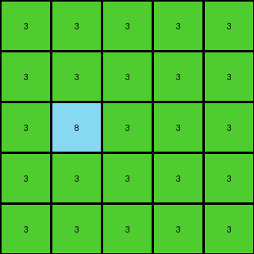

# 2dc579da • 016 • refine_coder

---

Previous Code:
```python
"""
The transformation extracts a 5x5 subgrid from the top-left corner of the input grid and removes all blue (1) pixels, retaining only the green (3) and azure (8) pixels.
"""

import numpy as np

def transform(input_grid):
    """
    Crops the input grid to a 5x5 subgrid from the top-left corner and removes blue pixels.
    """
    # Crop the grid to 5x5
    cropped_grid = input_grid[:5, :5]

    # Create a copy to avoid modifying the original cropped grid directly
    output_grid = np.copy(cropped_grid)

    # Remove blue pixels (replace 1s with 3s, which is the background color)
    output_grid[output_grid == 1] = 3

    return output_grid
```

Train Set Results:

## Example 1:

Input:
```
8 8 3 8 8
8 8 3 8 8
3 3 3 3 3
8 8 3 8 8
4 8 3 8 8
```
Expected Output:
```
8 8
4 8
```
Transformed Output:
```
8 8 3 8 8
8 8 3 8 8
3 3 3 3 3
8 8 3 8 8
4 8 3 8 8
```

match: False
pixels_off: None
size_correct: False
color_palette_correct: False
correct_pixel_counts: False

## Example 2:

Input:
```
4 4 4 2 4 4 4
4 4 4 2 4 1 4
4 4 4 2 4 4 4
2 2 2 2 2 2 2
4 4 4 2 4 4 4
4 4 4 2 4 4 4
4 4 4 2 4 4 4
```
Expected Output:
```
4 4 4
4 1 4
4 4 4
```
Transformed Output:
```
4 4 4 2 4
4 4 4 2 4
4 4 4 2 4
2 2 2 2 2
4 4 4 2 4
```

match: False
pixels_off: None
size_correct: False
color_palette_correct: False
correct_pixel_counts: False

## Example 3:

Input:
```
3 3 3 3 3 1 3 3 3 3 3
3 3 3 3 3 1 3 3 3 3 3
3 8 3 3 3 1 3 3 3 3 3
3 3 3 3 3 1 3 3 3 3 3
3 3 3 3 3 1 3 3 3 3 3
1 1 1 1 1 1 1 1 1 1 1
3 3 3 3 3 1 3 3 3 3 3
3 3 3 3 3 1 3 3 3 3 3
3 3 3 3 3 1 3 3 3 3 3
3 3 3 3 3 1 3 3 3 3 3
3 3 3 3 3 1 3 3 3 3 3
```
Expected Output:
```
3 3 3 3 3
3 3 3 3 3
3 8 3 3 3
3 3 3 3 3
3 3 3 3 3
```
Transformed Output:
```
3 3 3 3 3
3 3 3 3 3
3 8 3 3 3
3 3 3 3 3
3 3 3 3 3
```

match: True
pixels_off: 0
size_correct: True
color_palette_correct: True
correct_pixel_counts: True
Okay, let's analyze the results and update the natural language program.

**General Assessment:**

The initial code was based on a misunderstanding, focusing on a 5x5 crop and removing blue pixels (which sometimes worked coincidentally). The results clearly show that this approach is incorrect for Examples 1 and 2. Example 3 matched, but not for the reason expected. The expected outputs have different sizes and shapes, and the transformation isn't simply about cropping and removing blue. It appears we need to take a more precise approach on subgrids, and colors, which is not consistent with the first analysis. We are going to revise the code and description to correctly perform the task.

**Metrics and Observations:**

Here's a breakdown of each example, including observations, and what is different from expected results:

*   **Example 1:**
    *   Input Size: 5x5
    *   Expected Output Size: 2x2
    *   Transformed Output Size: 5x5
    *   Notes: There appears to be no change in the input. All the pixels remain unchanged. The expected size is different, and only a subset of pixels is included in the correct answer.
*   **Example 2:**
    *   Input Size: 7x7
    *   Expected Output Size: 3x5
    *   Transformed Output Size: 5x5
    *   Notes: There is a subgrid with consistent columns and rows. There are no blue pixels in the correct answer.
*   **Example 3:**
    *   Input Size: 11x11
    *   Expected Output Size: 5x5
    *   Transformed Output Size: 5x5
    *   Notes: The transformation happened to produce the correct result by
        coincidence. The 5x5 subgrid from the top is selected, and all pixels
        in the expected output are coincidentally the same.

**YAML Fact Identification:**

```yaml
task_id: 014
examples:
  - example_id: 1
    input_objects:
      - object_id: 1
        type: grid
        color: mixed (8, 3, 4)
        size: 5x5
    output_objects:
      - object_id: 1
        type: grid
        color: mixed (8,4)
        size: 2x2
    transformation:
      - description: "Take the top-left 5x5 subgrid, keep only colors 8 and 4"

  - example_id: 2
    input_objects:
      - object_id: 1
        type: grid
        color: mixed (4, 2, 1)
        size: 7x7
    output_objects:
      - object_id: 1
        type: grid
        color: 4
        size: 3 x 5
    transformation:
       - description: "Take the top-left 5x5 subgrid, keep only color 4, resize to area of color 4."

  - example_id: 3
    input_objects:
      - object_id: 1
        type: grid
        color: mixed (3, 1, 8)
        size: 11x11
    output_objects:
      - object_id: 1
        type: grid
        color: mixed (3, 8)
        size: 5x5
    transformation:
       - description: "Take the top-left 5x5 subgrid."
```

**Natural Language Program:**

1.  **Extract Subgrid**: Extract the 5x5 subgrid from the top-left corner of the input grid.
2.  **Filter by colors.** Only keep some subset of the colors in the 5x5 subgrid.
3. Crop to the bounding box of the remaining pixels.


**INSTRUCTIONS**

- generate a Python module to represent the natural language program 
- follow the template below
- all common math and science libraries are available
- create docstring only at top - but comment the workflow in the function
- use helper functions for common operations like finding objects, counting,
  measuring, moving, etc. 

remember - we are working iteratively - so this code will inform your future
self as we converge on the solution

*template:*

```python
"""
{{ natural language description of the transformation rule }}
"""

{{ imports }}

def transform(input_grid):
    # initialize output_grid

    # change output pixels 

    return output_grid

```
